# KisanLink — AI, Machine Learning & Optimization Specifications

**Project Name:** KisanLink (Direct Farm-to-Buyer Operating System)  
**Problem Statement ID:** 26033 (Smart India Hackathon 2026)  
**Document Version:** 1.1.0  
**Status:** Canonical Intelligence Specification (Synchronized with Codebase)  
**Core Architecture Principle:** Closed-Form Mathematical Determinism for Logistics & Feasibility; Generative/NLP AI for Voice Speech-to-Intent; Strict Separation of Transactions from Heuristics  
**Last Updated:** September 2026  

---

## Table of Contents

1. [Intelligence Systems Philosophy & Taxonomy](#1-intelligence-systems-philosophy--taxonomy)
2. [Classification Matrix (Implemented vs. Prototype vs. Future)](#2-classification-matrix-implemented-vs-prototype-vs-future)
3. [System 0: Market Maker Feasibility Engine (Deterministic Closed-Form Core)](#3-system-0-market-maker-feasibility-engine-deterministic-closed-form-core)
4. [System 1: Voice Intent Extractor (Google Gemini AI + Regex Fallback)](#4-system-1-voice-intent-extractor-google-gemini-ai--regex-fallback)
5. [System 2: Interactive AI Intelligence Cards (MarketplaceAiTrigger Lifecycle)](#5-system-2-interactive-ai-intelligence-cards-marketplaceaitrigger-lifecycle)
6. [System 3: Multi-Criteria Procurement Matching Engine](#6-system-3-multi-criteria-procurement-matching-engine)
7. [System 4: Dynamic Farmer Supply Clustering](#7-system-4-dynamic-farmer-supply-clustering)
8. [System 5: Fair Price Guidance & Mandi Benchmark Modeling](#8-system-5-fair-price-guidance--mandi-benchmark-modeling)
9. [System 6: Regional Demand & Arrival Forecasting](#9-system-6-regional-demand--arrival-forecasting)
10. [System 7: Logistics Route Optimization & Map Display](#10-system-7-logistics-route-optimization--map-display)
11. [System 8: Wastage Rescue & Dynamic Discounting](#11-system-8-wastage-rescue--dynamic-discounting)
12. [Planned Post-MVP Intelligence Systems (Future Scope)](#12-planned-post-mvp-intelligence-systems-future-scope)
13. [AI Failure Safeguards & Graceful Degradation Framework](#13-ai-failure-safeguards--graceful-degradation-framework)

---

## 1. Intelligence Systems Philosophy & Taxonomy

**KisanLink** rejects the anti-pattern of superficial "AI for the sake of marketing." We apply strict engineering discipline:
- **Never use Generative AI or black-box models for mathematical feasibility, financial settlements, or database state transitions.**
- **Use Closed-Form Deterministic Arithmetic** for transport viability, freight allocation, break-even volume, and ledger payouts (Market Maker Engine).
- **Use Generative AI / Large Language Models (Google Gemini)** strictly for accessibility: transcribing spoken Hindi or English audio into structured produce listing attributes (`/api/v1/listings/parse-voice`).
- **Use Staged Cognitive Animations** in the UI to present complex market insights in digestible, bite-sized steps without overwhelming rural users.

---

## 2. Classification Matrix (Implemented vs. Prototype vs. Future)

```
+----------------------------------------------------------------------------------------------------+
|                                    SYSTEM CLASSIFICATION MATRIX                                    |
+--------------------------+-----------------------+------------------------+------------------------+
| SUBSYSTEM                | IMPLEMENTATION TYPE   | ALGORITHM / ENGINE     | STATUS IN REPOSITORY   |
+--------------------------+-----------------------+------------------------+------------------------+
| 0. Market Maker Feasib.  | **Deterministic**     | Closed-form arithmetic | ✅ Fully Implemented   |
| 1. Voice Listing NLP     | **AI / Generative**   | Google Gemini API      | ✅ Fully Implemented   |
| 2. AI Card Focus Pattern | **Frontend Pattern**  | Portal + Scrim + Timer | ✅ Fully Implemented   |
| 3. Sourcing Matching     | **Real Backend**      | 5-Factor Weighted Model| ✅ Fully Implemented   |
| 4. Dynamic Clustering    | **Real Backend**      | Spatial Radius Pooling | ✅ Fully Implemented   |
| 5. Fair Price Guidance   | **Real Backend**      | Hedonic Mandi Spread   | ✅ Fully Implemented   |
| 6. Demand Forecasting    | **Deterministic/Demo**| Regional Arrival Model | ✅ Implemented / Demo  |
| 7. Multi-Stop Routing    | **Real API + Fallback**| Heuristic / OR-Tools   | ✅ API Ready + Fallback|
| 8. Wastage Rescue Sale   | **Real Backend**      | Algorithmic Discount   | ✅ Fully Implemented   |
| 9. Computer Vision CV    | **Planned (Future)**  | MobileNetV3 CNN        | ⚪ Post-MVP Roadmap     |
| 10. BHASHINI Speech API  | **Planned (Future)**  | MeitY BHASHINI Pipeline| ⚪ Post-MVP Roadmap     |
+--------------------------+-----------------------+------------------------+------------------------+
```

---

## 3. System 0: Market Maker Feasibility Engine (Deterministic Closed-Form Core)

For complete mathematical breakdown, refer to [DOCS/MARKET_MAKER.md](./MARKET_MAKER.md).

### 3.1 Closed-Form Equation
There is no probabilistic prediction or speculative machine learning here. The engine calculates the exact volume threshold at which fixed freight amortizes into a viable per-kg landed cost:

$$\text{Freight}_{\text{fixed}} = \text{round}(300 + \text{Capacity}_{\text{kg}} \times 0.375)$$
$$\text{Freight}_{\text{perKm}} = \text{round}(9 + \text{Capacity}_{\text{kg}} \times 0.0225)$$
$$\text{Freight}_{\text{total}} = \text{Freight}_{\text{fixed}} + (\text{Freight}_{\text{perKm}} \times \text{RouteDistance}_{\text{km}})$$
$$\text{Headroom}_{\text{perKg}} = \text{BuyerCeiling}_{\text{perKg}} - \text{FarmerFloor}_{\text{perKg}} - \text{PlatformFee}_{\text{perKg}}$$
$$\text{Threshold}_{\text{kg}} = \left\lceil \frac{\text{Freight}_{\text{total}}}{\text{Headroom}_{\text{perKg}}} \right\rceil$$

### 3.2 Auditability
Every parameter is inspectable in the UI via `MarketWhyPanel.tsx`, which executes `explainMarket()` to present the 7 arithmetic steps that justified corridor viability.

---

## 4. System 1: Voice Intent Extractor (Google Gemini AI + Regex Fallback)

### 4.1 Endpoint Contract
`POST /api/v1/listings/parse-voice`
- **Controller:** `backend/app/api/v1/listings.py`
- **Service:** `backend/app/services/gemini_listing.py`

### 4.2 Architecture & Execution
1. Browser Web Speech API records farmer audio in Hindi (`hi-IN`) or English (`en-IN`).
2. The speech transcript is sent to `/api/v1/listings/parse-voice`.
3. In `gemini_listing.py`, the backend calls Google Gemini (`gemini-1.5-flash` / `gemini-pro`) with a strict agricultural JSON system prompt.
4. Gemini extracts:
   - `crop_name` (e.g. "Tomato")
   - `crop_name_hi` (e.g. "टमाटर")
   - `quantity_kg` (converts quintals/tonnes into kilograms)
   - `price_per_kg` (extracts expected rate)
   - `confidence_score` ($0.0 - 1.0$)
5. **Deterministic Regex Fallback:** If the Gemini API key is missing, network times out, or quota is exceeded, the server automatically catches the exception and executes `_basic_extract()`, which uses Hindi number and crop regex matchers to populate the review form without crashing.

---

## 5. System 2: Interactive AI Intelligence Cards (`MarketplaceAiTrigger` Lifecycle)

Across all role modules, intelligence cards (`FarmerPulseCard`, `MarketplaceAiSection`, `BulkIntelligenceCards`, `LogisticsIntelligenceCards`) use the standardized lifecycle implemented in `frontend/src/components/ai/MarketplaceAiTrigger.tsx`:

### 5.1 Floating Focus & Scrim Overlay
When an AI check is triggered:
- The `body` element receives `.ai-analysis-active`, locking background scrolling without jumpy scrollbar shifts.
- A dark blurred scrim mounts via a **React Portal** directly onto `document.body`.
- The active card mounts as a sibling of the scrim, floating above the dimmed page.
- The in-flow page keeps an invisible placeholder with exact measured height, guaranteeing **zero layout shift** upon return.

### 5.2 Staged Analysis Animation (`AiThinkingState.tsx`)
Paces 4 to 5 domain-specific validation steps across $\sim 1400\text{ ms}$:
1. Checking harvest freshness.
2. Comparing regional farm prices.
3. Checking mandi benchmark references.
4. Reviewing available corridor stock.
5. Preparing recommendation.

---

## 6. System 3: Multi-Criteria Procurement Matching Engine

Implemented in `backend/app/services/matching_service.py` and exposed via `/api/v1/requirements/{id}/generate-matches`:
- Evaluates candidate crop listings against buyer requirements using a 5-factor scoring function:
  1. Distance score (PostGIS geodetic proximity).
  2. Price score (comparison against requirement target price).
  3. Reputation score (farmer track record).
  4. Freshness score (harvest window alignment).
  5. Urgency / Rescue bonus (prioritizing perishable crops tagged for urgent sale).

---

## 7. System 4: Dynamic Farmer Supply Clustering

Implemented in `backend/app/api/v1/clusters.py`:
- Clusters multiple smallholder listings whose combined harvest satisfies a bulk requirement volume ($> 100\text{ kg} - 5,000\text{ kg}$).
- Maintains individual `OrderFarmerAllocation` rows for every contributing farmer, ensuring 100% transparent and traceable individual payouts.

---

## 8. System 5: Fair Price Guidance & Mandi Benchmark Modeling

Implemented in `backend/app/api/v1/intelligence.py` and `app/services/pricing_service.py`:
- Anchored to `DEFAULT_CROP_BENCHMARKS` storing regional APMC mandi prices and historical 7-day price trends for key perishables:
  - Tomatoes: Mandi ₹24/kg, Direct ₹32/kg.
  - Potatoes: Mandi ₹21/kg, Direct ₹25/kg.
  - Onions: Mandi ₹18/kg, Direct ₹24/kg.
  - Spinach: Mandi ₹35/kg, Direct ₹42/kg.
- Formulates indicative fair price bands for farmers:
  $$P_{\text{fair}} = P_{\text{mandi}} + 0.5 \times (P_{\text{direct}} - P_{\text{mandi}})$$

---

## 9. System 6: Regional Demand & Arrival Forecasting

- Exposed via `GET /api/v1/intelligence/forecast/{crop_name}`.
- Categorizes crop demand into clear qualitative indicators (`HIGH_DEMAND`, `BALANCED`, `LOW_DEMAND`) with expected price trajectory over a 3-week window.

---

## 10. System 7: Logistics Route Optimization & Map Display

- **Canonical Endpoint:** `POST /api/v1/logistics/routes/optimize`.
- **MapLibre GL JS Visualization:** Renders pickup waypoints and delivery drops on `DigitalTwinCorridorMap.tsx` using CartoCDN Positron tiles and quadratic Bezier curves.
- **Fail-Safe Fallback:** If MapLibre fails or tiles time out, a structured schematic corridor card layout renders immediately with retry controls.

---

## 11. System 8: Wastage Rescue & Dynamic Discounting

- Exposed via `GET /api/v1/rescue/listings`.
- Farmers can tag perishable crops nearing shelf-life expiry as **Urgent Rescue Sales** with algorithmic discounts (e.g., 20% off), redirecting supply to food processors or quick-turnaround buyers before spoilage occurs.

---

## 12. Planned Post-MVP Intelligence Systems (Future Scope)

The following systems are documented in research specifications but are **explicitly out of scope for the current MVP prototype**:
- **MobileNetV3 Computer Vision Quality Grading:** Indicative image-based produce surface defect detection. Current implementation uses farmer-declared grading (`Grade A`, `Grade A+`).
- **MeitY BHASHINI Speech Integration:** Direct API integration with the Government of India BHASHINI STT/TTS pipeline. Current implementation uses browser Web Speech API + Google Gemini AI.
- **IoT Cold-Chain Telemetry:** Hardware sensor integration for live container temperature/humidity tracking.

---

## 13. AI Failure Safeguards & Graceful Degradation Framework

```mermaid
flowchart TD
    subgraph Voice_Failure_Path [Voice Parsing Safeguards]
        VoiceIn[Speech Audio] --> WebSpeech[Browser Speech Recognition]
        WebSpeech -->|Recognized| GeminiAPI[Google Gemini API]
        WebSpeech -->|Blocked / Error| ManualForm[Direct Numeric Form Input]
        GeminiAPI -->|Success| StructuredDraft[Pre-filled Listing Draft]
        GeminiAPI -->|Timeout / Quota| RegexFallback[Regex Entity Extractor]
        RegexFallback --> StructuredDraft
    end

    subgraph Map_Failure_Path [Map Display Safeguards]
        MapMount[Mount MapLibre Canvas] --> WebGLCheck[WebGL Probe]
        WebGLCheck -->|Supported & Online| RenderMap[Render Vector Tiles & Bezier Lines]
        WebGLCheck -->|Unsupported / Offline| SchematicFallback[Render Structured Schematic Cards]
        RenderMap -->|Tile Error / Disconnect| SchematicFallback
    end
```



---
*End of KisanLink AI, Machine Learning & Optimization Specifications*
