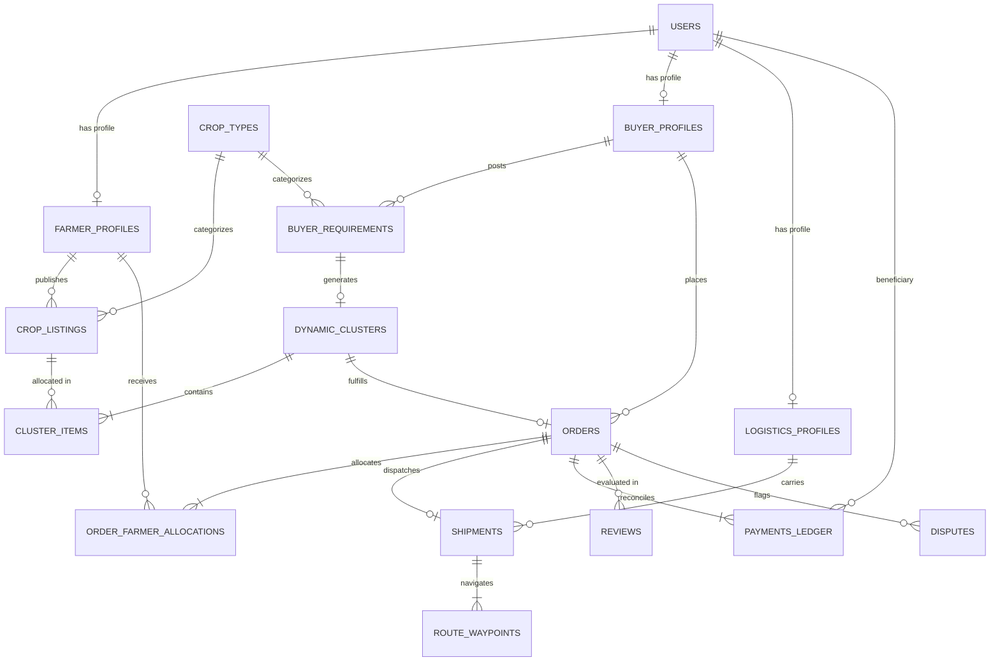

# KisanLink — Database Schema & Data Architecture

**Project Name:** KisanLink (Direct Farm-to-Buyer Operating System)  
**Problem Statement ID:** 26033 (Smart India Hackathon 2026)  
**Document Version:** 1.0.0  
**Status:** Approved Database Architecture  
**RDBMS:** PostgreSQL 16 with PostGIS Extension  
**ORM:** SQLAlchemy 2.0 (Asyncpg) + Alembic Migrations  
**Last Updated:** September 2026  

---

## Table of Contents

1. [Database Architecture & Core Principles](#1-database-architecture--core-principles)
2. [Entity-Relationship Diagram (Mermaid ERD)](#2-entity-relationship-diagram-mermaid-erd)
3. [Spatial & PostGIS Standards](#3-spatial--postgis-standards)
4. [Enumerations & Type Definitions](#4-enumerations--type-definitions)
5. [Core Table Definitions & SQL DDL](#5-core-table-definitions--sql-ddl)
   - 5.1 [Users & Role Profiles](#51-users--role-profiles)
   - 5.2 [Crops & Listings](#52-crops--listings)
   - 5.3 [Buyer Requirements & Procurement Postings](#53-buyer-requirements--procurement-postings)
   - 5.4 [Dynamic Supply Clusters](#54-dynamic-supply-clusters)
   - 5.5 [Orders & Allocations](#55-orders--allocations)
   - 5.6 [Logistics, Shipments & Waypoints](#56-logistics-shipments--waypoints)
   - 5.7 [Payments, Escrow & Settlements](#57-payments-escrow--settlements)
   - 5.8 [Intelligence, Pricing & Forecasts](#58-intelligence-pricing--forecasts)
   - 5.9 [Reputation, Reviews & Disputes](#59-reputation-reviews--disputes)
   - 5.10 [Operator Audit Logs](#510-operator-audit-logs)
6. [Spatial Indexing & Query Optimizations](#6-spatial-indexing--query-optimizations)
7. [Data Integrity, Constraints & ACID Guarantees](#7-data-integrity-constraints--acid-guarantees)
8. [Audit Timestamps & Soft-Delete Strategy](#8-audit-timestamps--soft-delete-strategy)
9. [Seed Data Specification (Corridor Data)](#9-seed-data-specification-corridor-data)
10. [Data Retention & Archival Policies](#10-data-retention--archival-policies)

---

## 1. Database Architecture & Core Principles

- **Engine:** PostgreSQL 16 (hosted on Supabase PostgreSQL in staging/production, local Docker container in development).
- **Spatial Processing:** PostGIS spatial extension enabled (`CREATE EXTENSION IF NOT EXISTS postgis`).
- **Identifier Strategy:** UUIDv4 (`uuid_generate_v4()`) for distributed safety and tamper-proof client exposure.
- **Strict Typing:** Decimal types (`NUMERIC(10, 2)`) for all financial rupee amounts; PostGIS `GEOGRAPHY(Point, 4326)` for coordinates.

---

## 2. Entity-Relationship Diagram (Mermaid ERD)



---

## 3. Spatial & PostGIS Standards

- **Spatial Reference System:** `SRID 4326` (WGS 84 GPS Lat/Lon).
- **Column Standard:** `GEOGRAPHY(Point, 4326)`.
- **Indexing Standard:** Spatial GiST indexing (`CREATE INDEX idx_..._geog ON ... USING GIST(location)`).
- **Distance Calculations:** Native PostGIS functions (`ST_Distance`, `ST_DWithin`, `ST_Centroid`).

---

## 4. Enumerations & Type Definitions

```sql
CREATE TYPE user_role_enum AS ENUM ('FARMER', 'BUYER', 'LOGISTICS_PROVIDER', 'OPERATOR_PROXY');
CREATE TYPE listing_status_enum AS ENUM ('ACTIVE', 'RESERVED', 'HARVESTED', 'RESCUE_ACTIVE', 'SOLD', 'EXPIRED', 'CANCELLED');
CREATE TYPE requirement_status_enum AS ENUM ('OPEN', 'MATCHED', 'ORDER_CREATED', 'FULFILLED', 'EXPIRED');
CREATE TYPE quality_grade_enum AS ENUM ('GRADE_A', 'GRADE_B', 'PROCESSING_GRADE');
CREATE TYPE cluster_status_enum AS ENUM ('PROPOSED', 'CONFIRMED', 'FULFILLED', 'DISSOLVED');
CREATE TYPE order_status_enum AS ENUM ('DRAFT', 'CONFIRMED', 'ESCROW_LOCKED', 'PICKUP_SCHEDULED', 'IN_TRANSIT', 'DELIVERED', 'SETTLED', 'DISPUTED', 'CANCELLED');
CREATE TYPE shipment_status_enum AS ENUM ('UNASSIGNED', 'ASSIGNED', 'PICKUP_IN_PROGRESS', 'LOADED', 'IN_TRANSIT', 'DELIVERED');
CREATE TYPE ledger_entry_type_enum AS ENUM ('ESCROW_LOCK', 'FARMER_PAYOUT', 'TRANSPORTER_FREIGHT', 'PLATFORM_FEE', 'REFUND');
```

---

## 5. Core Table Definitions & SQL DDL

### 5.1 Users & Role Profiles

```sql
CREATE TABLE users (
    id UUID PRIMARY KEY DEFAULT gen_random_uuid(),
    phone VARCHAR(16) UNIQUE NOT NULL,
    role user_role_enum NOT NULL,
    preferred_language VARCHAR(8) DEFAULT 'hi',
    is_verified BOOLEAN DEFAULT FALSE,
    is_active BOOLEAN DEFAULT TRUE,
    created_at TIMESTAMPTZ DEFAULT NOW(),
    updated_at TIMESTAMPTZ DEFAULT NOW()
);

CREATE TABLE farmer_profiles (
    id UUID PRIMARY KEY DEFAULT gen_random_uuid(),
    user_id UUID UNIQUE NOT NULL REFERENCES users(id) ON DELETE CASCADE,
    full_name VARCHAR(128) NOT NULL,
    village VARCHAR(128),
    district VARCHAR(128) NOT NULL,
    state VARCHAR(128) NOT NULL,
    location GEOGRAPHY(Point, 4326) NOT NULL,
    payout_upi_id VARCHAR(128),
    reputation_score NUMERIC(3, 2) DEFAULT 5.00,
    created_at TIMESTAMPTZ DEFAULT NOW()
);

CREATE TABLE buyer_profiles (
    id UUID PRIMARY KEY DEFAULT gen_random_uuid(),
    user_id UUID UNIQUE NOT NULL REFERENCES users(id) ON DELETE CASCADE,
    business_name VARCHAR(256) NOT NULL,
    buyer_type VARCHAR(64) NOT NULL, -- 'HOTEL', 'RESTAURANT', 'RETAILER', 'PROCESSOR', 'CONSUMER'
    gstin VARCHAR(32),
    delivery_address TEXT NOT NULL,
    delivery_location GEOGRAPHY(Point, 4326) NOT NULL,
    created_at TIMESTAMPTZ DEFAULT NOW()
);

CREATE TABLE logistics_profiles (
    id UUID PRIMARY KEY DEFAULT gen_random_uuid(),
    user_id UUID UNIQUE NOT NULL REFERENCES users(id) ON DELETE CASCADE,
    transporter_name VARCHAR(128) NOT NULL,
    vehicle_registration_number VARCHAR(32) NOT NULL,
    vehicle_type VARCHAR(64) NOT NULL, -- '3.5T_LCV', '5.0T_EICHER', 'PICKUP'
    capacity_kg NUMERIC(10, 2) NOT NULL CHECK (capacity_kg > 0),
    base_location GEOGRAPHY(Point, 4326) NOT NULL,
    is_available BOOLEAN DEFAULT TRUE,
    created_at TIMESTAMPTZ DEFAULT NOW()
);
```

### 5.2 Crops & Listings

```sql
CREATE TABLE crop_types (
    id UUID PRIMARY KEY DEFAULT gen_random_uuid(),
    name_en VARCHAR(64) UNIQUE NOT NULL,
    name_hi VARCHAR(64) NOT NULL,
    category VARCHAR(64) NOT NULL, -- 'VEGETABLE', 'FRUIT', 'GRAIN'
    shelf_life_days INT NOT NULL,
    standard_mandi_unit VARCHAR(16) DEFAULT 'kg'
);

CREATE TABLE crop_listings (
    id UUID PRIMARY KEY DEFAULT gen_random_uuid(),
    farmer_id UUID NOT NULL REFERENCES farmer_profiles(id) ON DELETE CASCADE,
    crop_type_id UUID NOT NULL REFERENCES crop_types(id),
    variety VARCHAR(64),
    quantity_kg NUMERIC(10, 2) NOT NULL CHECK (quantity_kg > 0),
    available_quantity_kg NUMERIC(10, 2) NOT NULL CHECK (available_quantity_kg >= 0),
    expected_price_per_kg NUMERIC(10, 2) NOT NULL CHECK (expected_price_per_kg > 0),
    quality_grade quality_grade_enum DEFAULT 'GRADE_A',
    is_pre_harvest BOOLEAN DEFAULT FALSE,
    harvest_date DATE NOT NULL,
    status listing_status_enum DEFAULT 'ACTIVE',
    location GEOGRAPHY(Point, 4326) NOT NULL,
    photos TEXT[], -- Array of image URLs
    is_urgent_rescue BOOLEAN DEFAULT FALSE,
    rescue_discount_price_per_kg NUMERIC(10, 2),
    created_at TIMESTAMPTZ DEFAULT NOW(),
    updated_at TIMESTAMPTZ DEFAULT NOW()
);
```

### 5.3 Buyer Requirements & Procurement Postings

```sql
CREATE TABLE buyer_requirements (
    id UUID PRIMARY KEY DEFAULT gen_random_uuid(),
    buyer_id UUID NOT NULL REFERENCES buyer_profiles(id) ON DELETE CASCADE,
    crop_type_id UUID NOT NULL REFERENCES crop_types(id),
    target_quantity_kg NUMERIC(10, 2) NOT NULL CHECK (target_quantity_kg > 0),
    max_price_per_kg NUMERIC(10, 2) NOT NULL CHECK (max_price_per_kg > 0),
    acceptable_grades quality_grade_enum[] NOT NULL,
    delivery_deadline TIMESTAMPTZ NOT NULL,
    delivery_location GEOGRAPHY(Point, 4326) NOT NULL,
    status requirement_status_enum DEFAULT 'OPEN',
    created_at TIMESTAMPTZ DEFAULT NOW()
);
```

### 5.4 Dynamic Supply Clusters

```sql
CREATE TABLE dynamic_clusters (
    id UUID PRIMARY KEY DEFAULT gen_random_uuid(),
    requirement_id UUID NOT NULL REFERENCES buyer_requirements(id),
    total_quantity_kg NUMERIC(10, 2) NOT NULL,
    average_farm_price_per_kg NUMERIC(10, 2) NOT NULL,
    estimated_freight_rupees NUMERIC(10, 2) NOT NULL,
    total_delivered_price_per_kg NUMERIC(10, 2) NOT NULL,
    cluster_centroid GEOGRAPHY(Point, 4326) NOT NULL,
    status cluster_status_enum DEFAULT 'PROPOSED',
    created_at TIMESTAMPTZ DEFAULT NOW()
);

CREATE TABLE cluster_items (
    id UUID PRIMARY KEY DEFAULT gen_random_uuid(),
    cluster_id UUID NOT NULL REFERENCES dynamic_clusters(id) ON DELETE CASCADE,
    listing_id UUID NOT NULL REFERENCES crop_listings(id),
    farmer_id UUID NOT NULL REFERENCES farmer_profiles(id),
    allocated_quantity_kg NUMERIC(10, 2) NOT NULL CHECK (allocated_quantity_kg > 0),
    agreed_price_per_kg NUMERIC(10, 2) NOT NULL CHECK (agreed_price_per_kg > 0),
    pickup_order_index INT NOT NULL,
    created_at TIMESTAMPTZ DEFAULT NOW()
);
```

### 5.5 Orders & Allocations

```sql
CREATE TABLE orders (
    id UUID PRIMARY KEY DEFAULT gen_random_uuid(),
    order_code VARCHAR(32) UNIQUE NOT NULL, -- e.g., 'ORD-2026-9821'
    buyer_id UUID NOT NULL REFERENCES buyer_profiles(id),
    cluster_id UUID REFERENCES dynamic_clusters(id),
    crop_type_id UUID NOT NULL REFERENCES crop_types(id),
    total_quantity_kg NUMERIC(10, 2) NOT NULL CHECK (total_quantity_kg > 0),
    gross_amount_rupees NUMERIC(10, 2) NOT NULL CHECK (gross_amount_rupees > 0),
    status order_status_enum DEFAULT 'DRAFT',
    delivery_otp VARCHAR(8) NOT NULL, -- 4-digit verification OTP
    created_at TIMESTAMPTZ DEFAULT NOW(),
    updated_at TIMESTAMPTZ DEFAULT NOW()
);

CREATE TABLE order_farmer_allocations (
    id UUID PRIMARY KEY DEFAULT gen_random_uuid(),
    order_id UUID NOT NULL REFERENCES orders(id) ON DELETE CASCADE,
    farmer_id UUID NOT NULL REFERENCES farmer_profiles(id),
    listing_id UUID NOT NULL REFERENCES crop_listings(id),
    allocated_kg NUMERIC(10, 2) NOT NULL,
    farmer_payout_amount_rupees NUMERIC(10, 2) NOT NULL,
    pickup_verification_otp VARCHAR(8) NOT NULL,
    is_picked_up BOOLEAN DEFAULT FALSE,
    is_settled BOOLEAN DEFAULT FALSE
);
```

### 5.6 Logistics, Shipments & Waypoints

```sql
CREATE TABLE shipments (
    id UUID PRIMARY KEY DEFAULT gen_random_uuid(),
    order_id UUID UNIQUE NOT NULL REFERENCES orders(id) ON DELETE CASCADE,
    transporter_id UUID REFERENCES logistics_profiles(id),
    total_distance_km NUMERIC(8, 2) NOT NULL,
    freight_payout_rupees NUMERIC(10, 2) NOT NULL,
    status shipment_status_enum DEFAULT 'UNASSIGNED',
    created_at TIMESTAMPTZ DEFAULT NOW()
);

CREATE TABLE route_waypoints (
    id UUID PRIMARY KEY DEFAULT gen_random_uuid(),
    shipment_id UUID NOT NULL REFERENCES shipments(id) ON DELETE CASCADE,
    sequence_index INT NOT NULL,
    waypoint_type VARCHAR(16) NOT NULL, -- 'DEPOT', 'PICKUP', 'DROP_OFF'
    farmer_id UUID REFERENCES farmer_profiles(id),
    location GEOGRAPHY(Point, 4326) NOT NULL,
    stop_name VARCHAR(128) NOT NULL,
    payload_weight_kg NUMERIC(10, 2) DEFAULT 0,
    is_completed BOOLEAN DEFAULT FALSE
);
```

### 5.7 Payments, Escrow & Settlements

```sql
CREATE TABLE payments_ledger (
    id UUID PRIMARY KEY DEFAULT gen_random_uuid(),
    order_id UUID NOT NULL REFERENCES orders(id),
    beneficiary_user_id UUID REFERENCES users(id),
    entry_type ledger_entry_type_enum NOT NULL,
    amount_rupees NUMERIC(10, 2) NOT NULL CHECK (amount_rupees > 0),
    gateway_reference_id VARCHAR(128),
    is_settled BOOLEAN DEFAULT FALSE,
    settled_at TIMESTAMPTZ,
    created_at TIMESTAMPTZ DEFAULT NOW()
);
```

### 5.8 Intelligence, Pricing & Forecasts

```sql
CREATE TABLE price_observations (
    id UUID PRIMARY KEY DEFAULT gen_random_uuid(),
    crop_type_id UUID NOT NULL REFERENCES crop_types(id),
    district VARCHAR(128) NOT NULL,
    modal_price_per_kg NUMERIC(10, 2) NOT NULL,
    min_price_per_kg NUMERIC(10, 2) NOT NULL,
    max_price_per_kg NUMERIC(10, 2) NOT NULL,
    arrival_tonnes NUMERIC(10, 2) NOT NULL,
    observation_date DATE NOT NULL,
    source VARCHAR(64) DEFAULT 'APMC_AGMARKNET'
);

CREATE TABLE demand_forecasts (
    id UUID PRIMARY KEY DEFAULT gen_random_uuid(),
    crop_type_id UUID NOT NULL REFERENCES crop_types(id),
    region VARCHAR(128) NOT NULL,
    forecast_status VARCHAR(32) NOT NULL, -- 'HIGH_DEMAND', 'NORMAL', 'LOW_DEMAND'
    projected_demand_index NUMERIC(5, 2) NOT NULL,
    projected_deficit_tonnes NUMERIC(10, 2),
    forecast_period_start DATE NOT NULL,
    forecast_period_end DATE NOT NULL,
    created_at TIMESTAMPTZ DEFAULT NOW()
);
```

### 5.9 Reputation, Reviews & Disputes

```sql
CREATE TABLE reviews (
    id UUID PRIMARY KEY DEFAULT gen_random_uuid(),
    order_id UUID NOT NULL REFERENCES orders(id),
    author_id UUID NOT NULL REFERENCES users(id),
    target_id UUID NOT NULL REFERENCES users(id),
    rating_score INT NOT NULL CHECK (rating_score BETWEEN 1 AND 5),
    feedback_text TEXT,
    created_at TIMESTAMPTZ DEFAULT NOW()
);

CREATE TABLE disputes (
    id UUID PRIMARY KEY DEFAULT gen_random_uuid(),
    order_id UUID NOT NULL REFERENCES orders(id),
    raised_by UUID NOT NULL REFERENCES users(id),
    dispute_reason VARCHAR(64) NOT NULL, -- 'WEIGHT_MISMATCH', 'QUALITY_DAMAGE', 'DELIVERY_DELAY'
    withheld_amount_rupees NUMERIC(10, 2) NOT NULL,
    is_resolved BOOLEAN DEFAULT FALSE,
    resolution_notes TEXT,
    created_at TIMESTAMPTZ DEFAULT NOW()
);
```

### 5.10 Operator Audit Logs

```sql
CREATE TABLE operator_audit_logs (
    id UUID PRIMARY KEY DEFAULT gen_random_uuid(),
    operator_user_id UUID NOT NULL REFERENCES users(id),
    farmer_user_id UUID NOT NULL REFERENCES users(id),
    action_type VARCHAR(64) NOT NULL, -- 'CREATE_PROXY_LISTING', 'ACCEPT_PROXY_OFFER'
    entity_id UUID NOT NULL,
    created_at TIMESTAMPTZ DEFAULT NOW()
);
```

---

## 6. Spatial Indexing & Query Optimizations

```sql
-- Spatial GiST Index on Crop Listings
CREATE INDEX idx_listings_location_gist ON crop_listings USING GIST(location);

-- Spatial GiST Index on Farmer Profiles
CREATE INDEX idx_farmers_location_gist ON farmer_profiles USING GIST(location);

-- Spatial GiST Index on Buyer Deliveries
CREATE INDEX idx_buyers_delivery_location_gist ON buyer_profiles USING GIST(delivery_location);

-- Compound Index for Filtered Spatial Marketplace Queries
CREATE INDEX idx_listings_composite_search ON crop_listings (crop_type_id, status, is_pre_harvest, harvest_date);
```

---

## 7. Data Integrity, Constraints & ACID Guarantees

1. **Check Constraints:** Ensure `quantity_kg > 0`, `expected_price_per_kg > 0`, and `rating_score BETWEEN 1 AND 5`.
2. **Atomic Settlement Transactions:** When an order transitions to `SETTLED`, all payout records in `payments_ledger` and `order_farmer_allocations` are committed within a single PostgreSQL transaction block.
3. **Optimistic Locking:** Listing records include `updated_at` checks to prevent race conditions during concurrent allocation into supply clusters.

---

## 8. Audit Timestamps & Soft-Delete Strategy

- `created_at` and `updated_at` automatically maintained via PostgreSQL trigger function.
- Orders and Payments are **never hard-deleted** to preserve complete financial traceability and dispute audit trails.

---

## 9. Seed Data Specification (Corridor Data)

The `seed_demo_data.py` script populates the **Delhi NCR – Haryana Agricultural Corridor**:
- **Crops:** Tomato (`टमाटर`), Cauliflower (`फूलगोभी`), Onion (`प्याज`), Potato (`आलू`).
- **4 Corridor Farmers:**
  - `Ramesh Sharma` (Sonipat): 1,200 kg Tomatoes @ ₹25/kg.
  - `Suresh Kumar` (Sonipat): 800 kg Tomatoes @ ₹25/kg.
  - `Balbir Singh` (Panipat): 1,700 kg Tomatoes @ ₹24.50/kg.
  - `Jaipal Malik` (Panipat): 1,300 kg Tomatoes @ ₹25.50/kg.
- **1 B2B Buyer:** `The Imperial Hotel` (Connaught Place, New Delhi): 5,000 kg Tomato Requirement @ max ₹28/kg.
- **1 Transporter:** `KisanExpress Logistics` (Murthal Hub): 5.0T Eicher Pro Truck.

---

## 10. Data Retention & Archival Policies

- **Active Listings:** Retained for 90 days post-harvest.
- **Order & Financial Ledgers:** Retained permanently for tax and compliance audits.
- **APMC Mandi History:** Retained for 3 years to power seasonal LightGBM demand models.

---
*End of KisanLink Database Schema & Data Architecture*
