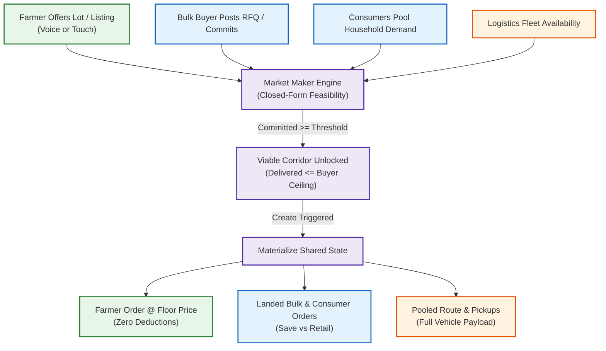
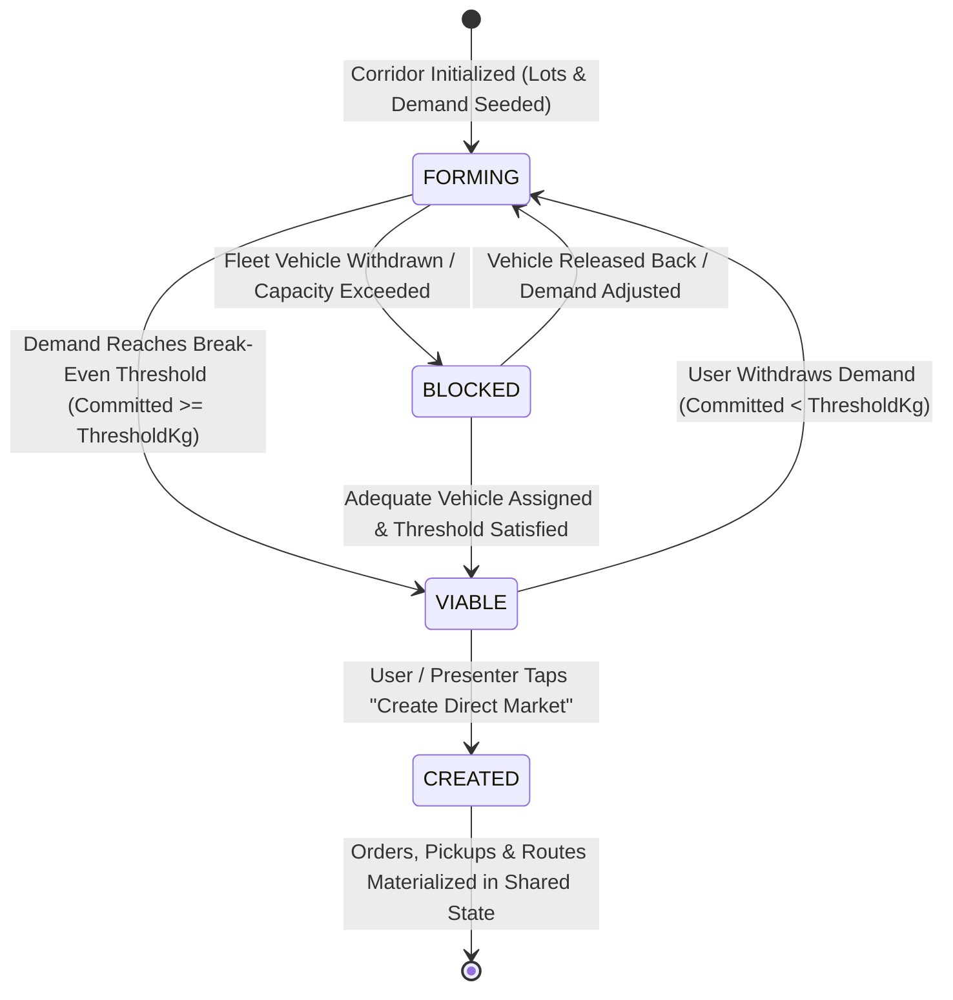
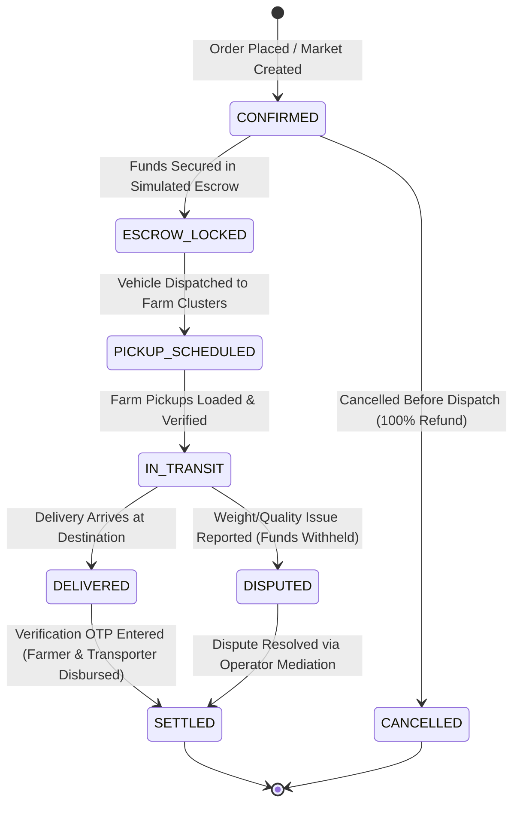
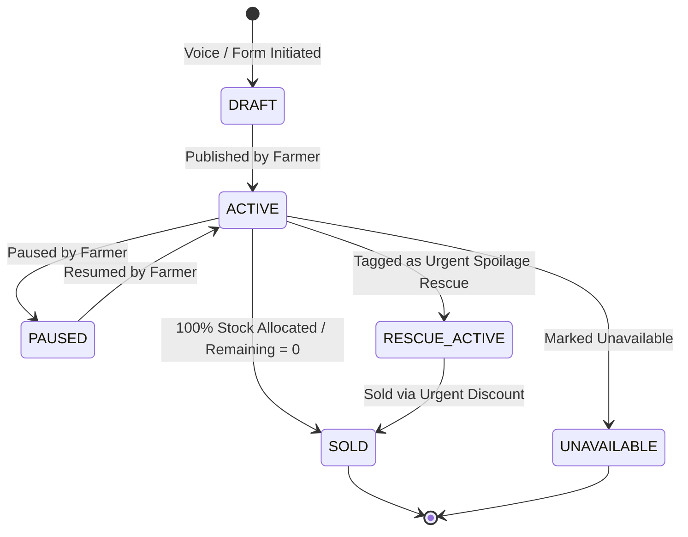
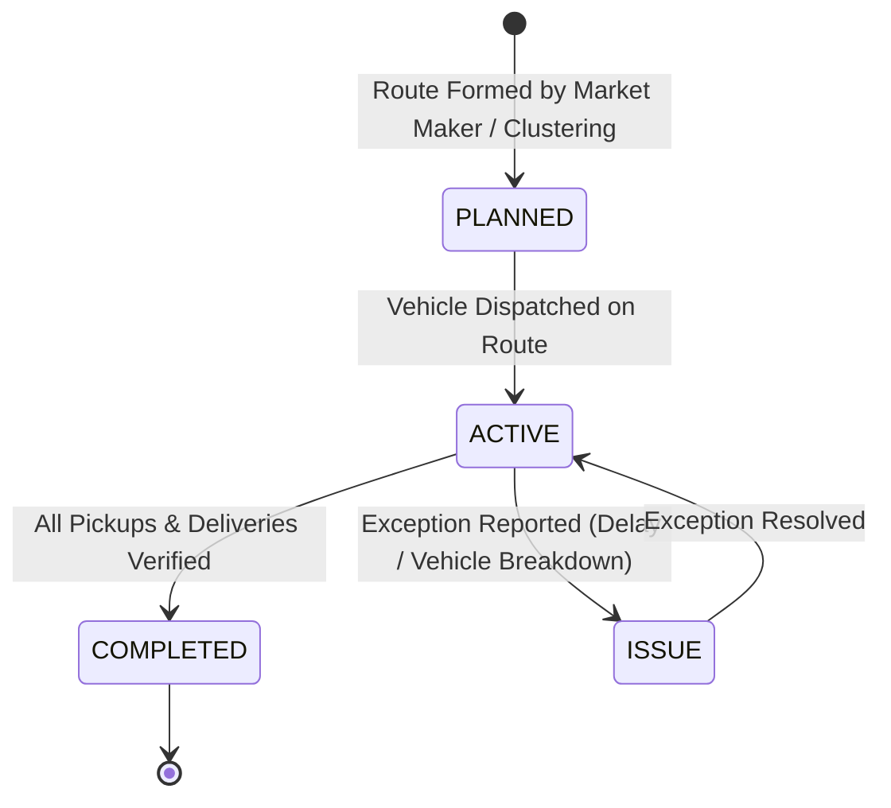
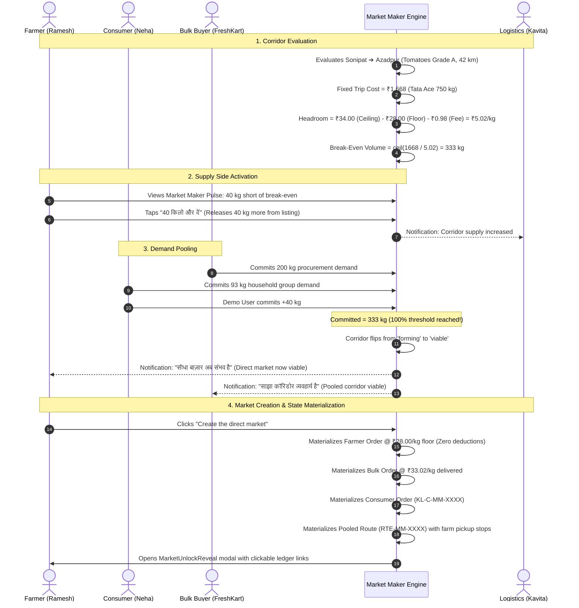
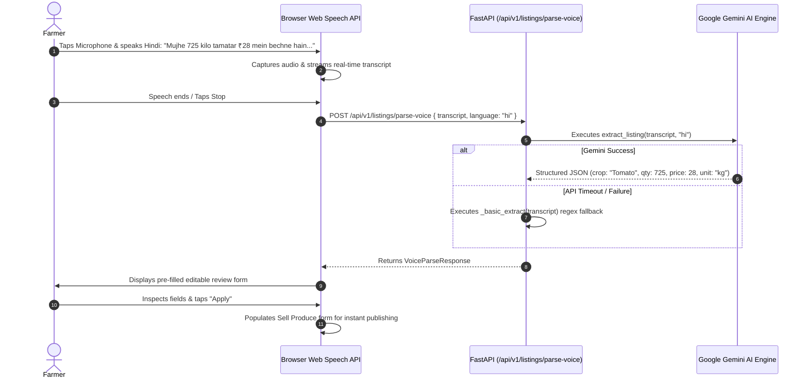
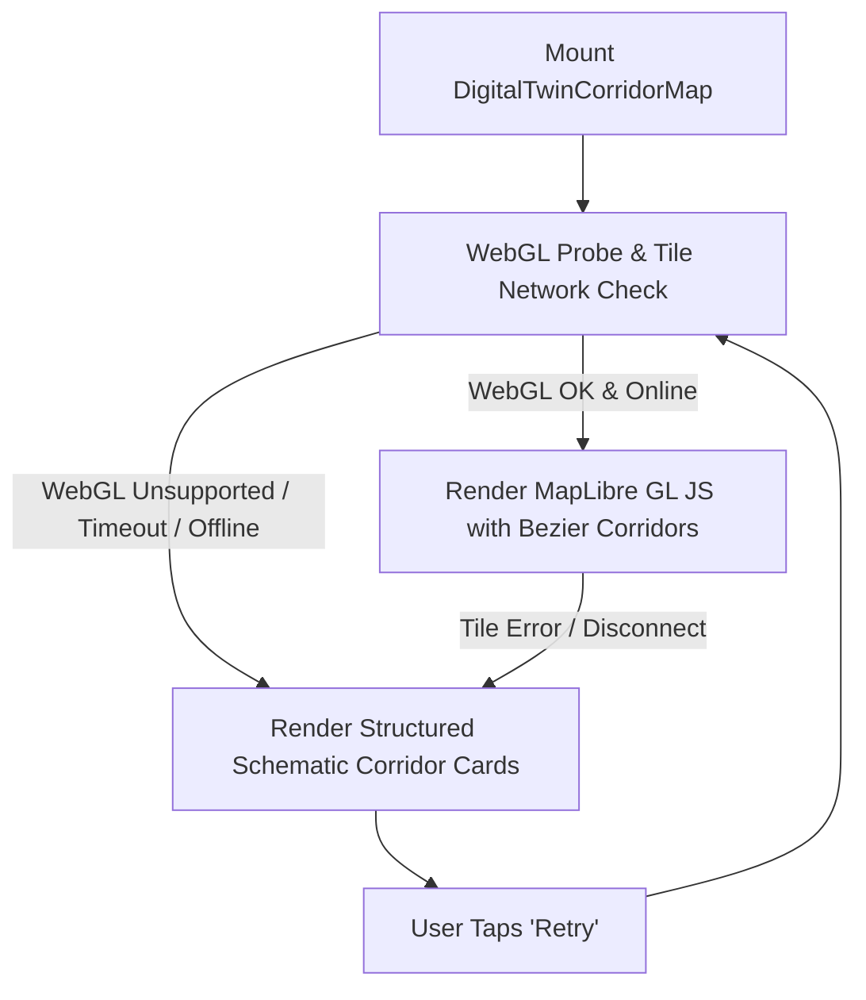
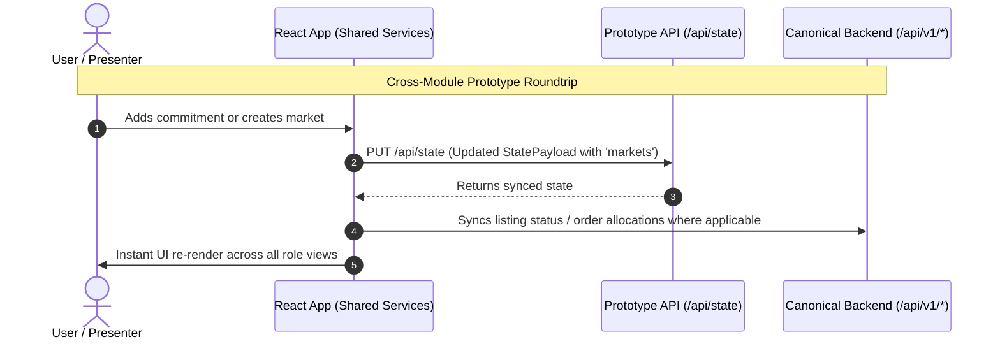

# KisanLink — End-to-End System Flows & State Machines

**Project Name:** KisanLink (Direct Farm-to-Buyer Operating System)  
**Problem Statement ID:** 26033 (Smart India Hackathon 2026)  
**Document Version:** 1.1.0  
**Status:** Canonical System Flow Specification (Synchronized with Codebase)  
**Parent Specifications:** [PRD.md](./PRD.md) | [TRD.md](./TRD.md) | [MARKET_MAKER.md](./MARKET_MAKER.md)  
**Last Updated:** September 2026  

---

## Table of Contents

1. [Flow Architecture Overview](#1-flow-architecture-overview)
2. [Finite State Machines (FSM)](#2-finite-state-machines-fsm)
   - 2.1 [Market Maker Corridor State Machine](#21-market-maker-corridor-state-machine)
   - 2.2 [Order Lifecycle State Machine](#22-order-lifecycle-state-machine)
   - 2.3 [Crop Listing State Machine](#23-crop-listing-state-machine)
   - 2.4 [Logistics & Route State Machine](#24-logistics--route-state-machine)
3. [Market Maker Multi-Role Sequence Flow](#3-market-maker-multi-role-sequence-flow)
4. [Farmer Experience Flows](#4-farmer-experience-flows)
   - 4.1 [Farmer Onboarding & Mobile OTP](#41-farmer-onboarding--mobile-otp)
   - 4.2 [Produce Management & Listing Creation](#42-produce-management--listing-creation)
   - 4.3 [Gemini AI Voice-Assisted Listing Flow](#43-gemini-ai-voice-assisted-listing-flow)
   - 4.4 [Farmer Market Maker Participation Flow](#44-farmer-market-maker-participation-flow)
   - 4.5 [Farmer Payout & Earnings Ledger Tracking](#45-farmer-payout--earnings-ledger-tracking)
5. [Consumer Experience Flows](#5-consumer-experience-flows)
   - 5.1 [Unified Home & In-Page Marketplace Discovery](#51-unified-home--in-page-marketplace-discovery)
   - 5.2 [Direct Produce Purchase, Cart & Checkout](#52-direct-produce-purchase-cart--checkout)
   - 5.3 [Consumer Market Maker Household Pooling](#53-consumer-market-maker-household-pooling)
6. [Bulk Buyer Procurement Flows](#6-bulk-buyer-procurement-flows)
   - 6.1 [Reverse Marketplace RFQ Creation with Target Price Advisor](#61-reverse-marketplace-rfq-creation-with-target-price-advisor)
   - 6.2 [Deterministic Supply Match Preview & Order Conversion](#62-deterministic-supply-match-preview--order-conversion)
   - 6.3 [Bulk Buyer Market Maker Corridor Commitment](#63-bulk-buyer-market-maker-corridor-commitment)
7. [Logistics Experience Flows](#7-logistics-experience-flows)
   - 7.1 [Operations Dashboard & Active Jobs Prioritization](#71-operations-dashboard--active-jobs-prioritization)
   - 7.2 [Digital Twin Corridor Map & Schematic Fallback](#72-digital-twin-corridor-map--schematic-fallback)
   - 7.3 [Vehicle Holding, Re-Quoting & Fleet Allocation Lever](#73-vehicle-holding-re-quoting--fleet-allocation-lever)
8. [Cross-Module State Synchronization Flow](#8-cross-module-state-synchronization-flow)
9. [Exception & Fallback Flows](#9-exception--fallback-flows)

---

## 1. Flow Architecture Overview

Every workflow in **KisanLink** is designed around **Farmer Floor Protection**, **Closed-Form Transport Feasibility**, and **Zero Hidden Intermediary Overhead**.

---

## 2. Finite State Machines (FSM)

### 2.1 Market Maker Corridor State Machine

### 2.2 Order Lifecycle State Machine

### 2.3 Crop Listing State Machine

### 2.4 Logistics & Route State Machine

---

## 3. Market Maker Multi-Role Sequence Flow

---

## 4. Farmer Experience Flows

### 4.1 Farmer Onboarding & Mobile OTP
1. Farmer enters mobile number (`+91 98765 43210`).
2. Taps "Send OTP" / "ओटीपी भेजें".
3. System verifies OTP (`123456` in demo environment).
4. System sets role token and opens `/farmer` dashboard.

### 4.2 Produce Management & Listing Creation
1. Farmer navigates to Produce via elevated center slot (`/farmer/produce`).
2. Taps "+ Sell Produce" (`/farmer/sell`).
3. Selects Crop from visual agricultural cards.
4. Enters harvest date, quantity (kg/quintal), and asking price.
5. Reviews fair-price comparison against local APMC mandi price.
6. Submits; listing appears immediately in Active tab.

### 4.3 Gemini AI Voice-Assisted Listing Flow

### 4.4 Farmer Market Maker Participation Flow
1. Farmer views **Market Maker Pulse Card** on home dashboard.
2. Taps into `/farmer/market`.
3. Reviews colloquial Hindi guidance: *"सीधा बाज़ार बनने के लिए 40 किलो और चाहिए"* (Needs 40 kg more).
4. Taps **"40 किलो और दें" (Give 40 kg more)** to release held crop into the corridor.

---

## 5. Consumer Experience Flows

### 5.1 Unified Home & In-Page Marketplace Discovery
1. Consumer opens `/consumer`.
2. Inspects **Fresh Near You** carousel and **Fresh Pick** AI recommendation.
3. Scrolls into **Explore Fresh Produce (`#marketplace`)**:
   - Types query into search bar.
   - Toggles category chips (`All`, `Vegetables`, `Fruits`, `Grains`, `Staples`).
   - Opens filter drawer to set maximum price, distance, or grade.
   - Adjusts sort order (`Recommended`, `Nearest`, `Freshest`, `Price low to high`).
4. Clicks product card to view listing detail with retail benchmark comparison.

### 5.2 Direct Produce Purchase, Cart & Checkout
1. Consumer selects quantity and taps **"Add to Cart"** or **"Buy Now"**.
2. Navigates to Cart via elevated center slot (`/consumer/cart`).
3. Reviews transparent cost split (Produce share, Logistics fee, Platform fee).
4. Proceeds to Checkout (`/consumer/checkout`).
5. Selects delivery address and simulated payment method (UPI / Card / Cash on Delivery).
6. Order confirmed; consumer tracks status on `/consumer/orders/:id`.

---

## 6. Bulk Buyer Procurement Flows

### 6.1 Reverse Marketplace RFQ Creation with Target Price Advisor
1. Bulk Buyer opens `/bulk` and taps **"Post Requirement"** (`/bulk/requests`).
2. Step 1 (Details): Enters crop, grade, quantity (MOQ 100 kg), target price, delivery location, and window.
   - Interacts with **Target Price Advisor** AI component to select competitive pricing.
3. Step 2 (Match Preview): Reviews deterministic supply pooling showing participating farm lots.
4. Step 3 (Review): Reviews total estimated landed cost.
5. Step 4 (Submit): Requirement published with active matching status.

### 6.2 Deterministic Supply Match Preview & Order Conversion
1. Buyer opens requirement detail (`/bulk/requests/:id`).
2. Reviews fulfilled percentage and multi-farmer contribution visual.
3. Taps **"Accept match & convert"**.
4. System creates confirmed Procurement Order (`/bulk/orders/:id`) with transparent landed cost.

---

## 7. Logistics Experience Flows

### 7.1 Operations Dashboard & Active Jobs Prioritization
1. Operator opens `/logistics`.
2. Reviews shift KPIs: Active pickups, active deliveries, vehicle capacity, load in transit.
3. Scans Active Jobs ranked in priority order:
   - Exceptions (`issue`) ranked first.
   - Unassigned pickups (`unassigned`) ranked second.
   - Scheduled work ranked third.
4. Taps job card to open pickup manifest or delivery confirmation.

### 7.2 Digital Twin Corridor Map & Schematic Fallback

### 7.3 Vehicle Holding, Re-Quoting & Fleet Allocation Lever
1. Operator opens Market Maker console (`/logistics/market`).
2. Views corridor quoter: Tata Ace (750 kg) is held for the corridor.
3. Operator taps **"Withdraw vehicle from corridor"** (simulating maintenance).
4. Engine immediately re-quotes corridor against next available fleet vehicle (1,500 kg pickup).
5. Higher fixed trip costs shift break-even threshold volume from 333 kg to 480 kg in real time!

---

## 8. Cross-Module State Synchronization Flow

---

## 9. Exception & Fallback Flows

1. **Speech Recognition Failure:** Browser displays clear localized error message ("माइक अनुमति दें" / "Microphone blocked") and keeps direct numeric touch inputs open.
2. **Gemini AI Outage:** Backend automatically catches exception and executes regex entity extractor (`_basic_extract`).
3. **MapLibre Canvas Error:** Graceful fallback UI renders schematic corridor node cards with full details and retry CTA.
4. **Backend Unreachable:** Frontend hooks gracefully fall back to local prototype seed state without breaking the demonstration.

---
*End of KisanLink End-to-End System Flows & State Machines*
