# KisanLink — End-to-End System Flows & State Machines

**Project Name:** KisanLink (Direct Farm-to-Buyer Operating System)  
**Problem Statement ID:** 26033 (Smart India Hackathon 2026)  
**Document Version:** 1.0.0  
**Status:** Approved System Flow Specification  
**Parent Specifications:** [PRD.md](./PRD.md) | [TRD.md](./TRD.md) | [IMPLEMENTATION_PLAN.md](./IMPLEMENTATION_PLAN.md)  
**Last Updated:** September 2026  

---

## Table of Contents

1. [Flow Architecture Overview](#1-flow-architecture-overview)
2. [Finite State Machines (FSM)](#2-finite-state-machines-fsm)
   - 2.1 [Order Lifecycle State Machine](#21-order-lifecycle-state-machine)
   - 2.2 [Crop Listing State Machine](#22-crop-listing-state-machine)
   - 2.3 [Shipment & Logistics State Machine](#23-shipment--logistics-state-machine)
   - 2.4 [Dynamic Supply Cluster State Machine](#24-dynamic-supply-cluster-state-machine)
3. [Farmer Experience Flows](#3-farmer-experience-flows)
   - 3.1 [Farmer Onboarding & Mobile OTP](#31-farmer-onboarding--mobile-otp)
   - 3.2 [Step-by-Step Touch Listing Flow](#32-step-by-step-touch-listing-flow)
   - 3.3 [Spoken Voice-Driven Listing Flow](#33-spoken-voice-driven-listing-flow)
   - 3.4 [Pre-Harvest Forward Listing Flow](#34-pre-harvest-forward-listing-flow)
   - 3.5 [Offer Receipt, Negotiation & Acceptance Flow](#35-offer-receipt-negotiation--acceptance-flow)
   - 3.6 [Order & Payment Payout Tracking Flow](#36-order--payment-payout-tracking-flow)
   - 3.7 [Wastage Rescue / Urgent Sale Tagging Flow](#37-wastage-rescue--urgent-sale-tagging-flow)
   - 3.8 [Assisted Tele-Support & Call Center Proxy Flow](#38-assisted-tele-support--call-center-proxy-flow)
4. [Buyer Experience Flows](#4-buyer-experience-flows)
   - 4.1 [Buyer Onboarding & Procurement Profile](#41-buyer-onboarding--procurement-profile)
   - 4.2 [Consumer Direct Marketplace Browse & Checkout](#42-consumer-direct-marketplace-browse--checkout)
   - 4.3 [Bulk Procurement Posting (Reverse Marketplace)](#43-bulk-procurement-posting-reverse-marketplace)
   - 4.4 [Dynamic Farmer Cluster Match & Procurement Plan Review](#44-dynamic-farmer-cluster-match--procurement-plan-review)
   - 4.5 [Payment Authorization & Escrow Lock Flow](#45-payment-authorization--escrow-lock-flow)
   - 4.6 [Consignment Delivery Verification & OTP Sign-Off](#46-consignment-delivery-verification--otp-sign-off)
   - 4.7 [Bidirectional Rating & Repeat Order Flow](#47-bidirectional-rating--repeat-order-flow)
5. [Logistics Provider Flows](#5-logistics-provider-flows)
   - 5.1 [Carrier Onboarding & Vehicle Registration](#51-carrier-onboarding--vehicle-registration)
   - 5.2 [Load Board Discovery & Job Acceptance](#52-load-board-discovery--job-acceptance)
   - 5.3 [Multi-Stop Farm Pickup & Manifest Execution](#53-multi-stop-farm-pickup--manifest-execution)
   - 5.4 [Delivery Handover & Freight Disbursement](#54-delivery-handover--freight-disbursement)
6. [Core System & Intelligence Flows](#6-core-system--intelligence-flows)
   - 6.1 [Demand & Supply Forecasting Flow](#61-demand--supply-forecasting-flow)
   - 6.2 [Fair Price Recommendation Flow](#62-fair-price-recommendation-flow)
   - 6.3 [Dynamic Cluster Formulation Solver Flow](#63-dynamic-cluster-formulation-solver-flow)
   - 6.4 [Google OR-Tools Route Optimization Flow](#64-google-or-tools-route-optimization-flow)
   - 6.5 [Multi-Party Escrow Settlement Split Flow](#65-multi-party-escrow-settlement-split-flow)
7. [Exception & Fallback Flows](#7-exception--fallback-flows)
   - 7.1 [AI Voice Recognition Failure Fallback](#71-ai-voice-recognition-failure-fallback)
   - 7.2 [Routing Engine Network Timeout Fallback](#72-routing-engine-network-timeout-fallback)
   - 7.3 [Quantity / Quality Discrepancy at Farm Gate](#73-quantity--quality-discrepancy-at-farm-gate)
   - 7.4 [Order Cancellation & Escrow Refund Protocol](#74-order-cancellation--escrow-refund-protocol)
   - 7.5 [Offline / Low-Connectivity PWA Synchronization](#75-offline--low-connectivity-pwa-synchronization)

---

## 1. Flow Architecture Overview

Every workflow in **KisanLink** is designed around the principles of **Radical Farmer Simplicity**, **Deterministic Transaction Integrity**, and **Zero Hidden Intermediary Overhead**.

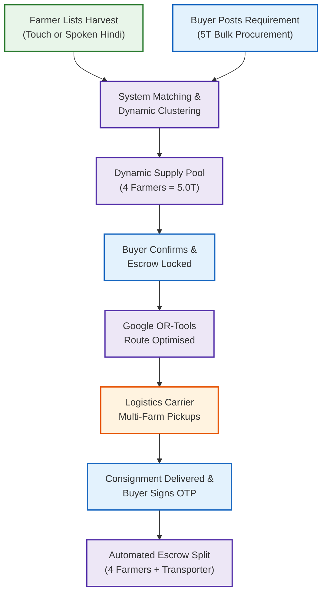

---

## 2. Finite State Machines (FSM)

### 2.1 Order Lifecycle State Machine

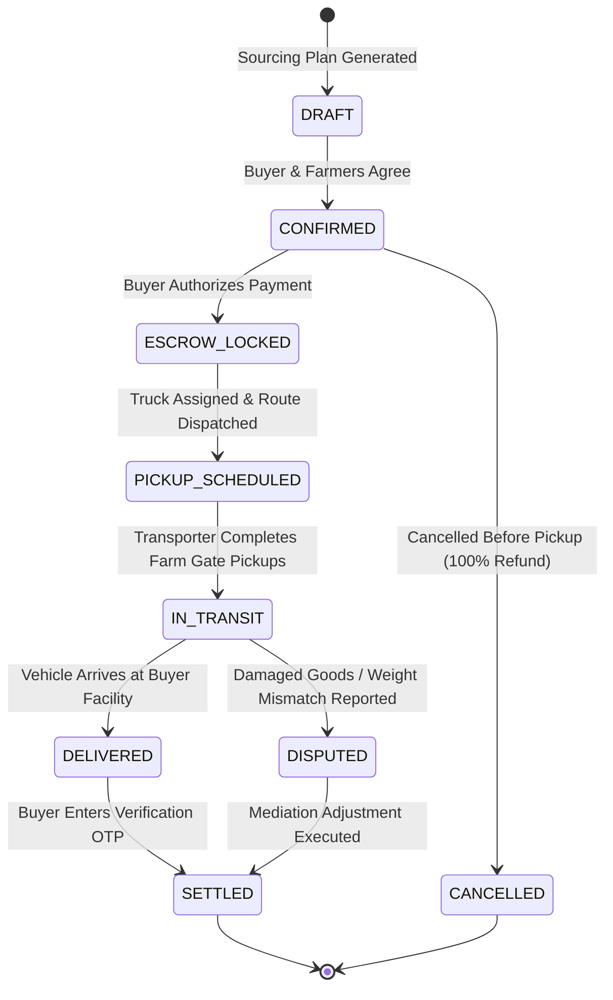

### 2.2 Crop Listing State Machine

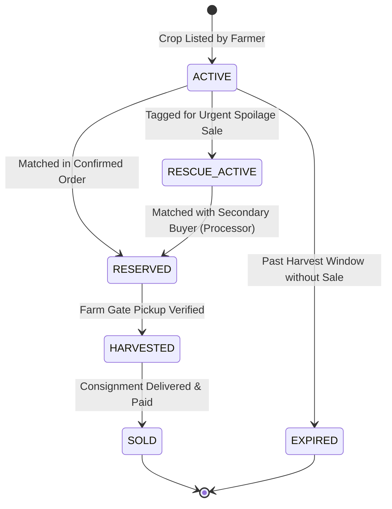

### 2.3 Shipment & Logistics State Machine

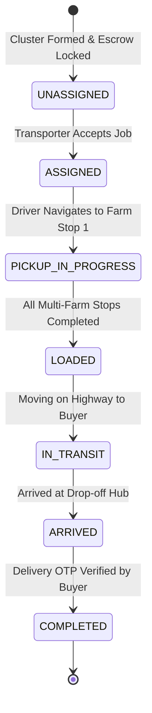

### 2.4 Dynamic Supply Cluster State Machine

```mermaid
stateDiagram-v2
    [*] --> PROPOSED : Sourcing Solver Aggregates Farms
    PROPOSED --> COMMITTED : All Matched Farmers Accept
    COMMITTED --> FULFILLED : All Crop Lots Picked Up
    COMMITTED --> PARTIAL_DISPATCH : 1 Farmer Fails; Backup Injected
    PROPOSED --> DISSOLVED : Buyer Declines or Window Times Out
    FULFILLED --> [*]
    DISSOLVED --> [*]
```

---

## 3. Farmer Experience Flows

### 3.1 Farmer Onboarding & Mobile OTP
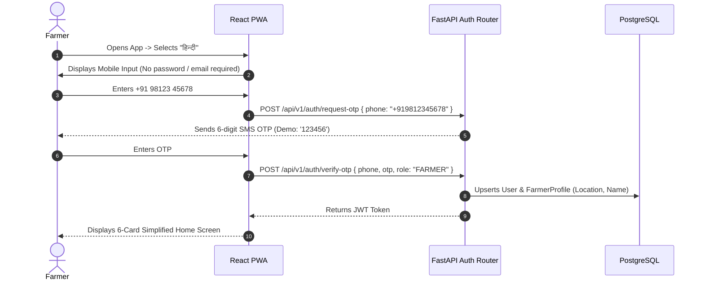

### 3.2 Step-by-Step Touch Listing Flow
To eliminate cognitive overload, the listing flow enforces **One Question Per Screen**:

```
Screen 1: What crop? (Crop Icons: Tomato, Potato, Onion, Cauliflower)
   ↓
Screen 2: How much quantity? (Large stepper: 1,200 kg / 1.2 Tonnes)
   ↓
Screen 3: When is it available? ("Ready Now" vs "Pre-Harvest: 3 Days")
   ↓
Screen 4: What is your expected price? (Guidance: ₹23-₹26/kg | Input: ₹25/kg)
   ↓
Screen 5: Add photo? (Optional camera capture)
   ↓
Screen 6: Big Green Button -> "Confirm & Sell / फसल बेचें"
```

### 3.3 Spoken Voice-Driven Listing Flow
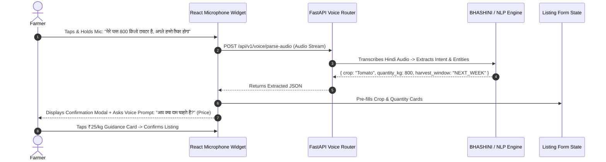

### 3.4 Pre-Harvest Forward Listing Flow
- Farmers declare crops 1 to 4 weeks prior to harvest.
- The platform tags the listing `is_pre_harvest = true` and indexes it in the **Crop Availability Calendar**.
- Buyers can place pre-harvest reservation locks, giving the farmer guaranteed purchase security before harvesting.

### 3.5 Offer Receipt, Negotiation & Acceptance Flow
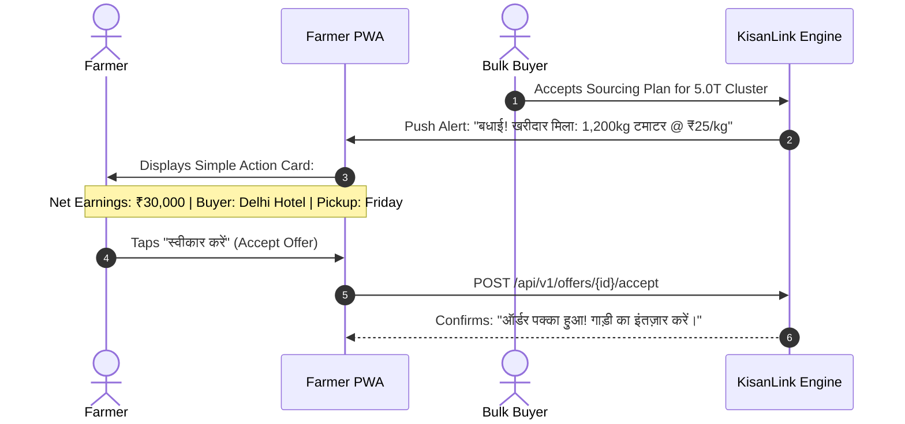

### 3.6 Order & Payment Payout Tracking Flow
- Farmer taps **"💰 Payments / भुगतान"** card on Home.
- Screen displays clear cards:
  - **In Escrow (Locked):** `₹30,000 (Tomato 1.2T - In Transit)`
  - **Paid to Bank:** `₹24,500 (Cauliflower - Delivered Yesterday)`
- Zero complex accounting tables; direct rupee amounts.

### 3.7 Wastage Rescue / Urgent Sale Tagging Flow
- If produce is approaching maturity without a buyer or an order is cancelled:
- Farmer taps **"Urgent Sale / जल्दी बेचें"** on the listing.
- System recommends dynamic rescue price (e.g., ₹21/kg vs. standard ₹25/kg).
- Listing is prioritized on the **Buyer Rescue Feed** for nearby food processors and catering kitchens.

### 3.8 Assisted Tele-Support & Call Center Proxy Flow
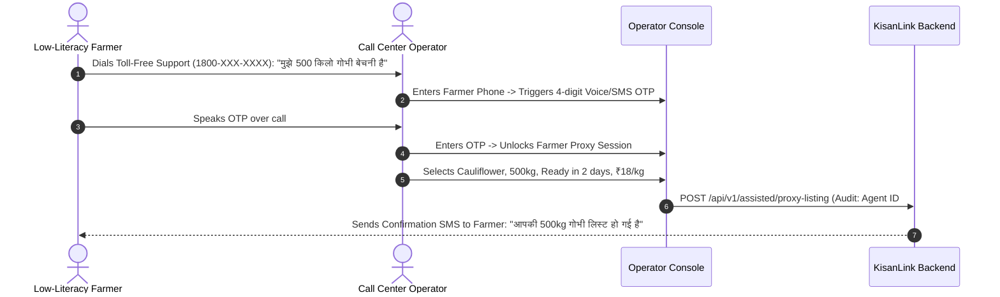

---

## 4. Buyer Experience Flows

### 4.1 Buyer Onboarding & Procurement Profile
- Buyer registers with Phone + OTP.
- Selects Buyer Type: **Individual Consumer**, **Restaurant / Hotel**, **Retailer**, or **Food Processor**.
- Inputs Business Name, GSTIN (optional for consumers), and primary delivery warehouse coordinates.

### 4.2 Consumer Direct Marketplace Browse & Checkout
- Consumer browses nearby single-farm listings.
- Selects 10 kg Tomatoes @ ₹26/kg (vs. Retail ₹34/kg).
- Views farmer farm story (*"Harvested in Sonipat 6 hours ago by Ramesh"*).
- Instant simulated UPI checkout with direct delivery.

### 4.3 Bulk Procurement Posting (Reverse Marketplace)
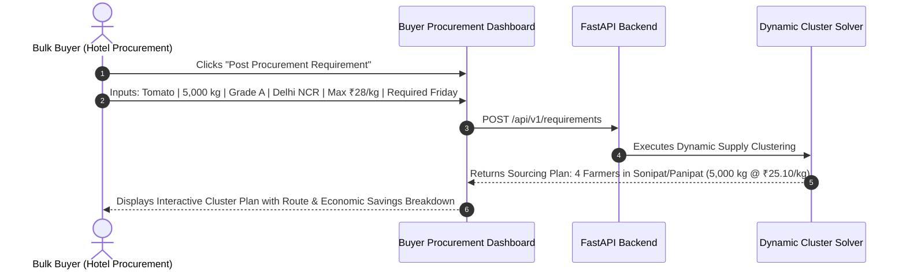

### 4.4 Dynamic Farmer Cluster Match & Procurement Plan Review
- Buyer sees visual cluster card:
  - Total Volume: **5,000 / 5,000 kg (100% Fulfilled)**.
  - Sourcing Breakdown: Farmer A (1.2T), Farmer B (0.8T), Farmer C (1.7T), Farmer D (1.3T).
  - Average Farm-Gate Cost: **₹25.00/kg**.
  - Shared Freight Cost: **₹2.20/kg**.
  - Landed Kitchen Cost: **₹27.20/kg** (vs. Wholesale Mandi ₹32.00/kg ➔ **15.0% Buyer Savings**).

### 4.5 Payment Authorization & Escrow Lock Flow
- Buyer clicks **"Accept Sourcing Plan & Secure Payment"**.
- Simulated payment gateway locks ₹1,37,500 in platform custody.
- Escrow ledger entry created; triggers automated notification to all 4 cluster farmers.

### 4.6 Consignment Delivery Verification & OTP Sign-Off
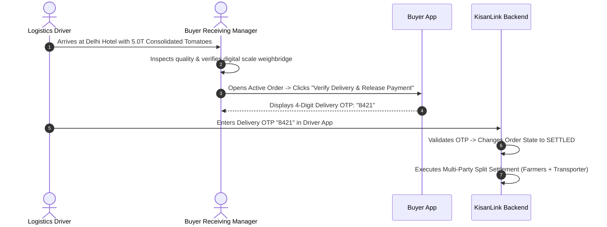

### 4.7 Bidirectional Rating & Repeat Order Flow
- Buyer rates Farmer Cluster: Quality (5/5), Fulfilment Accuracy (5/5).
- Farmers rate Buyer: Unloading Turnaround (5/5), Payment Promptness (5/5).
- Buyer can click **"Repeat Order"** to automatically initiate future procurement from the same farmer group.

---

## 5. Logistics Provider Flows

### 5.1 Carrier Onboarding & Vehicle Registration
- Transporter registers vehicle: Capacity (3.5T or 5.0T), Vehicle Type (Eicher / Tata 407 / Pickup), Operating Base (e.g., Murthal, Haryana).

### 5.2 Load Board Discovery & Job Acceptance
- Transporter views available pooled jobs:
  - **Route:** Sonipat ➔ Panipat ➔ Delhi NCR.
  - **Stops:** 4 Farm Gate Pickups ➔ 1 Drop-off.
  - **Payload:** 5,000 kg.
  - **Freight Payout:** ₹12,500.
- Transporter clicks **"Accept Dispatch Job"**.

### 5.3 Multi-Stop Farm Pickup & Manifest Execution
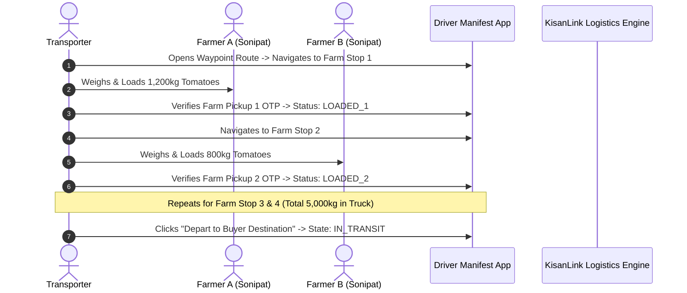

### 5.4 Delivery Handover & Freight Disbursement
- Driver arrives at Buyer warehouse.
- Buyer enters Delivery OTP.
- System automatically credits ₹12,500 freight payment to Transporter wallet.

---

## 6. Core System & Intelligence Flows

### 6.1 Demand & Supply Forecasting Flow
1. Nightly cron job executes LightGBM regression pipeline on regional APMC arrivals and buyer procurement trends.
2. Updates `demand_forecasts` table with 7-day and 14-day demand pressure index.
3. Farmer and Buyer UI consume `/api/v1/forecasts/regional` to render demand trend badges.

### 6.2 Fair Price Recommendation Flow
```
Inputs: Modal Mandi Price (₹19/kg) + Buyer Wholesale Benchmark (₹32/kg) + Transit Cost (₹2.20/kg)
   ↓
Formula: Fair Base = Mandi + 0.5 * (Wholesale - Mandi - Transit) = 19 + 0.5 * (32 - 19 - 2.20) = ₹24.40/kg
   ↓
Output Band: ₹23.50/kg to ₹26.00/kg (Rendered on Farmer & Buyer screens)
```

### 6.3 Dynamic Cluster Formulation Solver Flow
```mermaid
flowchart TD
    Req[Buyer Requirement: 5,000kg] --> SpatialFilter[PostGIS Query: Active/Pre-Harvest within 100km]
    SpatialFilter --> Candidates[Candidate Pool: 12 Farmers]
    Candidates --> MILP[SciPy MILP Solver\nMinimizes Distance & Price Variance]
    MILP --> Cluster[Dynamic Cluster Created:\nFarmer A: 1.2T | Farmer B: 0.8T | Farmer C: 1.7T | Farmer D: 1.3T]
    Cluster --> Preview[Render Sourcing Plan on Buyer UI]
```

### 6.4 Google OR-Tools Route Optimization Flow
1. Inputs: Depot coordinates, 4 Farm coordinates, 1 Buyer destination coordinate, 5.0T vehicle capacity.
2. Distance Matrix: Fetched asynchronously from OSRM table endpoint.
3. OR-Tools CVRP Solver executes Capacitated Vehicle Routing solver with 2-second time limit.
4. Returns optimal pickup order minimizing total km traveled: $\text{Depot} \rightarrow \text{Farm C} \rightarrow \text{Farm A} \rightarrow \text{Farm D} \rightarrow \text{Farm B} \rightarrow \text{Buyer}$.

### 6.5 Multi-Party Escrow Settlement Split Flow
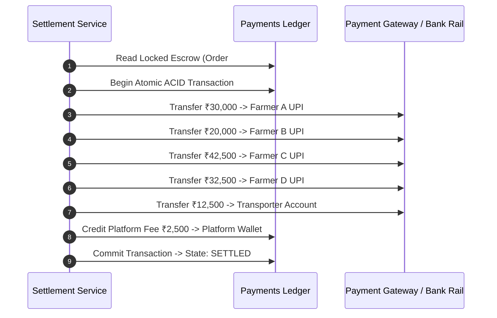

---

## 7. Exception & Fallback Flows

### 7.1 AI Voice Recognition Failure Fallback
```
[Farmer Speaks Audio] ➔ [Audio Transmission Timeout / Unclear Audio]
                               │
                [System Detects Low Confidence < 0.60]
                               │
            [App Displays Gentle Fallback Screen in Hindi]
       "माफ़ कीजिये, आवाज़ साफ नहीं आई। कृपया स्क्रीन पर फसल चुनें।"
                               │
         [Farmer Completes Step-by-Step Touch Wizard (1 Question/Screen)]
```

### 7.2 Routing Engine Network Timeout Fallback
- If the OSRM road matrix server times out ($> 2.0\text{ s}$), the system calculates pairwise Euclidean distances adjusted by a $1.3\times$ road-tortuosity factor and executes a greedy nearest-neighbor TSP algorithm.

### 7.3 Quantity / Quality Discrepancy at Farm Gate
- If Farmer A listed 1,200 kg but only loads 1,000 kg:
  1. Driver inputs actual scale weight ($1,000\text{ kg}$) into manifest check-in.
  2. Farmer confirms modified weight via SMS OTP.
  3. Escrow ledger automatically recalculates payout shares ($1,000 \times ₹25 = ₹25,000$) and refunds surplus ($200 \times ₹25 = ₹5,000$) to the buyer.

### 7.4 Order Cancellation & Escrow Refund Protocol
- **Cancellation Before Dispatch:** 100% full refund returned to buyer escrow account; listings reverted to `ACTIVE`.
- **Cancellation After Dispatch:** Transporter receives 100% guaranteed freight payment; produce redirected to nearby **Wastage Rescue** processor.

### 7.5 Offline / Low-Connectivity PWA Synchronization
```
[Farmer Submits Listing in Low-Network Khet]
                   │
     [No Active Internet Connection Detected]
                   │
[PWA Service Worker Stores Listing in Local IndexedDB]
                   │
[UI Displays: "ऑफ़लाइन सेव हुआ - नेटवर्क आते ही अपलोड होगा"]
                   │
     [Device Reconnects to 4G Network]
                   │
[Background Sync Worker Transmits Payload to FastAPI Backend]
```

---
*End of KisanLink End-to-End System Flows & State Machines*
