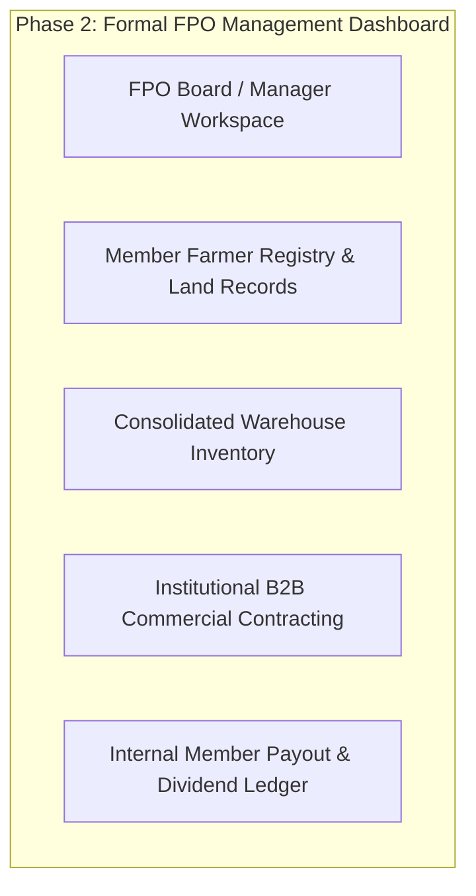
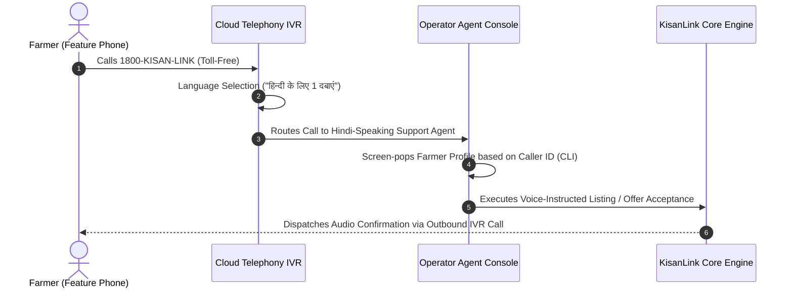

# KisanLink — Future Roadmap & Post-MVP Specifications

**Project Name:** KisanLink (Direct Farm-to-Buyer Operating System)  
**Problem Statement ID:** 26033 (Smart India Hackathon 2026)  
**Document Version:** 1.0.0  
**Status:** Approved Post-MVP Scope & Strategic Backlog  
**Scope Classification:** Phase 2+ Long-Term Vision (Strictly Excluded from Current SIH MVP)  
**Last Updated:** September 2026  

---

## Table of Contents

1. [Roadmap Governance & Scope Protection Principle](#1-roadmap-governance--scope-protection-principle)
2. [Post-MVP Phase Overview Timeline](#2-post-mvp-phase-overview-timeline)
3. [Track 1: Formal FPO Management System (Phase 2)](#3-track-1-formal-fpo-management-system-phase-2)
4. [Track 2: Platform Operations & Administration CRM (Phase 2)](#4-track-2-platform-operations--administration-crm-phase-2)
5. [Track 3: Cloud Telephony & Call Center Platform (Phase 3)](#5-track-3-cloud-telephony--call-center-platform-phase-3)
6. [Track 4: Government DPI & e-NAM National Integrations (Phase 3)](#6-track-4-government-dpi--e-nam-national-integrations-phase-3)
7. [Track 5: Deep Logistics & Cold-Chain IoT Telemetry (Phase 4)](#7-track-5-deep-logistics--cold-chain-iot-telemetry-phase-4)
8. [Track 6: Regulated Banking Escrow & Trade Financing (Phase 4)](#8-track-6-regulated-banking-escrow--trade-financing-phase-4)
9. [Track 7: Advanced Agronomic AI & Micro-Insurance (Phase 5)](#9-track-7-advanced-agronomic-ai--micro-insurance-phase-5)
10. [Strategic Decision Backlog & Triggers](#10-strategic-decision-backlog--triggers)

---

## 1. Roadmap Governance & Scope Protection Principle

> [!IMPORTANT]
> The features detailed in this document are **explicitly excluded from the SIH 2026 MVP**.  
> The MVP focuses strictly on proving the core economic engine: direct farmer listings, buyer reverse marketplace, dynamic algorithmic supply pooling (Dynamic Farmer Clusters), Google OR-Tools route optimization, simulated escrow, and real-time impact analytics.  
> Under no circumstances should engineering resources be diverted into building formal FPO modules or complex administrative CRMs during the MVP phase.

---

## 2. Post-MVP Phase Overview Timeline

```
+----------------------------------------------------------------------------------------------------+
|                                    LONG-TERM EVOLUTION ROADMAP                                     |
+------------------------------------+----------------------------------+----------------------------+
| PHASE 2 (Post-Hackathon Q4 2026)   | PHASE 3 (National Scaling 2027)  | PHASE 4 & 5 (Full OS 2028) |
+------------------------------------+----------------------------------+----------------------------+
| • Formal FPO Management Module     | • National e-NAM Gateway Sync    | • IoT Cold-Chain Telemetry |
| • Platform Operations Admin CRM    | • Cloud Telephony IVR Call Center| • Regulated Banking Escrow |
| • Extended Dispute Mediation Tool  | • AgriStack / IDEA DPI Auth      | • Trade Credit & Financing |
| • 8 Regional Indian Languages      | • Warehouse Partner Grid         | • Parametric Micro-Insur.  |
+------------------------------------+----------------------------------+----------------------------+
```

---

## 3. Track 1: Formal FPO Management System (Phase 2)

While the MVP algorithmically groups independent farmers into temporary **Dynamic Farmer Clusters**, Phase 2 introduces formal legal entity support for incorporated **Farmer Producer Organisations (FPOs)**:



### Planned Capabilities:
1. **FPO Onboarding & Legal Verification:** Registration via MCA / NABARD portal numbers, uploading FPO bylaws, and verifying board directors.
2. **Member Farmer Ledger:** Managing hundreds of shareholder farmers, their landholding acreage, and crop historical production.
3. **Collective Inventory & Aggregation Hubs:** Physical aggregation management at FPO collection centers with digital barcode labeling.
4. **Member Dividend & Settlement Engine:** Splitting institutional bulk contract revenues into individual member accounts after deducting FPO operational cess.

---

## 4. Track 2: Platform Operations & Administration CRM (Phase 2)

An internal back-office suite for platform operators, risk managers, and customer support supervisors.

### Planned Capabilities:
1. **Merchant & Farmer KYC Auditing:** Manual verification queue for GSTIN, FSSAI licenses, and farm land records.
2. **Dispute Resolution & Escrow Mediation Console:** Tri-party dispute arbitration interface (Buyer vs. Farmer vs. Transporter) with power to split disputed escrow allocations.
3. **Fraud & Risk Telemetry:** Automated flagging of unusual bidding behaviors, fake listings, and abnormal price drops.
4. **Supply Chain Digital Twin Command Center:** Macro monitoring of nationwide agricultural commodities, district-level deficits, and inflation warning indices.

---

## 5. Track 3: Cloud Telephony & Call Center Platform (Phase 3)

Transitioning from direct phone links to an enterprise cloud telephony and IVR platform (Exotel / Ozonetel integration):



---

## 6. Track 4: Government DPI & e-NAM National Integrations (Phase 3)

Connecting KisanLink into India's Digital Public Infrastructure (DPI) ecosystem:
1. **National e-NAM Electronic Trading Platform:** Direct API bridge allowing KisanLink farmer clusters to bid on national APMC electronic trading lots.
2. **AgriStack / IDEA Integration:** Validating farmer identity and land ownership through government digital farmer registries.
3. **PM-Kisan & Soil Health Card Data Sync:** Fetching localized soil nutrient data to refine crop yield forecasting.

---

## 7. Track 5: Deep Logistics & Cold-Chain IoT Telemetry (Phase 4)

1. **BLE / LoRa Transit Telemetry:** Integrating low-cost Bluetooth/LoRa temperature and humidity sensors in refrigerated trucks.
2. **Automated Spoilage Penalty Triggers:** If temperature exceeds critical thresholds (e.g., $> 12^\circ\text{C}$ for tomatoes) during transit, smart contracts adjust delivery payouts automatically.
3. **3PL Carrier Exchange:** Direct API integration with commercial freight aggregators for automated spot bidding.

---

## 8. Track 6: Regulated Banking Escrow & Trade Financing (Phase 4)

1. **Licensed Banking Partner Escrow (Trust Accounts):** Integration with scheduled commercial banks (e.g., ICICI / HDFC / SBI) operating regulated tripartite escrow accounts.
2. **Agricultural Input Credit & Trade Financing:** Underwriting 30-day procurement credit for verified bulk buyers based on historical platform transaction ratings.
3. **Parametric Weather Insurance:** Micro-insurance policies that disburse payouts automatically when satellite telemetry detects unseasonal rainfall.

---

## 9. Track 7: Advanced Agronomic AI & Micro-Insurance (Phase 5)

1. **Multi-Spectral Drone & Satellite CV Grading:** Analyzing multispectral satellite imagery to estimate harvest maturity dates 30 days in advance.
2. **Hyper-Local Pest & Weather Risk Advisory:** Pushing proactive agronomic alerts to farmers based on localized micro-climate models.

---

## 10. Strategic Decision Backlog & Triggers

| Feature Track | Trigger for Activation | Required Prerequisite |
|---|---|---|
| **FPO Module** | $> 20$ registered FPO partnerships | Phase 1 MVP completion |
| **Admin Operations CRM** | $> 500$ daily commercial orders | Core database schema stability |
| **Cloud Telephony IVR** | $> 1,000$ daily incoming farmer support calls | Toll-free telecom licensing |
| **Banking Escrow Rails** | Cumulative platform GMV $> ₹10\text{ Crore}$ | RBI regulatory sandbox approval |
| **IoT Cold-Chain Telemetry** | Inter-state refrigerated shipments $> 100\text{ monthly}$ | Carrier fleet partner onboarded |

---
*End of KisanLink Future Roadmap & Post-MVP Specifications*
