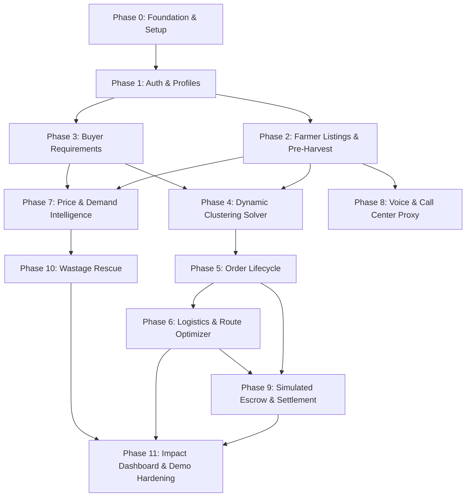

# KisanLink — System Implementation Plan & Technical Roadmap

**Project Name:** KisanLink (Direct Farm-to-Buyer Operating System)  
**Problem Statement ID:** 26033 (Smart India Hackathon 2026)  
**Document Version:** 1.0.0  
**Status:** Approved Engineering Blueprint  
**Target Stack:** FastAPI (Python 3.11+) + PostgreSQL (v16 with PostGIS) + React 18 / Vite (TypeScript, Tailwind CSS, MapLibre GL JS) + Google OR-Tools  
**Last Updated:** September 2026  

---

## Table of Contents

1. [Current Repository Assessment](#1-current-repository-assessment)
2. [Existing Features & Baseline](#2-existing-features--baseline)
3. [Missing Features & Gap Analysis](#3-missing-features--gap-analysis)
4. [System Architecture & Core Patterns](#4-system-architecture--core-patterns)
5. [Domain Model & Entity-Relationship Specifications](#5-domain-model--entity-relationship-specifications)
6. [Backend Engineering Work Breakdown](#6-backend-engineering-work-breakdown)
7. [Frontend Engineering Work Breakdown](#7-frontend-engineering-work-breakdown)
8. [Farmer Experience Engineering (Ultra-Simplified UI)](#8-farmer-experience-engineering-ultra-simplified-ui)
9. [Buyer Experience Engineering (B2B Procurement & B2C)](#9-buyer-experience-engineering-b2b-procurement--b2c)
10. [Logistics & Fleet Dispatch Engineering](#10-logistics--fleet-dispatch-engineering)
11. [AI, ML & Mathematical Optimization Work](#11-ai-ml--mathematical-optimization-work)
12. [Maps, Spatial Indexing & Geolocation](#12-maps-spatial-indexing--geolocation)
13. [Payment, Escrow Simulation & Payout Splitting](#13-payment-escrow-simulation--payout-splitting)
14. [Contextual Notification Subsystem](#14-contextual-notification-subsystem)
15. [Multilingual & Speech Processing Subsystem](#15-multilingual--speech-processing-subsystem)
16. [Call-Center Assisted Access & Proxy Architecture](#16-call-center-assisted-access--proxy-architecture)
17. [Verification & Testing Strategy](#17-verification--testing-strategy)
18. [Security, Authentication & Input Validation](#18-security-authentication--input-validation)
19. [Observability, Telemetry & Logging](#19-observability-telemetry--logging)
20. [Seed Data & Golden Path Corridor Configuration](#20-seed-data--golden-path-corridor-configuration)
21. [SIH 2026 Golden Path Demo Script & Runbook](#21-sih-2026-golden-path-demo-script--runbook)
22. [Deployment & Containerization Architecture](#22-deployment--containerization-architecture)
23. [Phased Implementation Roadmap (Phase 0 – Phase 11)](#23-phased-implementation-roadmap-phase-0--phase-11)
24. [Dependency Graph & Critical Path](#24-dependency-graph--critical-path)
25. [Engineering Risk & Mitigation Matrix](#25-engineering-risk--mitigation-matrix)
26. [Definition of Done (DoD)](#26-definition-of-done-dod)

---

## 1. Current Repository Assessment

### 1.1 Codebase State
- **Root Directory:** `/Users/vansh/Documents/Hackathons/KisanLink`
- **Current Structure:** Clean, green-field workspace with complete documentation specifications in `DOCS/`.
- **Active Documents:**
  - `DOCS/PRD.md`: Master Product Requirements Document.
  - `DOCS/TRD.md`: Technical Requirements & Architecture Document.
  - `DOCS/FLOWS.md`: End-to-End System Flows & State Machines.
  - `DOCS/UI_UX_DESIGN.md`: UI/UX Design System & Wireframes.
  - `DOCS/API_DESIGN.md`: REST API & WebSocket Specifications.
  - `DOCS/DATABASE_DESIGN.md`: Database Schema & PostGIS Specifications.
  - `DOCS/AI_SYSTEMS.md`: AI, ML & Optimization Specifications.
  - `DOCS/DEPLOYMENT.md`: Deployment & Infrastructure Guide.
  - `DOCS/FUTURE_ROADMAP.md`: Future Roadmap & Post-MVP Specifications.
  - `DOCS/IMPLEMENTATION_PLAN.md`: System Implementation Plan & Roadmap.

### 1.2 Architectural Decisions & Alignment
- **Architecture Style:** **Modular Monolith** with cleanly separated domain services (Marketplace, Clustering, Optimization, Intelligence, Payments, Logistics, Assisted Access).
- **Backend Selection:** **FastAPI (Python 3.11+)** chosen for native asynchronous performance, strict Pydantic v2 data validation, and first-class integration with Python scientific/optimization libraries (`ortools`, `lightgbm`, `numpy`, `pandas`, `scipy`).
- **Frontend Selection:** **Single React 18 + Vite (TypeScript)** configured as a Progressive Web App (PWA) with Tailwind CSS, MapLibre GL JS, and role shells (`/farmer`, `/buyer`, `/logistics`), ensuring fast mobile rendering, offline service-worker caching, and responsive layouts across farmer mobile screens and buyer desktop monitors.
- **Database Selection:** **PostgreSQL 16** with spatial extension (**PostGIS**) for native geodetic bounding box queries and distance matrix indexing.

---

## 2. Existing Features & Baseline

| Area | Current Status | Notes |
|---|---|---|
| Documentation Base | **Complete (v1.0)** | Master PRD and Implementation Plan established. |
| Application Code | **Not Started** | Clean baseline ready for Phase 0 scaffolding. |
| Database Schema | **Specified** | SQL DDL & SQLAlchemy models ready for generation. |
| Mock/Seed Datasets | **Specified** | Delhi NCR agricultural corridor data prepared for seeding. |

---

## 3. Missing Features & Gap Analysis

To deliver the end-to-end SIH 2026 golden path, the following modules must be engineered across phases:

```
[Missing Feature Backlog]
├── Core Authentication & User Roles (Farmer, Buyer, Transporter, Operator)
├── Farmer Ultra-Simple Listing Engine (Current + Pre-Harvest crops)
├── Native Hindi/English Voice Parsing & Audio Transcription
├── Buyer Reverse Marketplace (Procurement Requirement Posting)
├── Dynamic Farmer Supply Clustering (Mixed-Integer Linear Pooling Solver)
├── Google OR-Tools Multi-Stop Route Optimizer for Shared Pickups
├── Indicative Fair-Price Guidance Engine with APMC Mandi Benchmarks
├── Regional Demand Forecasting Engine (High / Normal / Low Status)
├── Digital Supply-Demand Map & Geographic Hotspot Twin
├── Simulated Escrow Payment & Multi-Party Automated Settlement Splits
├── Wastage Rescue & Dynamic Distress-Sale Pricing
├── Assisted Call-Center Operator Proxy Mode
└── Real-Time SIH Impact Analytics Engine (Farmer Delta, Savings, Wastage)
```

---

## 4. System Architecture & Core Patterns

```mermaid
graph TD
    classDef client fill:#e1f5fe,stroke:#0288d1,stroke-width:2px;
    classDef gateway fill:#ede7f6,stroke:#512da8,stroke-width:2px;
    classDef backend fill:#e8f5e9,stroke:#2e7d32,stroke-width:2px;
    classDef ai fill:#fff3e0,stroke:#e65100,stroke-width:2px;
    classDef db fill:#fbe9e7,stroke:#d84315,stroke-width:2px;

    subgraph Client_Tier [Client Presentation Layer (React 18 + Vite PWA)]
        FarmerApp["Farmer UI (Simplified 6-Card + Voice + Hindi)"]:::client
        BuyerApp["Buyer Dashboard (Reverse Mkt + Calendar + Twin)"]:::client
        LogisticsApp["Transporter Load Board (Route Sheet + GPS)"]:::client
        OperatorApp["Call Center Operator Proxy Workspace"]:::client
    end

    subgraph API_Tier [API Gateway & Ingress Layer]
        FastAPI_Gateway["FastAPI Gateway (JWT Auth, Rate Limiter, CORS)"]:::gateway
    end

    subgraph Core_Services [Modular Domain Services Layer]
        AuthService["Auth & Profile Service"]:::backend
        MarketplaceService["Listing & Requirement Service"]:::backend
        ClusteringService["Dynamic Supply Clustering Engine"]:::backend
        OrderEscrowService["Order State & Simulated Escrow Engine"]:::backend
        LogisticsService["Logistics & Dispatch Service"]:::backend
        ImpactService["Impact Metrics Calculation Service"]:::backend
    end

    subgraph Intelligence_Tier [AI, Analytics & Optimization Engines]
        ORTools["Google OR-Tools (Routing & Clustering Solvers)"]:::ai
        DemandForecast["Demand & Price Forecasting (LightGBM/XGB)"]:::ai
        VoiceNLP["Voice Intent Parser (Web Speech + LLM/Whisper)"]:::ai
        CVGrading["Indicative Quality Grading (Vision API)"]:::ai
    end

    subgraph Storage_Tier [Persistence Layer]
        PostgresDB[("PostgreSQL 16 + PostGIS\n(Relational & Spatial Core)")]:::db
        RedisCache[("Redis (Optional Session & Rate Limiter)")]:::db
    end

    Client_Tier -->|HTTPS / REST / WS| FastAPI_Gateway
    FastAPI_Gateway --> Core_Services
    Core_Services --> Intelligence_Tier
    Core_Services --> Storage_Tier
```

---

## 5. Domain Model & Entity-Relationship Specifications

### 5.1 Core Relational Entities

```
+--------------------------------------------------------------------------------------------------+
|                                    CORE DOMAIN ENTITIES                                          |
+-------------------+-------------------+--------------------+------------------+------------------+
| users             | crops             | buyer_requirements | orders           | payments_ledger  |
| farmer_profiles   | crop_listings     | dynamic_clusters   | order_items      | impact_metrics   |
| buyer_profiles    | harvest_schedules | cluster_items      | shipments        | dispute_tickets  |
| transporter_profs | price_records     | vehicle_manifests  | route_waypoints  | operator_audit   |
+-------------------+-------------------+--------------------+------------------+------------------+
```

### 5.2 Key Schema Relationships
- `users (1)` ➔ `(1) farmer_profiles` OR `buyer_profiles` OR `transporter_profiles`
- `farmer_profiles (1)` ➔ `(N) crop_listings` (with `is_pre_harvest: boolean`, `harvest_date: date`)
- `buyer_requirements (1)` ➔ `(N) cluster_matches`
- `dynamic_clusters (1)` ➔ `(N) cluster_items` (linking individual `crop_listings` with allocated weights $Q_i$)
- `orders (1)` ➔ `(1) dynamic_clusters` (or single listing) + `(1) shipments` + `(N) payments_ledger` entries
- `shipments (1)` ➔ `(N) route_waypoints` (ordered pickup stops $1 \dots k$ followed by buyer drop-off)

---

## 6. Backend Engineering Work Breakdown

```
backend/
├── app/
│   ├── api/
│   │   ├── v1/
│   │   │   ├── auth.py              # OTP login, role assignment, JWT refresh
│   │   │   ├── listings.py          # Farmer listings (CRUD, pre-harvest, voice)
│   │   │   ├── requirements.py      # Buyer reverse marketplace postings
│   │   │   ├── matching.py          # Cluster matching & recommendation API
│   │   │   ├── orders.py            # Order lifecycle & state transitions
│   │   │   ├── logistics.py         # Route optimization & shipment tracking
│   │   │   ├── pricing.py           # Fair-price guidance & mandi benchmarks
│   │   │   ├── forecasting.py       # Demand & supply forecast projections
│   │   │   ├── rescue.py            # Wastage rescue / urgent sale tagging
│   │   │   ├── impact.py            # Real-time SIH impact calculations
│   │   │   └── operator.py          # Call center proxy actions & audit log
│   ├── core/
│   │   ├── config.py                # Environment settings & Pydantic Config
│   │   ├── database.py              # SQLAlchemy async engine & sessionmaker
│   │   └── security.py              # Passwordless OTP, JWT signing & verification
│   ├── models/                      # SQLAlchemy ORM models (PostGIS enabled)
│   ├── schemas/                     # Pydantic v2 request/response schemas
│   ├── services/                    # Pure business logic & service handlers
│   └── intelligence/                # AI, ML, OR-Tools solvers & parsers
```

---

## 7. Frontend Engineering Work Breakdown

```
frontend/
├── public/
│   ├── icons/                       # Crop icons, role badges, PWA manifests
│   └── locales/                     # i18n JSON bundles (en.json, hi.json)
├── src/
│   ├── app/
│   │   ├── (auth)/login/            # Mobile OTP onboarding screen
│   │   ├── (farmer)/dashboard/      # 6-Card Farmer Home & voice interface
│   │   ├── (farmer)/sell/           # Sell crop wizard (touch + voice + pricing)
│   │   ├── (buyer)/dashboard/       # B2B Procurement workspace & requirement poster
│   │   ├── (buyer)/marketplace/     # Forward supply catalog & calendar
│   │   ├── (buyer)/twin-map/        # Digital Supply-Demand map & hotspot visualizer
│   │   ├── (logistics)/loads/       # Transporter load board & multi-stop route navigator
│   │   ├── (shared)/orders/[id]/    # Order tracking, escrow status, & PoD sign-off
│   │   ├── (public)/impact/         # Public live SIH impact tracker
│   │   └── (operator)/assisted/     # Call-center tele-support proxy workspace
│   ├── components/
│   │   ├── ui/                      # Touch-friendly button cards, modals, steppers
│   │   ├── voice/                   # Audio recording microphone widget & feedback
│   │   ├── maps/                    # MapLibre GL JS route renderer
│   │   └── common/                  # Call Support persistent floating widget, language toggle
│   ├── hooks/                       # Custom hooks (useVoice, useLocation, useAuth)
│   └── lib/                         # API client, i18n runtime, formatters
```

---

## 8. Farmer Experience Engineering (Ultra-Simplified UI)

### 8.1 Core Principles & UI Rules
- **Rule 1: Maximum 6 Primary Touch Cards on Home:**
  1. `🌾 Sell My Crop / अपनी फसल बेचें`
  2. `🔍 Find Buyers / खरीदार खोजें`
  3. `📦 My Orders / मेरे ऑर्डर`
  4. `🚚 Transport / गाड़ी / वाहन`
  5. `💰 Payments / भुगतान / खाते`
  6. `🤖 Speak to AI / बोलकर बताएं`
- **Rule 2: Persistent Toll-Free Call Support:**
  - Red/green high-visibility floating action button on every screen: `🔴 Call Support / हमसे बात करें (1800-XXX-XXXX)`.
- **Rule 3: One-Tap Language Switch:**
  - Sticky header toggle: `[हिन्दी | English]`.
- **Rule 4: Zero Jargon:**
  - Display net money earned in rupees ($\text{₹}$) and kilograms ($\text{kg}$), never percentages or abstract indices.

---

## 9. Buyer Experience Engineering (B2B Procurement & B2C)

### 9.1 B2B Reverse Marketplace Poster
- Form allowing buyers to define procurement specs:
  - Crop: Selection from structured list (e.g., Tomato, Onion).
  - Target Quantity: Stepper/Input (e.g., 5,000 kg).
  - Grade: Grade A / Grade B / Process Grade.
  - Delivery Location: Pincode / GPS address.
  - Required By: Date picker.
  - Ceiling Price: Max landed price per kg.
- **Dynamic Cluster Preview:** Displays instant matching breakdown:
  *"4 nearby farmers identified in Sonipat/Panipat. Combined yield: 5,000 kg. Estimated price: ₹25.10/kg."*

### 9.2 Forward Crop Availability Calendar
- Visual Gantt / Matrix view showing harvest forecasts across 1–4 weeks.

---

## 10. Logistics & Fleet Dispatch Engineering

### 10.1 Multi-Stop Route Optimization
- Integrates **Google OR-Tools Capacitated Vehicle Routing Problem (CVRP)** solver:
  - Input: Vehicle capacity (e.g., 3.5T LCV), depot location, farmer pickup coordinates ($lat_i, lon_i$), pickup weights ($w_i$), buyer destination.
  - Output: Sequential optimal waypoint sequence minimizing total distance and transit hours.
- Visual turn-by-turn waypoint list with driver pickup verification check-ins.

### 10.2 Load Pooling Engine
- Automatically aggregates multiple smaller shipments into a single vehicle run to achieve $> 85\%$ capacity utilization.

---

## 11. AI, ML & Mathematical Optimization Work

```
+----------------------------------------------------------------------------------------------------+
|                                    INTELLIGENCE ENGINE WORKSTREAM                                  |
+------------------------------+----------------------------------+----------------------------------+
|      AI / ML SUBSYSTEM       |         ALGORITHM / MODEL        |          PRIMARY FUNCTION        |
+------------------------------+----------------------------------+----------------------------------+
| Demand Forecasting           | LightGBM / XGBoost Regressor     | Predict regional crop demand     |
|                              | + Seasonal trend decomposition   | (High / Normal / Low status)     |
+------------------------------+----------------------------------+----------------------------------+
| Dynamic Farmer Clustering    | Mixed-Integer Linear Program     | Pool multiple farm supplies to   |
|                              | (MILP via SciPy / PuLP)          | satisfy bulk buyer requirements  |
+------------------------------+----------------------------------+----------------------------------+
| Logistics Route Optimization | Google OR-Tools (CVRP solver)    | Optimal multi-farm pickup order  |
|                              | + OSRM distance matrix           | and buyer delivery path          |
+------------------------------+----------------------------------+----------------------------------+
| Voice NLP Intent Parser      | Web Speech API / Whisper STT     | Parse spoken Hindi/English into  |
|                              | + Structured LLM Intent Extractor| structured listing JSON          |
+------------------------------+----------------------------------+----------------------------------+
| Indicative CV Grading        | MobileNetV3 / Vision API         | Estimate surface defects, color, |
| (Stretch Feature)            | lightweight classifier           | & quality grade (A/B/C)          |
+------------------------------+----------------------------------+----------------------------------+
```

---

## 12. Maps, Spatial Indexing & Geolocation

- **Spatial Coordinate Storage:** PostGIS `GEOGRAPHY(Point, 4326)` for farmer farm gates, buyer drop-offs, and logistics depots.
- **Spatial Proximity Queries:** PostGIS `ST_DWithin` queries for rapid sub-50ms candidate filtering within radius $R \le 150\text{ km}$.
- **Interactive UI Map:** Leaflet.js / OpenStreetMap tile layer with custom SVG markers for farm clusters, transit trucks, and delivery hubs.

---

## 13. Payment, Escrow Simulation & Payout Splitting

### 13.1 Simulated Escrow Lifecycle
1. `ORDER_CREATED`: Order placed; payment intent generated.
2. `ESCROW_LOCKED`: Buyer authorizes payment; funds secured in platform holding ledger.
3. `DISPATCHED`: Transporter picks up produce; pickup OTPs verified.
4. `DELIVERY_CONFIRMED`: Buyer signs digital PoD OTP.
5. `SETTLEMENT_EXECUTED`: Escrow executes multi-split transfer:
   $$\text{Total Paid} = \sum_{i=1}^k \text{Payout}_{\text{Farmer } i} + \text{Payout}_{\text{Logistics}} + \text{Fee}_{\text{Platform}}$$

---

## 14. Contextual Notification Subsystem

Automated contextual push/SMS notifications:
- Farmer: *"Buyer found for your 1,200kg tomatoes! Net payout: ₹30,000. Tap to accept."*
- Transporter: *"New pickup route assigned: 4 farm stops in Sonipat. Total load: 5.0 tonnes."*
- Buyer: *"Your tomato consignment has departed Farm Stop #4. ETA: 4:30 PM."*
- Wastage Alert: *"Your cauliflower listing reaches harvest maturity in 48 hours. Enable Urgent Rescue Sale?"*

---

## 15. Multilingual & Speech Processing Subsystem

- **Runtime Localization:** React i18next engine supporting instant toggling between **Hindi (hi)** and **English (en)** without page reload.
- **Voice Flow:**
  1. User holds microphone button on mobile screen.
  2. Audio recorded via MediaStream API.
  3. Transcribed text processed by backend `/api/v1/listings/parse-voice`.
  4. Response returns pre-filled listing form modal for one-tap confirmation.

---

## 16. Call-Center Assisted Access & Proxy Architecture

- Dedicated Operator route: `/assisted-support`.
- Operator enters farmer's mobile number ➔ Sends 4-digit verification code to farmer.
- Farmer reads code over the phone ➔ Operator enters code to unlock **Proxy Mode**.
- Operator interface displays:
  - Farmer active listings.
  - Incoming buyer offers with fair-price indicators.
  - New listing creation form (Operator enters details given verbally).
- Every proxy action records: `created_by: "CALL_CENTER_AGENT"`, `agent_id: "AGENT-07"`.

---

## 17. Verification & Testing Strategy

```
+----------------------------------------------------------------------------------------------------+
|                                    TESTING & VERIFICATION MATRIX                                   |
+----------------------+---------------------------------+-------------------------------------------+
| TEST SUITE           | TOOLS & FRAMEWORKS              | COVERAGE FOCUS                            |
+----------------------+---------------------------------+-------------------------------------------+
| Unit Tests           | `pytest`, `pytest-asyncio`      | Services, price calculations, state flows |
| Integration Tests    | `httpx`, `pytest-mock`          | FastAPI endpoint contracts, DB migrations |
| Optimization Tests   | `pytest`, Google OR-Tools       | Route solver convergence & clustering math|
| E2E Golden Path      | Playwright / Synthetic runner   | 8-Step SIH Demo scenario execution        |
| Frontend Type Check  | `tsc --noEmit`                  | TypeScript strict mode adherence          |
+----------------------+---------------------------------+-------------------------------------------+
```

---

## 18. Security, Authentication & Input Validation

- **Auth Token:** Stateless JWT containing user UUID, role, and expiry ($24\text{ hours}$).
- **Passwordless OTP:** 6-digit cryptographically secure random token with 5-minute TTL.
- **Input Sanitization:** Strict Pydantic v2 validation on all numeric bounds (quantities $> 0$, prices within sane agricultural limits).
- **CORS & Rate Limiting:** Restricted CORS headers; sliding-window rate limiting on OTP request endpoints (max 3 per 5 minutes per IP/phone).

---

## 19. Observability, Telemetry & Logging

- Structured JSON logging with `structlog` containing `request_id`, `user_id`, `path`, and `duration_ms`.
- Health check endpoints: `/healthz` (service status) and `/readyz` (database connectivity).

---

## 20. Seed Data & Golden Path Corridor Configuration

Deterministic seed script `seed_demo_data.py` populating the **Delhi NCR – Haryana Agricultural Corridor**:
- **Farmers:**
  - `Farmer 1 (Ramesh)`: Sonipat (Lat: 28.99, Lon: 77.01) — 1,200 kg Tomatoes, Grade A, Available in 3 days, ₹25/kg.
  - `Farmer 2 (Suresh)`: Sonipat (Lat: 29.02, Lon: 77.05) — 800 kg Tomatoes, Grade A, Available in 3 days, ₹25/kg.
  - `Farmer 3 (Balbir)`: Panipat (Lat: 29.39, Lon: 76.96) — 1,700 kg Tomatoes, Grade A, Available in 4 days, ₹24.50/kg.
  - `Farmer 4 (Jaipal)`: Panipat (Lat: 29.35, Lon: 77.02) — 1,300 kg Tomatoes, Grade A, Available in 3 days, ₹25.50/kg.
- **Buyer:**
  - `The Imperial Hotel / Commercial Kitchen`: Connaught Place, New Delhi (Lat: 28.63, Lon: 77.21) — Requirement: 5,000 kg Tomatoes @ max ₹28/kg.
- **Transporter:**
  - `KisanExpress Freight (Gurpreet)`: 1x 5.0-Tonne Eicher Pro Truck located at Murthal Hub (Lat: 29.03, Lon: 77.07).

---

## 21. SIH 2026 Golden Path Demo Script & Runbook

```
+----------------------------------------------------------------------------------------------------+
|                                 SIH 2026 GOLDEN PATH DEMO RUNBOOK                                  |
+------+----------------------+-------------------------------+--------------------------------------+
| STEP | SCREEN / ACTOR       | ACTION                        | SYSTEM RESPONSE & JUDGE TAKEAWAY     |
+------+----------------------+-------------------------------+--------------------------------------+
| 1    | Farmer UI (Ramesh)   | Tap "Sell Crop" -> Speak      | Voice parsed: 1.2T Tomatoes @ ₹25/kg |
|      | (Sonipat)            | "Mere paas 1200 kilo tamatar" | Fair Price Engine shows ₹23-26 band. |
+------+----------------------+-------------------------------+--------------------------------------+
| 2    | Buyer UI             | Open Reverse Marketplace ->   | System searches supply corridor      |
|      | (Delhi Hotel)        | Post "Need 5,000kg Tomatoes"  | within 100 km radius.                |
+------+----------------------+-------------------------------+--------------------------------------+
| 3    | Matching Engine      | Click "Generate Sourcing Plan"| Combines Farmers A+B+C+D into 5.0T   |
|      |                      |                               | Dynamic Cluster #TC-104.             |
+------+----------------------+-------------------------------+--------------------------------------+
| 4    | Buyer UI             | Accept Plan & Lock Escrow     | ₹1,37,500 locked in simulated escrow.|
|      |                      |                               | SMS sent to all 4 farmers.           |
+------+----------------------+-------------------------------+--------------------------------------+
| 5    | Logistics UI         | View Dispatch Route Sheet     | Google OR-Tools renders multi-pickup |
|      | (Gurpreet Truck)     |                               | route: Depot -> A -> B -> C -> D ->  |
|      |                      |                               | Delhi. Distance: 112 km.             |
+------+----------------------+-------------------------------+--------------------------------------+
| 6    | Delivery Sign-Off    | Buyer enters Delivery OTP     | Delivery confirmed; Escrow splits:   |
|      |                      |                               | Farmers get ₹1.25L, Truck gets ₹12.5K|
+------+----------------------+-------------------------------+--------------------------------------+
| 7    | Live Impact Screen   | View SIH Impact Dashboard     | Farmer Gain: +32.4% | Buyer Save:    |
|      |                      |                               | 18.1% | Km Saved: 68 km.             |
+------+----------------------+-------------------------------+--------------------------------------+
```

---

## 22. Deployment & Containerization Architecture

- Single-command local developer boot: `docker-compose up --build`.
- Containers:
  1. `kisanlink-db`: PostgreSQL 16 with PostGIS extension (`postgis/postgis:16-3.4`).
  2. `kisanlink-backend`: FastAPI backend server (`uvicorn app.main:app --host 0.0.0.0 --port 8000`).
  3. `kisanlink-frontend`: Next.js production server (`node server.js` or `npm run dev` on port 3000).

---

## 23. Phased Implementation Roadmap (Phase 0 – Phase 11)

```
+----------------------------------------------------------------------------------------------------+
|                                    PHASED IMPLEMENTATION TIMELINE                                  |
+----------------------------------------------------------------------------------------------------+
| PHASE 0  : Foundation, Scaffolding & Repository Setup                                              |
| PHASE 1  : Auth, User Profiles & Role Selection                                                    |
| PHASE 2  : Farmer Listings & Pre-Harvest Engine                                                    |
| PHASE 3  : Buyer Requirements & Reverse Marketplace                                                |
| PHASE 4  : Matching Engine & Dynamic Farmer Supply Pooling                                         |
| PHASE 5  : Order Lifecycle & Negotiation Protocols                                                 |
| PHASE 6  : Logistics, Load Pooling & Google OR-Tools Routing                                       |
| PHASE 7  : Demand Forecasting & Fair-Price Intelligence Engine                                     |
| PHASE 8  : Voice Input, Multilingual UI & Call-Center Proxy Mode                                   |
| PHASE 9  : Escrow Payment Simulation & Settlement Ledger                                            |
| PHASE 10 : Wastage Rescue & Dynamic Distress Pricing                                               |
| PHASE 11 : Impact Analytics, Digital Twin Map & SIH Demo Hardening                                 |
+----------------------------------------------------------------------------------------------------+
```

### Phase 0: Foundation, Scaffolding & Repository Setup
- **Objective:** Initialize clean project structure, dependencies, Docker configurations, and base database migrations.
- **Frontend Work:** Initialize Next.js 14 TypeScript app, Tailwind CSS configuration, Lucide icon set, and base layout shell.
- **Backend Work:** Initialize FastAPI app, Pydantic settings, SQLAlchemy PostGIS base model, and CORS middleware.
- **Dependencies:** None.
- **Acceptance Criteria:** `docker-compose up` launches backend on `:8000` and frontend on `:3000` with clean health checks.

### Phase 1: Auth, User Profiles & Role Selection
- **Objective:** Enable phone OTP authentication and profile setup for Farmers, Buyers, Transporters, and Support Agents.
- **Frontend Work:** Mobile OTP modal, role selector card, profile setup wizard.
- **Backend Work:** `/api/v1/auth/request-otp`, `/api/v1/auth/verify-otp`, JWT issuance, User and Profile models.
- **Dependencies:** Phase 0.
- **Acceptance Criteria:** User can register with mobile number and select role; JWT persisted in client state.

### Phase 2: Farmer Listings & Pre-Harvest Engine
- **Objective:** Allow farmers to list current and upcoming (pre-harvest) crops with asking price, photos, and location.
- **Frontend Work:** Simplified 6-card farmer home, crop listing wizard with crop selection grid and date picker.
- **Backend Work:** `/api/v1/listings` CRUD, spatial coordinate persistence, pre-harvest flags.
- **Dependencies:** Phase 1.
- **Acceptance Criteria:** Farmer can create and view active and pre-harvest crop listings.

### Phase 3: Buyer Requirements & Reverse Marketplace
- **Objective:** Allow bulk buyers to publish procurement requirements and browse forward crops.
- **Frontend Work:** Buyer requirement posting form, forward crop availability calendar view.
- **Backend Work:** `/api/v1/requirements` CRUD, spatial proximity search endpoint.
- **Dependencies:** Phase 2.
- **Acceptance Criteria:** Buyer can post 5,000kg requirement and see matched nearby supplies.

### Phase 4: Matching Engine & Dynamic Farmer Supply Pooling
- **Objective:** Build algorithm to combine multiple small farmers into temporary supply clusters.
- **Frontend Work:** Dynamic cluster sourcing card displaying combined farmer contributions and payout shares.
- **Backend Work:** `/api/v1/matching/cluster` solver integrating MILP aggregation logic.
- **Dependencies:** Phase 3.
- **Acceptance Criteria:** Given a 5,000kg requirement, solver selects 4 farmers (1.2T + 0.8T + 1.7T + 1.3T) within 30km radius.

### Phase 5: Order Lifecycle & Negotiation Protocols
- **Objective:** Complete offer-counteroffer flow and order confirmation state machine.
- **Frontend Work:** Offer review card, counter-offer input, order confirmation screen.
- **Backend Work:** Order state machine (`DRAFT` ➔ `CONFIRMED` ➔ `DISPATCHED` ➔ `DELIVERED`).
- **Dependencies:** Phase 4.
- **Acceptance Criteria:** Buyer accepts cluster sourcing plan; all 4 farmers receive order confirmation.

### Phase 6: Logistics, Load Pooling & Google OR-Tools Routing
- **Objective:** Optimize multi-farm pickup routes and assign vehicles.
- **Frontend Work:** Transporter load board, interactive route map with ordered waypoint stops.
- **Backend Work:** `/api/v1/logistics/optimize-route` executing Google OR-Tools CVRP solver.
- **Dependencies:** Phase 5.
- **Acceptance Criteria:** Multi-stop pickup route generated in $< 1.5\text{s}$ with total distance and turn-by-turn stop order.

### Phase 7: Demand Forecasting & Fair-Price Intelligence Engine
- **Objective:** Provide indicative price bands and regional demand predictions.
- **Frontend Work:** Fair-price guidance badge on farmer listing form, buyer market price comparison chart.
- **Backend Work:** `/api/v1/pricing/guidance`, `/api/v1/forecasting/regional` with historical mandi reference data.
- **Dependencies:** Phase 2, Phase 3.
- **Acceptance Criteria:** Listing form recommends ₹23–₹26/kg band when mandi benchmark is ₹19/kg.

### Phase 8: Voice Input, Multilingual UI & Call-Center Proxy Mode
- **Objective:** Enable voice-driven listing creation, Hindi localization, and call-center operator proxy mode.
- **Frontend Work:** Speech recognition microphone button, language switcher toggle, operator proxy console.
- **Backend Work:** `/api/v1/listings/parse-voice` NLP intent parser, operator proxy audit logging.
- **Dependencies:** Phase 2, Phase 7.
- **Acceptance Criteria:** Spoken Hindi sentence creates pre-filled listing; operator can create listing on farmer's behalf.

### Phase 9: Escrow Payment Simulation & Settlement Ledger
- **Objective:** Secure buyer funds on order placement and execute automated split payouts upon delivery.
- **Frontend Work:** Escrow status badge, transparent financial breakdown modal, farmer payout history.
- **Backend Work:** `/api/v1/orders/{id}/lock-escrow`, `/api/v1/orders/{id}/confirm-delivery-payout`.
- **Dependencies:** Phase 5, Phase 6.
- **Acceptance Criteria:** On buyer OTP confirmation, escrow balance splits into 4 individual farmer payouts and 1 transporter payout.

### Phase 10: Wastage Rescue & Dynamic Distress Pricing
- **Objective:** Tag ageing crops for urgent sale and recommend discounted pricing to nearby food processors.
- **Frontend Work:** "Urgent Rescue" badge toggle on farmer listing, buyer rescue produce section.
- **Backend Work:** `/api/v1/rescue/tag-urgent`, dynamic discounting recommendation service.
- **Dependencies:** Phase 2, Phase 7.
- **Acceptance Criteria:** Farmer tags expiring batch; system suggests ₹21/kg rescue price to nearby commercial kitchens.

### Phase 11: Impact Analytics, Digital Twin Map & SIH Demo Hardening
- **Objective:** Deliver the public impact analytics dashboard, supply-demand map, and execute end-to-end demo hardening.
- **Frontend Work:** Live Impact Tracker screen (Farmer gain, buyer savings, wastage avoided, km saved), Digital Twin Map.
- **Backend Work:** `/api/v1/impact/summary` calculating real-time aggregated metrics from database records.
- **Dependencies:** All previous phases.
- **Acceptance Criteria:** 8-Step Golden Path demo executes seamlessly in $< 4\text{ minutes}$ with verified metrics.

---

## 24. Dependency Graph & Critical Path



---

## 25. Engineering Risk & Mitigation Matrix

| Risk ID | Description | Severity | Mitigation Strategy |
|---|---|---|---|
| **RSK-01** | Google OR-Tools routing convergence timeout | High | Set solver timeout limit to 2.0s; implement greedy nearest-neighbor TSP fallback. |
| **RSK-02** | Speech-to-text latency or unsupported browser API | Medium | Native Web Speech API with immediate fallback to structured touch-based wizard. |
| **RSK-03** | Map tile server latency during live demo | Medium | Cache OpenStreetMap tiles locally in Next.js public directory for demo bounding box. |
| **RSK-04** | Corrupted demo state during repeated presentations | High | Dedicated `/api/v1/demo/reset` endpoint that restores database to clean baseline seed in 1 second. |

---

## 26. Definition of Done (DoD)

A phase or feature is considered **Done** only when:
1. **Backend:** Endpoint implemented, Pydantic schemas validated, async DB transaction committed, error handlers wrapped.
2. **Frontend:** Clean TypeScript types, responsive UI adhering to design system, loading & error states handled.
3. **Localization:** All farmer-facing strings present in both `en.json` and `hi.json`.
4. **Verification:** Automated unit/integration tests pass with 0 failures.
5. **Documentation:** Affected API or schema docs updated in `DOCS/`.

---
*End of KisanLink System Implementation Plan*
