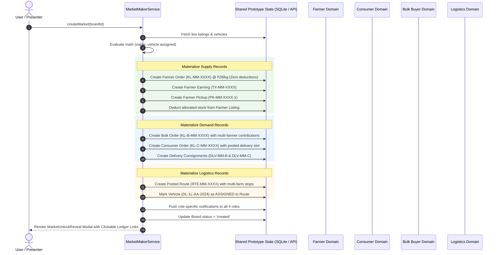

# KisanLink — Market Maker System Specification

**Document Version:** 1.0.0  
**Status:** Canonical Product & Engineering Specification  
**Component Codebase:** `frontend/src/services/marketMakerEngine.ts`, `frontend/src/services/marketMakerService.ts`, `frontend/src/pages/MarketMakerPage.tsx`, `frontend/src/components/market/*`  
**Last Updated:** September 2026  

---

## 1. Executive Summary & Problem Definition

### 1.1 The Fundamental Agricultural Coordination Dilemma
Direct farm-to-buyer transactions fail in India not because farmers and buyers refuse to trade, but because of a hard physical reality: **a freight vehicle has a fixed minimum trip cost (driver, vehicle wear, fuel, highway tolls) that does not scale down when payload decreases**.

```
Single Smallholder (e.g., 20 kg tomatoes) 
   ──> Dedicated Truck to City (Fixed Cost ₹1,200) 
   ──> Freight = ₹60.00/kg! (Economically Impossible)

Result: Smallholder MUST sell to local village middleman at distress mandi rates (₹18–₹24/kg).
```

Conversely, a small consumer household buying 5 kg or a mid-sized restaurant needing 200 kg cannot book a dedicated truck directly from a farm. Middlemen (aggregators, commission agents, mandi wholesalers, secondary distributors, retail shops) exist precisely to aggregate physical volume, but they extract **65%–75% of the total produce value in stacked markups and physical handling cuts**.

### 1.2 What is Market Maker?
**KisanLink Market Maker** is the **closed-form, deterministic feasibility engine** that turns fragmented smallholder supply and fragmented buyer demand into a single, economically viable, pooled corridor trip.

Market Maker does **not** rely on speculative machine-learning models or black-box predictions. Instead, it computes the exact mathematical break-even threshold at which:
1. **The farmer's floor price is fully protected** (never bid down or squeezed).
2. **The buyer's delivered landed price is lower than their current retail or commercial supplier**.
3. **The transporter's dedicated trip cost is 100% covered** by dividing the fixed freight across the pooled volume.
4. **The platform fee is transparently billed** to the buyer without deducting a single rupee from the farmer's payout.

---

## 2. Core Mathematical Engine (`marketMakerEngine.ts`)

Every calculation in Market Maker is inspectable, auditable, and closed-form:

### 2.1 Fixed + Distance Freight Model
Freight is calculated per available vehicle class in the logistics fleet:
$$\text{Freight}_{\text{fixed}} = \text{round}(300 + \text{Capacity}_{\text{kg}} \times 0.375)$$
$$\text{Freight}_{\text{perKm}} = \text{round}(9 + \text{Capacity}_{\text{kg}} \times 0.0225)$$
$$\text{Freight}_{\text{total}} = \text{Freight}_{\text{fixed}} + (\text{Freight}_{\text{perKm}} \times \text{RouteDistance}_{\text{km}})$$

### 2.2 Economic Headroom & Break-Even Threshold Volume
$$\text{PlatformFee}_{\text{perKg}} = \text{round}(\text{FarmerFloor}_{\text{perKg}} \times \text{PlatformFeePct})$$
$$\text{Headroom}_{\text{perKg}} = \text{BuyerCeiling}_{\text{perKg}} - \text{FarmerFloor}_{\text{perKg}} - \text{PlatformFee}_{\text{perKg}}$$

If $\text{Headroom}_{\text{perKg}} > 0$:
$$\text{Threshold}_{\text{kg}} = \left\lceil \frac{\text{Freight}_{\text{total}}}{\text{Headroom}_{\text{perKg}}} \right\rceil$$

If committed volume is below $\text{Threshold}_{\text{kg}}$, the fixed trip cost spread across too few kilograms forces delivered price above the buyer's ceiling price:
$$\text{Freight}_{\text{perKg}} = \frac{\text{Freight}_{\text{total}}}{\text{Committed}_{\text{kg}}}$$
$$\text{Delivered}_{\text{perKg}} = \text{FarmerFloor}_{\text{perKg}} + \text{Freight}_{\text{perKg}} + \text{PlatformFee}_{\text{perKg}}$$

### 2.3 The Core Tenet: Farmer Floor Protection
> **Critical Architectural Rule:** In Market Maker, the farmer's floor price is an **immutable input**, never an output. The engine solves for required pooled volume, never for a lower farm-gate price.

---

## 3. The Flagship Demonstration Corridor

For SIH 2026 evaluation, the system seeds and evaluates the **Sonipat ➔ Azadpur / New Delhi Corridor**:

| Parameter | Value | Description |
|---|---|---|
| **Corridor Name** | Sonipat to Azadpur (सोनीपत से आज़ादपुर) | Flagship NCT-Haryana peri-urban corridor |
| **Crop & Grade** | Tomatoes (ताज़े टमाटर), Grade A | High-perishable, high-spread benchmark crop |
| **Distance** | 42 km | Farm clusters in Sonipat to Azadpur central market / Dwarka hub |
| **Farmer Floor** | ₹28.00/kg | Farmer's guaranteed take-home pay (no commission, no deduction) |
| **Mandi Benchmark** | ₹24.00/kg | What local APMC mandi pays farmer today |
| **Farmer Net Gain** | +₹4.00/kg (+16.7%) | Guaranteed direct gain above mandi |
| **Buyer Current Cost**| ₹42.00/kg | What buyers (retail consumer / bulk buyer) pay through traditional mandi chain |
| **Buyer Ceiling** | ₹34.00/kg | Maximum price at which buyers switch to KisanLink |
| **Platform Fee** | 3.5% of farm-gate (₹0.98/kg) | Billed to buyer, keeping farmer floor whole |
| **Assigned Vehicle** | Tata Ace (DL-1L-AA-2024), 750 kg capacity | Fixed freight: ₹581 base + ₹25.88/km = ₹1,668 total trip cost |
| **Headroom** | ₹34.00 - ₹28.00 - ₹0.98 = ₹5.02/kg | Margin available to absorb transport |
| **Break-Even Threshold**| $\lceil 1668 / 5.02 \rceil = \mathbf{333\text{ kg}}$ | Minimum volume to unlock farm-direct pricing |

---

## 4. Visual Components & UI Subsystems

Market Maker consists of a cohesive suite of UI components in `frontend/src/components/market/`:

### 4.1 Market Demand Ring (`MarketDemandRing.tsx`)
- **Visual Structure:** A radial SVG gauge where $360^\circ$ represents $100\%$ of the break-even threshold ($\text{Threshold}_{\text{kg}}$).
- **Segmented Arcs:** Distinct gradient arcs represent committed demand sources:
  - Green gradient (`#2f7d57` ➔ `#1c5b3c`): Commercial bulk buyer commitments.
  - Amber gradient (`#e7b657` ➔ `#d1902d`): Consumer household group commitments.
  - Dashed outline: The remaining demand gap ($\text{Gap}_{\text{kg}}$) inviting user participation.
- **Center Stat:** Displays committed kilograms with live `AnimatedNumber` odometer animation, total threshold, and status badge (`Forming`, `Threshold Reached`, or `Market Created`).

### 4.2 Outcome Summary Bar (`MarketOutcomeSummary`)
- An infographic banner comparing economic reality before and after:
  - **Without Market Maker (Traditional Mandi):** Farmer gets ₹24/kg, Buyer pays ₹42/kg (Intermediary spread: ₹18/kg).
  - **With Market Maker (Pooled Direct):** Farmer gets ₹28/kg, Buyer pays ₹33.02/kg (At threshold volume).

### 4.3 Market State Rail (`MarketStateRail`)
- A 3-stage progress rail showing corridor maturity:
  1. **Market is forming (बाज़ार बन रहा है):** Small needs are being pooled.
  2. **Ready to create (बनाने के लिए तैयार):** Demand threshold reached ($\text{Committed}_{\text{kg}} \ge \text{Threshold}_{\text{kg}}$).
  3. **Direct market created (सीधा बाज़ार बन गया):** Orders, pickups, and logistics route have been materialized.

### 4.4 Role-Specific Deep Visualizations

| Role | Deep Visualization | Component | Core Question Answered |
|---|---|---|---|
| **Farmer** | Delivered Price vs Volume Curve | `MarketFreightCurve.tsx` | "Why does volume matter to unlock my pickup?" |
| **Consumer** | Value Split Decomposition | `MarketValueSplit.tsx` | "Where does my rupee actually go vs retail shops?" |
| **Bulk Buyer** | Supply-Demand Convergence Grid | `MarketConvergence.tsx` | "How are smaller farm lots assembled to satisfy my order?" |
| **Logistics** | Freight Curve & Vehicle Utilisation | `MarketFreightCurve.tsx` | "At what load does this trip pay for my fuel and driver?" |

#### Details of Deep Visualizations:
- **`MarketFreightCurve.tsx`:** Renders the exact hyperbolic function $y = \text{Floor} + \frac{\text{FixedTrip}}{x} + \text{Fee}$. Displays horizontal reference lines for Traditional Retail (₹42/kg), Buyer Limit (₹34/kg), and Farmer Floor (₹28/kg), plus a shaded viable zone past break-even. Fully responsive with mobile-adapted aspect ratio.
- **`MarketValueSplit.tsx`:** Proportional stacked bar comparing the traditional 5-layer intermediary margin against KisanLink's direct split: Farmer share, Freight, Platform Fee, and Buyer Savings.
- **`MarketConvergence.tsx`:** Three-column responsive convergence layout showing individual farm supply lots on the left (highlighting smallholder lots tagged *"too small alone"*), central transport hub in the middle, and pooled buyers on the right.

### 4.5 Inspectable Economics: "Why is this Viable?" (`MarketWhyPanel.tsx`)
- An expandable audit panel powered by `explainMarket()` in `marketMakerEngine.ts`.
- Lays out the 7 exact arithmetic steps that computed feasibility:
  1. Fixed cost of one trip.
  2. Price buyers will switch at.
  3. Farmer floor, protected.
  4. Platform fee.
  5. Left for transport (headroom).
  6. Break-even volume.
  7. Committed today & feasibility verdict.

### 4.6 Explanatory "How It Works" Section (`MarketHowItWorks.tsx`)
- 5 step-by-step numbered cards explaining the operational pipeline:
  1. Farms offer produce (lots too small to sell direct alone).
  2. Demand is pooled (business demand + household demand).
  3. A vehicle is matched (matched from live fleet).
  4. Break-even is computed (fixed cost shared across load).
  5. KisanLink recommends the next step (`Create` or `Wait`).

### 4.7 Secondary Infographics Grid (`MarketInfographics.tsx`)
- Four role-tailored quick-stat cards:
  - **Farmer:** Farmer Floor, Committed Today, Break-even Load, Corridor Distance.
  - **Consumer:** Delivered Price, Committed Today, Freight per kg, Farmer Floor.
  - **Bulk Buyer:** Supply Offered, Committed Today, Delivered Price, Corridor Distance.
  - **Logistics:** Vehicle Load %, Break-even Load, Committed Today, Freight per kg.

---

## 5. Role-Specific Implementation Differences

Market Maker is **not** a generic one-size-fits-all page. Each module interacts with the shared board according to that role's mental model and operational levers:

```
                  ┌─────────────────────────────────────────────────┐
                  │          Shared Market Maker Corridor           │
                  │   (Sonipat ➔ Azadpur, Tomatoes Grade A)         │
                  └─────────────────────────────────────────────────┘
                         ▲               ▲             ▲          ▲
        Offer More Stock │    Commit Bulk│  Commit B2C │          │ Hold / Withdraw
       ┌─────────────────┴─┐ ┌───────────┴──┐ ┌────────┴───┐ ┌────┴────────────┐
       │   FARMER VIEW     │ │  BULK BUYER  │ │  CONSUMER  │ │    LOGISTICS     │
       │ (/farmer/market)  │ │ (/bulk/market│ │(/consumer/ │ │(/logistics/market│
       │                   │ │              │ │  market)   │ │                  │
       │ • 1 Gauge, 1 Price│ │ • MOQ Slider │ │ • B2C Cart │ │ • Vehicle Quoter │
       │ • Plain Hindi/Eng │ │ • Landed cost│ │ • Farm-dir │ │ • Fuel break-even│
       │ • "Give 40kg more"│ │ • Pool audit │ │   vs retail│ │ • Trip dispatch  │
       └───────────────────┘ └──────────────┘ └───────────┘ └──────────────────┘
```

### 5.1 Farmer Experience (`FarmerMarketMaker.tsx`)
- **Design Philosophy:** Radical rural simplicity. No analytical curve plots, no confusing spreadsheets.
- **Tone:** Written in direct, colloquial Hindi / plain English:
  - *Forming:* "लगभग तैयार। 40 किलो और खरीदार चाहिए। ज़्यादा फसल देकर मदद करें।" ("Almost ready. 40 kg more buyers needed. Give more produce to help.")
  - *Viable:* "तैयार। फसल जा सकती है। आपकी 80 किलो का मिलान हो गया।" ("Ready. Your produce can go. 80 kg of yours is matched.")
  - *Blocked:* "रुकें। गाड़ी तैयार नहीं। खरीदार तैयार हैं, गाड़ी चाहिए।" ("Wait. Vehicle not ready. Buyers are ready, vehicle is needed.")
  - *Created:* "बिक गया। गाड़ी आ रही है। आपकी 80 किलो बिक गई।" ("Sold. Pickup is coming. 80 kg of yours is sold.")
- **Action Button:** Farmer can tap **"Give 40 kg more / 40 किलो और दें"** to release additional stock from their verified listing into the corridor, helping push the pool over break-even.

### 5.2 Consumer Experience (`ConsumerHome` & `MarketMakerPage`)
- **Design Philosophy:** Group-buying and farm-direct savings.
- **Framing:** Compares the delivered price directly against local retail/supermarket rates (₹42/kg), NOT wholesale mandi rates.
- **Action Button:** Consumer can commit 1–40 kg directly to the corridor, watching the ring advance toward break-even.

### 5.3 Bulk Buyer Experience (`BulkDashboard` & `MarketMakerPage`)
- **Design Philosophy:** Institutional procurement and landed cost optimization.
- **Framing:** Combines bulk requirements (e.g. 200–400 kg) with retail household pools so smaller commercial orders become economically dispatchable.
- **Action Button:** Bulk Buyer commits 10–400 kg in increments of 10 kg, viewing exact landed delivery breakdown.

### 5.4 Logistics Experience (`LogisticsDashboard` & `MarketMakerPage`)
- **Design Philosophy:** Fleet utilization and zero deadhead dispatching.
- **Framing:** Evaluates fleet vehicles against the corridor.
- **Operational Lever (`LogisticsLever`):**
  - Logistics operators can **"Hold Vehicle"** or **"Withdraw Vehicle"** from the corridor.
  - If the primary vehicle (Tata Ace, 750 kg) is withdrawn (e.g., put into maintenance), Market Maker dynamically re-quotes the corridor against the next available fleet vehicle (e.g. 1,500 kg pickup), recalculates higher trip fixed costs, and shifts break-even volume from 333 kg to 480 kg in real time!

---

## 6. The Unlock & Materialization Sequence (`MarketUnlockReveal.tsx`)

When committed demand crosses break-even, the corridor transitions from `forming` to `viable`. Any authorized role (or demo presenter) can click **"Create the direct market"**.

### 6.1 Real Prototype State Propagation
Clicking "Create" does **not** simply flip a boolean in a local component. `marketMakerService.createMarket()` executes an atomic multi-domain state transformation across the shared prototype store:



### 6.2 The Visual Reveal Experience
1. **Background Dimming & Scrim:** A page-covering dark backdrop dims surrounding clutter.
2. **Animated Success Badge:** Pulse ring animation confirms the unlock.
3. **Audit Ledger Rows:** A multi-item ledger card renders each newly created record:
   - Farmer order and earning link.
   - Bulk procurement order link.
   - Consumer order link.
   - Farm pickups count and link.
   - Pooled route link.
4. **Accessible Animation:** Respects `prefers-reduced-motion`—users with motion sensitivity immediately see the complete final ledger without delay.

---

## 7. AI & Intelligence Card Lifecycle

All AI and intelligence cards across KisanLink (including `MarketPulseCard`, `FarmerPulseCard`, `MarketplaceAiSection`, `BulkIntelligenceCards`, and `LogisticsIntelligenceCards`) adhere to a standardized interaction pattern managed by `MarketplaceAiTrigger.tsx`:

### 7.1 Interaction Stages
```
[ IDLE ] 
   │  User taps "Find my pick" / "Review opportunity" / "Run check"
   ▼
[ FLOATING FOCUS STATE ]
   │  • Body receives .ai-analysis-active (background scroll locked)
   │  • Page-covering darkened/blurred overlay mounts via React Portal
   │  • Card elevates above overlay as a portal sibling (never inherits blur)
   │  • Surrounding page retains invisible placeholder with exact measured height
   ▼
[ STAGED ANALYSIS ANIMATION (AiThinkingState) ]
   │  • Paces 4–5 realistic intelligence checks across ~1400ms duration
   │  • Visual step scanner with progress rail and signal icons
   ▼
[ RESULT STATE ]
   │  • Recommendation card renders with confidence badge & reasoning factors
   │  • Actionable CTA ("Add to cart", "Create requirement", "View corridor")
   ▼
[ DISMISS / SETTLE ]
   │  • Escape key or Close button gently returns card to in-flow position
   │  • Placeholder height releases smoothly without layout shifts
```

---

## 8. SIH 2026 Golden Demo Flow: Market Maker

In an SIH 2026 judging presentation, Market Maker provides the ultimate **3-minute showstopper**:

1. **Start on Farmer Home (`/farmer`):**
   - Show the **Market Maker Pulse Card** at the top of the dashboard.
   - Tap into `/farmer/market`.
   - Show the Hindi gauge: *"बाज़ार बनने के लिए 40 किलो और चाहिए"* (Needs 40 kg more).
   - Point out: Farmer Floor is protected at ₹28/kg (mandi is only ₹24/kg).
   - Tap **"40 किलो और दें" (Give 40 kg more)**.

2. **Switch to Consumer or Bulk Buyer (`/consumer` or `/bulk`):**
   - Show that the exact same corridor board is live across the network.
   - In Bulk Buyer (`/bulk/market`), show the **Market Demand Ring**.
   - Tap **Commit Demand (+40 kg)**.
   - The ring completes $360^\circ$ and flips from amber (`Forming`) to green (`Ready to create / viable`).

3. **Trigger "Create the direct market":**
   - Tap **"Create the direct market"**.
   - The **Unlock Reveal** modal animates open.
   - Walk the judges through the real records generated in shared state:
     - The Farmer's order and payout.
     - The Bulk Buyer's procurement invoice.
     - The pooled multi-stop logistics route.
   - Click the generated **Farmer Order** link to prove the transaction materialized into the live farmer order management screen.
