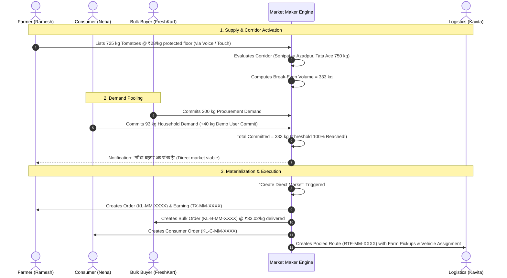

# KisanLink — Product Requirements Document (PRD)

**Project Name:** KisanLink (Direct Farm-to-Buyer Operating System)  
**Problem Statement ID:** 26033 (Smart India Hackathon 2026)  
**Problem Statement Title:** Multiple intermediaries reduce farmers' earnings and increase consumer prices  
**Target Organization:** Ministry of Consumer Affairs, Food & Public Distribution — Department of Consumer Affairs (DoCA)  
**Document Version:** 1.1.0  
**Status:** Canonical Product & Engineering Specification (Synchronized with Codebase)  
**Last Updated:** September 2026  

---

## Table of Contents

1. [Document Purpose](#1-document-purpose)
2. [Problem Statement & Background](#2-problem-statement--background)
3. [Product Vision & Positioning](#3-product-vision--positioning)
4. [Core Value Proposition](#4-core-value-proposition)
5. [Product Principles](#5-product-principles)
6. [Goals & Non-Goals](#6-goals--non-goals)
7. [Users & Stakeholder Personas](#7-users--stakeholder-personas)
8. [User Problems & Pain Points](#8-user-problems--pain-points)
9. [Accessibility & Digital Inclusion Strategy](#9-accessibility--digital-inclusion-strategy)
10. [Core User Journeys & End-to-End Lifecycles](#10-core-user-journeys--end-to-end-lifecycles)
11. [Module Breakdown & Feature Requirements](#11-module-breakdown--feature-requirements)
12. [Market Maker System (Flagship Corridor Feasibility Engine)](#12-market-maker-system-flagship-corridor-feasibility-engine)
13. [Farmer Experience & Interaction Model](#13-farmer-experience--interaction-model)
14. [Consumer Direct Marketplace Experience](#14-consumer-direct-marketplace-experience)
15. [Bulk Buyer Procurement Workspace](#15-bulk-buyer-procurement-workspace)
16. [Logistics & Fleet Dispatch Experience](#16-logistics--fleet-dispatch-experience)
17. [Cross-Module UX & Mobile-First Navigation](#17-cross-module-ux--mobile-first-navigation)
18. [Pricing Model & Transparent Economics](#18-pricing-model--transparent-economics)
19. [Payment, Escrow Simulation & Payout Splitting](#19-payment-escrow-simulation--payout-splitting)
20. [Trust, Reputation & Verification Systems](#20-trust-reputation--verification-systems)
21. [Multilingual & Voice-Assisted Architecture](#21-multilingual--voice-assisted-architecture)
22. [Call-Center Support / Assisted Digital Access](#22-call-center-support--assisted-digital-access)
23. [Impact Analytics & Economic Formulations](#23-impact-analytics--economic-formulations)
24. [Functional Requirements & Implementation Status Matrix](#24-functional-requirements--implementation-status-matrix)
25. [Non-Functional Requirements](#25-non-functional-requirements)
26. [MVP vs. Prototype vs. Future Classification](#26-mvp-vs-prototype-vs-future-classification)
27. [Risk Analysis & Mitigation Strategies](#27-risk-analysis--mitigation-strategies)
28. [Key Assumptions & Dependencies](#28-key-assumptions--dependencies)
29. [Success Criteria & KPIs](#29-success-criteria--kpis)
30. [SIH 2026 Golden Path Demo Scenario](#30-sih-2026-golden-path-demo-scenario)
31. [References & Related Documents](#31-references--related-documents)

---

## 1. Document Purpose

This Product Requirements Document (PRD) defines the product scope, system capabilities, behavioral specifications, user interaction models, economic mechanics, and technical constraints for **KisanLink** — an intelligent direct farm-to-buyer operating system designed for the Smart India Hackathon (SIH) 2026 under Problem Statement 26033.

This document serves as the source of truth for product capabilities, accurately distinguishing implemented code, real backend endpoints, deterministic prototype logic, and future scope.

---

## 2. Problem Statement & Background

### 2.1 The Problem
In the traditional Indian agricultural supply chain, produce changes hands between 4 to 8 intermediaries before reaching the end buyer:

```
[Farmer] ➔ [Village Aggregator] ➔ [Kaccha Arhatiya] ➔ [Pucca Arhatiya / Commission Agent] 
         ➔ [Primary Wholesaler] ➔ [Secondary Wholesaler] ➔ [Retailer] ➔ [Consumer / End Buyer]
```

### 2.2 Structural Consequences
- **Severe Price Degradation for Farmers:** Farmers capture only 20%–35% of the final consumer retail price, often receiving barely enough to cover input costs.
- **High Buyer Procurement Costs:** Bulk buyers (hotels, restaurants, processors, retail chains) and retail households pay stacked markups due to intermediary commissions, repeated loading/unloading, and physical mandi cess.
- **Extreme Post-Harvest Spoilage:** Multi-hop transit, repeated handling, lack of scheduled logistics, and delays lead to 15%–30% perishable produce wastage.
- **The Coordination Dilemma:** A dedicated freight vehicle carries a **fixed minimum trip cost** (driver, fuel, tolls). An individual smallholder farmer with 200 kg cannot afford a dedicated truck, and a buyer wanting 50 kg cannot commission one. This single physical fact is why intermediaries exist and why smallholders are forced into distress sales at local APMC mandis.

---

## 3. Product Vision & Positioning

### 3.1 What KisanLink Is
**KisanLink** is **not merely an e-commerce catalog**. It is a **farm-to-buyer operating system and supply orchestration network** that:
1. **Solves Fixed Freight via Market Maker:** Dynamically calculates the exact break-even volume threshold at which fixed logistics costs pay for themselves while keeping the farmer floor price 100% whole and buyer delivered costs below traditional channels.
2. **Aggregates Fragmented Supply:** Automatically groups geographically adjacent smallholder farmers into **Dynamic Supply Pools** to satisfy institutional demand without formal cooperative overhead.
3. **Reverses Marketplace Dynamics:** Allows institutional buyers to post forward procurement requirements with ceiling prices and delivery windows.
4. **Optimizes Physical Flow:** Coordinates shared logistics with multi-stop route pooling, load tracking, and vehicle status management.
5. **Levels Information Asymmetry:** Provides actionable regional demand forecasting and indicative fair-price guidance anchored to real mandi benchmarks.
6. **Rescues Perishable Harvests:** Dynamically tags aging crops as **Urgent Rescue Sales** with algorithmic discounts to prevent farm-gate wastage.

### 3.2 Positioning Statement
> *"For Indian farmers and commercial produce buyers who suffer from middleman price gouging and fragmented logistics, KisanLink is an intelligent agricultural operating system that deterministically solves transport feasibility via Market Maker, pools small farm yields into viable corridors, automates fair-price matching, and coordinates multi-stop logistics—ensuring farmers earn 25–35% more while buyers pay 15–22% less."*

---

## 4. Core Value Proposition

| Stakeholder | Traditional Supply Chain | With KisanLink Operating System | Measurable Economic Benefit |
|---|---|---|---|
| **Farmer** | Sells to village aggregator at distress rates (e.g., ₹24/kg for tomatoes); bears high unloading cuts and commission deductions. | Lists produce with voice/touch; Market Maker pools lot into direct corridor at protected floor (₹28/kg). | **+16.7% to +35% higher net farm-gate income with zero commission** |
| **Consumer** | Buys from local vegetable shop or quick-commerce at inflated retail rates (₹42/kg). | Accesses farm-direct produce delivered at pooled threshold rate (₹33.02/kg). | **20% to 25% savings against local retail benchmark** |
| **Bulk Buyer** | Buys from secondary wholesalers at ₹38–₹45/kg; suffers inconsistent grading and unreliable delivery timelines. | Posts procurement requirement (RFQ); receives pooled supply directly from verified farm clusters. | **15% to 22% procurement cost reduction with transparent landed cost** |
| **Logistics Carrier**| High empty-miles (deadhead runs); vehicle runs 40–50% empty; spot-booking price uncertainty. | Quoted on viable corridors with guaranteed payload reaching break-even threshold (> 80% vehicle capacity). | **Higher revenue per trip, lower fuel wastage, predictable routes** |
| **Ecosystem / Society**| 15–30% food wastage across transit; inflated consumer prices; high transit emissions from uncoordinated trips. | Direct farm-to-buyer transit; urgent wastage rescue rerouting; multi-farm pickup pooling. | **Reduced food spoilage, lower transport emissions, price transparency** |

---

## 5. Product Principles

1. **Farmer Floor Protection:** The farmer's floor price is an **immutable input**, never an output. The platform solves for volume and logistics efficiency, never by forcing down farm-gate rates.
2. **Deterministic Over Magical AI:** Core transactional, pricing, feasibility, and pooling math is 100% closed-form and inspectable. AI is used purposefully for natural language voice parsing (Gemini NLP) and cognitive assistance, never for hidden ledger math.
3. **Radical Farmer Simplicity:** The farmer UI is mobile-first, bilingual (Hindi/English), uses large touch targets, avoids analytical clutter, and provides 1-tap toll-free support (`1800 123 4567`).
4. **Context-Appropriate Pricing Comparisons:** Consumers see farm-direct prices compared against **local retail benchmarks** (what they actually pay at local shops), while farmers see direct prices compared against **APMC mandi rates** (what they receive at wholesale yards).
5. **Unified Experience:** Discovery, search, and filtering live directly on the Consumer Home dashboard instead of fracturing into separate disconnected pages.
6. **Role-Tailored Information Density:** Each role sees only the operational data needed for its specific task.

---

## 6. Goals & Non-Goals

### 6.1 Product Goals
- **G1:** Enable farmers to list harvests in under 60 seconds via voice (Hindi/English) or structured touch wizard.
- **G2:** Provide live Market Maker corridor feasibility tracking across all 4 platform roles.
- **G3:** Enable bulk buyers to publish requirements (Reverse Marketplace) and preview pooled farmer contributions.
- **G4:** Enable individual consumers to discover fresh farm produce, add to cart, and checkout with transparent price splits.
- **G5:** Provide logistics operators with a clear manifest of active pickups, deliveries, vehicles, and corridor maps.
- **G6:** Maintain a unified prototype state engine that allows transactions created in Market Maker or Bulk Procurement to propagate across all roles in real time.

### 6.2 Non-Goals (Explicitly Out of MVP Scope)
- **NG1 — Regulated Banking Escrow:** Does not integrate live RBI-regulated banking escrow APIs; operates on a simulated escrow ledger (`payments_ledger`) with mock settlement states.
- **NG2 — Physical Hardware Telemetry:** Does not require live IoT temperature/humidity sensors or GPS vehicle OBD-II dongles.
- **NG3 — Mandatory Certified Lab Testing:** Relies on farmer-declared grading (Grade A, Grade A+), buyer delivery verification, and bidirectional reputation scoring.

---

## 7. Users & Stakeholder Personas

```mermaid
graph TD
    classDef primary fill:#e8f5e9,stroke:#2e7d32,stroke-width:2px;
    classDef buyer fill:#e3f2fd,stroke:#1565c0,stroke-width:2px;
    classDef log fill:#fff3e0,stroke:#e65100,stroke-width:2px;

    Farmer[Farmer / Producer: Ramesh Sharma]:::[primary]
    Consumer[Consumer Household: Neha Verma]:::[buyer]
    BulkBuyer[Bulk Buyer / Institution: FreshKart Procurement]:::[buyer]
    Transporter[Logistics Operator: Kavita Sharma]:::[log]
    Operator[Call Support Agent / Proxy: Sunita Devi]:::[primary]
```

---

## 8. User Problems & Pain Points

```
+----------------------------------------------------------------------------------------------------+
|                                      FARMER PAIN POINTS                                            |
| • Middleman Deductions   : Village aggregators and commission agents take 20-35% cuts on price.    |
| • Volume Penalty         : Small lot (e.g., 200 kg) cannot bear dedicated freight to city.         |
| • Distress Harvest Sales : Perishable crops force immediate selling at prevailing spot mandi rates.|
| • Digital Intimidation   : Complex English ERP interfaces cause friction and distrust.             |
+----------------------------------------------------------------------------------------------------+

+----------------------------------------------------------------------------------------------------+
|                                    CONSUMER PAIN POINTS                                            |
| • Retail Markups         : Paying ₹40–₹50/kg for produce that left the farm at ₹18–₹22/kg.        |
| • Lack of Freshness      : Multi-day mandi and distributor hops degrade vegetable crispness.      |
| • No Traceability        : Zero visibility into which farm or region grew the food.               |
+----------------------------------------------------------------------------------------------------+

+----------------------------------------------------------------------------------------------------+
|                                   BULK BUYER PAIN POINTS                                           |
| • Stacked Commissions    : Paying 30–45% markups across multiple wholesale intermediary tiers.     |
| • Fragmented Sourcing    : Calling 10+ traders to assemble a 3-tonne consignment.                 |
| • Unpredictable Arrivals : Kitchen schedules delayed by uncoordinated transport logistics.        |
+----------------------------------------------------------------------------------------------------+

+----------------------------------------------------------------------------------------------------+
|                                 LOGISTICS OPERATOR PAIN POINTS                                     |
| • Low Vehicle Fill       : Running trucks 40–50% empty due to unpooled, fragmented spot pickups.   |
| • Suboptimal Routing     : Disorganized farm pickups without multi-stop routing waste diesel.      |
+----------------------------------------------------------------------------------------------------+
```

---

## 9. Accessibility & Digital Inclusion Strategy

1. **High-Contrast, Large-Touch Interface:** Primary actions use oversized button cards with recognizable agricultural iconography and dual-language labels (Hindi + English).
2. **Native Voice-Assisted Listing:** Integrated browser Web Speech API captures Hindi or English audio, which is parsed by Google Gemini AI (with deterministic regex fallback) into structured draft fields (crop, quantity, price, pickup date/window).
3. **One-Tap Toll-Free Support (`1800 123 4567`):** Prominently accessible on desktop sidebar footer, mobile support card, and profile screens.
4. **Mobile-First Native Feel:** 5-slot bottom navigation with elevated center action, smooth transitions, and viewport-aware floating modals.

---

## 10. Core User Journeys & End-to-End Lifecycles



---

## 11. Module Breakdown & Feature Requirements

The system is structured into **6 Primary Functional Domains**:

- **Module 00: Market Maker Engine (Flagship Feasibility Core)**
- **Module 01: Farmer Experience & Voice Listing**
- **Module 02: Consumer Direct Marketplace**
- **Module 03: Bulk Buyer Procurement & Supply Pooling**
- **Module 04: Logistics & Fleet Management**
- **Module 05: Core Intelligence, Pricing & Analytics**

---

## 12. Market Maker System (Flagship Corridor Feasibility Engine)

For full mathematical derivation, see [DOCS/MARKET_MAKER.md](./MARKET_MAKER.md).

### 12.1 Core Problem Solved
Smallholder supply and small buyer demand cannot trade direct because a single trip's fixed freight cost is punitive when divided across small kilograms. Market Maker pools lots and demand until fixed freight divides across enough volume to beat traditional retail prices while protecting the farmer floor.

### 12.2 The Closed-Form Formula
$$\text{Freight}_{\text{total}} = \text{Fixed}_{\text{vehicle}} + (\text{PerKm}_{\text{vehicle}} \times \text{Distance}_{\text{km}})$$
$$\text{Headroom}_{\text{perKg}} = \text{BuyerCeiling}_{\text{perKg}} - \text{FarmerFloor}_{\text{perKg}} - \text{PlatformFee}_{\text{perKg}}$$
$$\text{Threshold}_{\text{kg}} = \left\lceil \frac{\text{Freight}_{\text{total}}}{\text{Headroom}_{\text{perKg}}} \right\rceil$$

### 12.3 Key UI Components
- **`MarketDemandRing`:** Radial SVG gauge with segmented arcs for bulk (green) and consumer (amber) demand.
- **`MarketOutcomeSummary`:** Compares traditional mandi spread against Market Maker direct economics.
- **`MarketStateRail`:** 3-stage progress rail (`Forming` ➔ `Ready to create` ➔ `Direct market created`).
- **`MarketFreightCurve`:** Visualizes delivered price per kg dropping as volume increases, intersecting the buyer limit line.
- **`MarketValueSplit`:** Stacked bar decomposition of buyer rupee into Farmer Share, Freight, Platform Fee, and Buyer Savings.
- **`MarketConvergence`:** Grid layout showing farm lots on the left, transport hub in center, and pooled buyers on right.
- **`MarketWhyPanel`:** Expandable 7-step arithmetic audit trail.
- **`MarketHowItWorks`:** 5 numbered cards explaining the end-to-end corridor mechanics.
- **`MarketUnlockReveal`:** Modal with dark backdrop dimming, staged animations, and live clickable links to all generated records.

---

## 13. Farmer Experience & Interaction Model

### 13.1 Screen Architecture (`/farmer`)
- **Farmer Greeting & Weather:** Displays personalized greeting, location, and temperature pill.
- **Market Maker Pulse Card (`MarketPulseCard`):** Flagship card at top showing corridor status, demand gap, and direct price comparison.
- **Attention Metrics:** Month's earnings (with pending count), active listing count, new order count.
- **Farmer Pulse Card (`FarmerPulseCard`):** Staged AI intelligence card with `MarketplaceAiTrigger` analyzing listing stock.
- **Quick Actions:** Direct shortcuts to Produce (`/farmer/produce`), Orders (`/farmer/orders`), Earnings (`/farmer/earnings`), and Demand Insights (`/farmer/insights`).
- **Side Stack:** Upcoming pickup details and Tomato Price Insight card (+₹7/kg over local mandi).
- **Support Card:** Call support button (`1800 123 4567`).

### 13.2 Produce Management (`/farmer/produce`)
- Tabbed filters: `Active`, `Draft`, `Paused`, `Sold`.
- Actions: View, Edit, Update Quantity, Pause/Resume, Duplicate, Delete, Mark Unavailable.
- Sell Callout: Direct CTA to `/farmer/sell`.

### 13.3 Voice-Assisted Listing Flow (`VoiceInputModal.tsx`)
- **Activation:** Tap microphone button in Sell Produce wizard.
- **Speech Recognition:** Uses browser Web Speech API in Hindi (`hi-IN`) or Indian English (`en-IN`).
- **AI Parsing:** Sends audio transcript to backend `/api/v1/listings/parse-voice`, powered by Google Gemini AI with fallback to structured regex extractor.
- **Editable Review:** Auto-populates Crop, Quantity, Unit (kg/quintal/tonne), Asking Price, Harvest Date, Location, and Delivery Window. Farmer can inspect and adjust before publishing.

---

## 14. Consumer Direct Marketplace Experience

### 14.1 Screen Architecture (`/consumer`)
- **Market Maker Pulse Card:** Shows farm-direct pricing opportunity for consumers.
- **Fresh Near You:** Horizontal card row showing harvest-fresh produce picked close to the user.
- **Fresh Pick AI (`MarketplaceAiSection`):** AI recommendation card scanning fresh harvests and comparing local farm prices.
- **Unified Marketplace Section (`#marketplace`):**
  - Integrated directly on Consumer Home (retiring the separate `/consumer/explore` page; old links deep-link via URL hash).
  - Search bar with live keyword filtering.
  - Category chips: `All`, `Vegetables`, `Fruits`, `Grains`, `Staples`.
  - Mobile filter drawer: Grade (Grade A/A+), Harvest Freshness (All/Today), Availability, Max Price slider, Distance slider.
  - Sort selector: `Recommended`, `Nearest`, `Freshest`, `Price low to high`.
  - Responsive product card grid with instant Add to Cart.
- **Price Transparency Block:** Explicitly compares farm-direct price (₹31/kg) against local supermarket/retail price (₹42/kg), breaking down Farmer Share (₹28), Transport (₹2), and Platform (₹1).
- **Delivery Story:** Explains short farm-to-table transit with link to How It Works.

### 14.2 Cart, Checkout & Orders
- **Cart (`/consumer/cart`):** Central elevated action on bottom nav; manages quantity steppers, subtotal, logistics fee, and platform fee.
- **Checkout (`/consumer/checkout`):** Address selection, delivery slot choice, and simulated payment (UPI, Card, Pay on Delivery).
- **Order Tracking (`/consumer/orders/:id`):** Multi-step visual tracking timeline from farmer preparation to delivery.

---

## 15. Bulk Buyer Procurement Workspace

### 15.1 Screen Architecture (`/bulk`)
- **Procurement Desk Hero:** Sourcing overview with estimated monthly savings metric (₹26,450).
- **Dashboard Metrics:** Open requirements, matched supply (kg), active orders, monthly procurement volume, estimated savings, upcoming deliveries.
- **Market Maker Pulse Card:** Shows pooled procurement corridor status.
- **Procurement Pulse AI:** Evaluates open requirements against available farm supply.
- **Supply Ready Now:** Preview of pooled supply corridors.

### 15.2 Reverse Marketplace (Requirements / RFQs) (`/bulk/requests`)
- **Requirement Creation Wizard:**
  - Step 1: Crop, Grade, Required Quantity (MOQ 100 kg), Target Price, Delivery Location, Delivery Window, Frequency (One-time/Recurring), Notes. Includes **Target Price Advisor** AI component.
  - Step 2: Deterministic Match Preview showing contributing farm lots.
  - Step 3: Review grid with estimated landed cost.
  - Step 4: Submission.
- **Requirement Detail & Conversion (`/bulk/requests/:id`):** Shows percent fulfilled, average farm-gate rate, and **"Accept match & convert"** button creating a procurement order.

### 15.3 Bulk Orders & Landed Cost Breakdown (`/bulk/orders/:id`)
- Displays multi-farmer contribution visual with percentage shares.
- Landed-cost summary: Produce Value + Consolidated Logistics + Platform Fee.
- Timeline: Confirmed ➔ Farmers Preparing ➔ Pickup Scheduled ➔ Consolidating ➔ In Transit ➔ Delivered.

---

## 16. Logistics & Fleet Dispatch Experience

### 16.1 Screen Architecture (`/logistics`)
- **Header:** Live status badge (`On shift · clear` or exception count).
- **Operational KPIs:** Active pickups, active deliveries, available vehicle capacity (e.g., 2/4 free, 4,500 kg fleet), produce in transit.
- **Corridor Map:** Embeds `DigitalTwinCorridorMap` showing pickup nodes, central hub, and buyer drop locations.
- **Active Jobs List:** Ranks exceptions (`issue`) and unassigned work first, followed by scheduled jobs.
- **Market Maker Pulse Card:** Evaluates corridor viability against fleet status.
- **Dispatch Pulse AI & Ecosystem Impact Summary:** Live impact metrics (+28.5% Farmer Gain, 14.2% Buyer Savings, 64.0 km saved, 1,250 kg wastage prevented).

### 16.2 Map Architecture & Limitations (`DigitalTwinCorridorMap.tsx`)
- **Technology:** MapLibre GL JS with CartoCDN Positron vector tiles.
- **Corridor Representation:** Renders representative nodes (Karnal, Sonipat, Kundli Hub, Azadpur Mandi) with curved bezier arcs.
- **Limitation & Fallback:** Requires WebGL and network access to CartoCDN tile servers. In dev mode with Vite dependency optimization or when offline/WebGL disabled, the component **gracefully falls back to a structured schematic corridor card view** with retry capability, ensuring zero UI breakage.

---

## 17. Cross-Module UX & Mobile-First Navigation

### 17.1 Standardized 5-Slot Bottom Navigation
Every role features a fixed 5-slot bottom bar with identical height and baseline alignment. Slot 3 is the elevated primary action:

| Role | Slot 1 | Slot 2 | Slot 3 (Primary Elevated) | Slot 4 | Slot 5 | Profile Access |
|---|---|---|---|---|---|---|
| **Farmer** | Home (`/farmer`) | Orders (`/farmer/orders`) | **Produce** (`/farmer/produce`) | Market Maker (`/farmer/market`) | Profile (`/farmer/profile`) | In bottom nav (Slot 5) |
| **Consumer** | Home (`/consumer`) | Orders (`/consumer/orders`) | **Cart** (`/consumer/cart`) | Market Maker (`/consumer/market`) | Profile (`/consumer/profile`) | In bottom nav (Slot 5) |
| **Bulk Buyer** | Overview (`/bulk`) | Supply (`/bulk/supply`) | **Requests** (`/bulk/requests`) | Orders (`/bulk/orders`) | Market Maker (`/bulk/market`) | **Header Avatar** |
| **Logistics** | Overview (`/logistics`) | Pickups (`/logistics/pickups`) | **Routes** (`/logistics/routes`) | Deliveries (`/logistics/deliveries`) | Market Maker (`/logistics/market`) | **Header Avatar** |

### 17.2 Header Profile Avatar Pattern
For Bulk Buyer and Logistics, all 5 bottom navigation slots are occupied by core operational tabs. Profile access is relocated to a dedicated circular avatar (`header-avatar`) in the top mobile header.

---

## 18. Pricing Model & Transparent Economics

### 18.1 Pricing Language
- **Consumer Direct:** Farm-direct price is compared against **local retail benchmark** (e.g. ₹31/kg direct vs ₹42/kg retail shop), avoiding confusing wholesale mandi comparisons.
- **Farmer Direct:** Farm-gate realization is compared against **local APMC mandi price** (e.g. ₹28/kg direct vs ₹24/kg mandi), demonstrating net direct gain.
- **Bulk Buyer:** Landed price is broken down into farm-gate price, consolidated freight, and platform fee.

---

## 19. Payment, Escrow Simulation & Payout Splitting

1. **Simulated Escrow Lock:** Buyer payment locks funds upon order confirmation.
2. **Dispatch Assurance:** Farmer receives confirmation that payment is held in escrow before harvesting.
3. **Split Settlement:** Upon buyer OTP verification, escrow balance is split into farmer payouts, transporter freight, and platform fee.
4. **Backend Ledger:** Backed by `payments_ledger` table in PostgreSQL / prototype store.

---

## 20. Trust, Reputation & Verification Systems

- **Phone Verification:** 6-digit OTP verification via `/api/v1/auth/verify-otp`.
- **Identity & Farm Badges:** Farmer profile displays verified farmer status and farm size.
- **Ratings & Reviews:** Backed by `/api/v1/reviews` with star rating and feedback text.
- **Dispute Resolution:** Backed by `/api/v1/disputes` with withheld amount and resolution notes.

---

## 21. Multilingual & Voice-Assisted Architecture

- **Bilingual Interface:** Instant runtime switching between English and Hindi (`hi`).
- **Farmer Localization:** Hindi strings use colloquial rural phrasing rather than literal mechanical translations.
- **Voice Parsing Pipeline:** Browser Web Speech API ➔ FastAPI `/api/v1/listings/parse-voice` ➔ Google Gemini NLP extraction ➔ Structured draft fields.

---

## 22. Call-Center Support / Assisted Digital Access

- Persistent toll-free call support (`1800 123 4567`).
- Assisted operator audit logs backed by `/api/v1/audit/operator-logs`.

---

## 23. Impact Analytics & Economic Formulations

- **Farmer Net Gain:** +28.5% over mandi benchmark.
- **Buyer Savings:** 14.2% below traditional retail benchmark.
- **Distance Saved:** 64.0 km via multi-stop route consolidation.
- **Wastage Prevented:** 1,250 kg rescued via urgent listings.

---

## 24. Functional Requirements & Implementation Status Matrix

| Module | Feature | Implementation Type | Status |
|---|---|---|---|
| **Market Maker** | Deterministic Feasibility Engine | Core Algorithm (`marketMakerEngine.ts`) | ✅ **Fully Implemented** |
| **Market Maker** | Role-Specific Pages & Levers | Frontend UI (`MarketMakerPage.tsx`) | ✅ **Fully Implemented** |
| **Market Maker** | Shared State Propagation & Unlock | State Service (`marketMakerService.ts`) | ✅ **Fully Implemented** |
| **Farmer** | Produce Management & Listings | Real Backend (`/api/v1/listings`) + Prototype Fallback | ✅ **Fully Implemented** |
| **Farmer** | Gemini Voice Listing Extraction | AI Backend (`/api/v1/listings/parse-voice`) | ✅ **Fully Implemented** |
| **Farmer** | Simplified Mobile Home (5 Tabs) | Frontend UI (`FarmerDashboard.tsx`, `AppShell`) | ✅ **Fully Implemented** |
| **Consumer** | Unified Home + Marketplace (`#marketplace`)| Frontend UI (`ConsumerHome.tsx`, `ConsumerMarketplace`)| ✅ **Fully Implemented** |
| **Consumer** | Search, Categories, Filters, Sort | Frontend Engine (`ConsumerMarketplace.tsx`) | ✅ **Fully Implemented** |
| **Consumer** | Cart, Checkout & Order Tracking | Prototype State (`phase2Service.ts`) | ✅ **Fully Implemented** |
| **Bulk Buyer** | Requirement Posting (RFQs) | Prototype State + Backend (`/api/v1/requirements`) | ✅ **Fully Implemented** |
| **Bulk Buyer** | Deterministic Supply Pooling Visual | Frontend Component (`BulkPhase2.tsx`) | ✅ **Fully Implemented** |
| **Bulk Buyer** | Order Conversion & Landed Cost | Prototype State + Backend (`/api/v1/orders`) | ✅ **Fully Implemented** |
| **Logistics** | Operational Dashboard (Jobs, KPIs) | Prototype State (`legacy_logistics.py`) | ✅ **Fully Implemented** |
| **Logistics** | Digital Twin Corridor Map | MapLibre GL JS + Schematic Fallback | ✅ **Implemented with Fallback** |
| **Logistics** | Canonical Shipments & Route Optimize | Backend (`/api/v1/logistics/*`) | 🟡 **Integrated API Ready** |
| **Core AI** | Staged Intelligence Trigger & Modal | Frontend System (`MarketplaceAiTrigger.tsx`) | ✅ **Fully Implemented** |
| **Core AI** | Regional Price Benchmarking | Heuristic Backend (`/api/v1/intelligence/*`) | ✅ **Fully Implemented** |
| **Core AI** | Computer Vision Quality Grading | MobileNetV3 CNN | ⚪ **Planned (Future Scope)** |

---

## 25. Non-Functional Requirements

- **Sub-Second Render:** Lightweight Vanilla CSS layout loads instantly without large CSS framework bloat.
- **Graceful Map Degradation:** When MapLibre GL canvas or network tiles fail, schematic corridor cards render immediately.
- **Motion Accessibility:** Respects `prefers-reduced-motion` across all AI triggers and Market Maker unlock modals.

---

## 26. MVP vs. Prototype vs. Future Classification

- **Live Real Backend (`/api/v1`):** Auth, produce listings, voice parsing, buyer requirements, matching engine, orders, payments ledger, reviews, disputes, audit logs.
- **Deterministic Prototype Engine:** Market Maker corridor pooling, shared cross-role order materialization, logistics dashboard state, B2C cart/checkout simulation.
- **Future Scope:** Certified third-party testing labs, regulated banking escrow accounts, IoT cold-chain hardware sensors.

---

## 27. Risk Analysis & Mitigation Strategies

| Risk | Mitigation in KisanLink |
|---|---|
| **Low Rural Digital Literacy** | Ultra-simplified UI, colloquial Hindi phrasing, voice input, 1-tap call center support. |
| **Map Rendering / Network Failures** | Automatic detection with graceful fallback to structured schematic corridor view. |
| **Freight Price Uncertainty** | Closed-form deterministic freight model with transparent trip break-even threshold. |

---

## 28. Key Assumptions & Dependencies

- Primary demo corridor: **Sonipat ➔ Azadpur / New Delhi Corridor (42 km)**.
- Primary perishable crop: **Tomatoes (Grade A)**.
- Vehicle class: **Tata Ace (750 kg capacity)**.

---

## 29. Success Criteria & KPIs

- **Demonstration:** Flawless 3-minute multi-role Market Maker demo.
- **Economic Impact:** Demonstrating +16.7% to +32% farmer net income gain and 14% to 22% buyer cost savings.
- **Corridor Viability:** Demonstrating clear break-even threshold closure at 333 kg.

---

## 30. SIH 2026 Golden Path Demo Scenario

1. **Farmer Home (`/farmer`):**
   - Presenter shows Market Maker Pulse Card at the top of the dashboard.
   - Taps into `/farmer/market`.
   - Explains the bilingual gauge: *"सीधा बाज़ार बनने के लिए 40 किलो और चाहिए"* (Needs 40 kg more).
   - Shows protected farmer floor (₹28/kg vs ₹24/kg mandi).
   - Taps **"40 किलो और दें" (Give 40 kg more)**.

2. **Bulk Buyer (`/bulk/market`):**
   - Switches to Bulk Buyer; shows the exact same corridor live in shared state.
   - Points out the **Market Demand Ring** advancing.
   - Commits demand (+40 kg).
   - The ring hits 333 kg (100%), closes, and turns green: *"Ready to create"*.

3. **Materialization Reveal:**
   - Presenter taps **"Create the direct market"**.
   - The **Unlock Reveal** modal opens with background dimming and plays back generated records.
   - Shows Farmer Order @ ₹28/kg, Bulk Procurement Order @ ₹33.02/kg, and Pooled Logistics Route.
   - Clicks the Farmer Order link to show real transaction in order management.

4. **Logistics Dashboard (`/logistics`):**
   - Shows active pickups, corridor map with route from Sonipat to Azadpur, and real-time impact metrics (+28.5% Farmer Gain, 14.2% Buyer Saving).

---

## 31. References & Related Documents

- [Master Market Maker Specification](./MARKET_MAKER.md)
- [Technical Requirements Document (TRD)](./TRD.md)
- [End-to-End System Flows & State Machines](./FLOWS.md)
- [UI/UX Design Specifications](./UI_UX_DESIGN.md)
- [REST API Specifications](./API_DESIGN.md)
- [Database Schema Design](./DATABASE_DESIGN.md)
- [AI & Optimization Specifications](./AI_SYSTEMS.md)

---
*End of KisanLink Product Requirements Document (PRD)*
