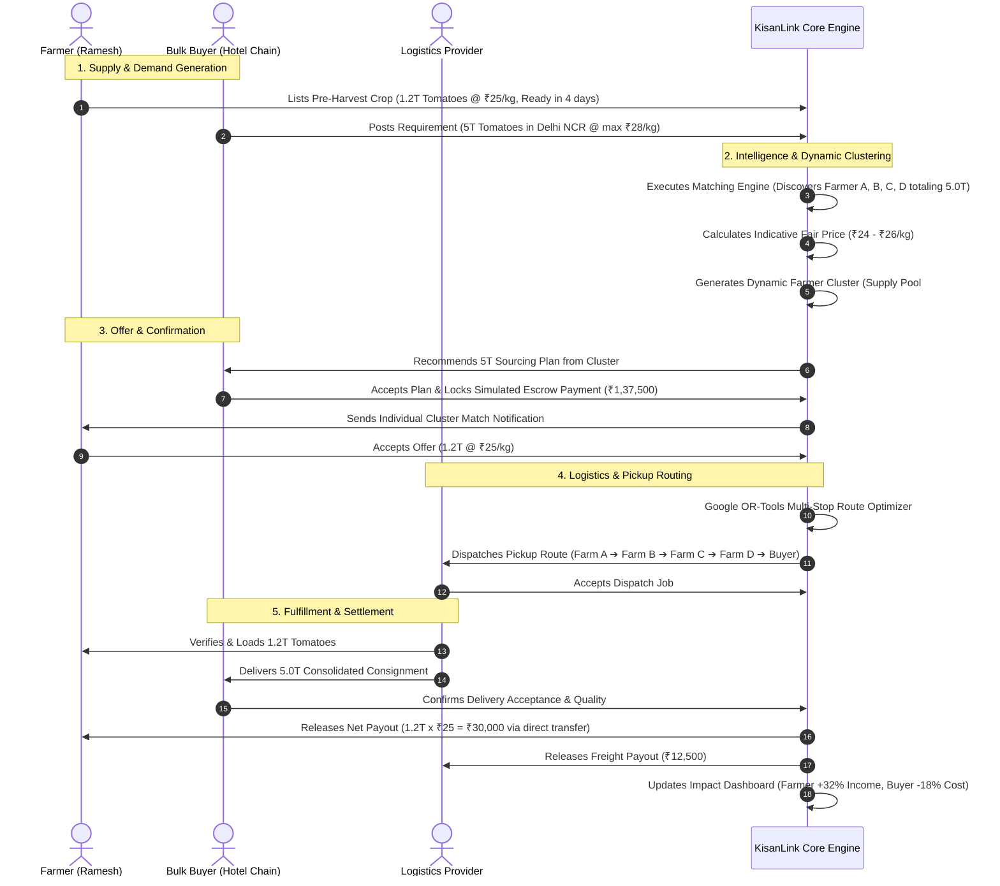

# KisanLink — Product Requirements Document (PRD)

**Project Name:** KisanLink (Direct Farm-to-Buyer Operating System)  
**Problem Statement ID:** 26033 (Smart India Hackathon 2026)  
**Problem Statement Title:** Multiple intermediaries reduce farmers' earnings and increase consumer prices  
**Target Organization:** Ministry of Consumer Affairs, Food & Public Distribution — Department of Consumer Affairs (DoCA)  
**Document Version:** 1.0.0  
**Status:** Approved Architectural Specification  
**Last Updated:** September 2026  

---

## Table of Contents

1. [Document Purpose](#1-document-purpose)
2. [Problem Statement & Background](#2-problem-statement--background)
3. [Product Vision & Positioning](#3-product-vision--positioning)
4. [Core Value Proposition](#4-core-value-proposition)
5. [Product Principles](#5-product-principles)
6. [Goals & Non-Goals](#6-goals--non-goals)
7. [Users & Stakeholder Personas](#7-users--stakeholder-personas)
8. [User Problems & Pain Points](#8-user-problems--pain-points)
9. [Accessibility & Digital Inclusion Strategy](#9-accessibility--digital-inclusion-strategy)
10. [Core User Journeys & End-to-End Lifecycles](#10-core-user-journeys--end-to-end-lifecycles)
11. [Module Breakdown & Feature Requirements](#11-module-breakdown--feature-requirements)
12. [Farmer Experience & Interaction Model](#12-farmer-experience--interaction-model)
13. [Buyer Experience (Consumer vs. Bulk Buyer)](#13-buyer-experience-consumer-vs-bulk-buyer)
14. [Logistics Experience & Shared Transportation](#14-logistics-experience--shared-transportation)
15. [AI, Machine Learning & Optimization Engine](#15-ai-machine-learning--optimization-engine)
16. [Marketplace Mechanics & Reverse Marketplace](#16-marketplace-mechanics--reverse-marketplace)
17. [Dynamic Farmer Clusters / Supply Pooling](#17-dynamic-farmer-clusters--supply-pooling)
18. [Pricing Model & Price Transparency Engine](#18-pricing-model--price-transparency-engine)
19. [Payment & Settlement Architecture (Escrow Experience)](#19-payment--settlement-architecture-escrow-experience)
20. [Trust, Reputation & Verification Systems](#20-trust-reputation--verification-systems)
21. [Multilingual & Voice Interaction Architecture](#21-multilingual--voice-interaction-architecture)
22. [Call-Center Support / Assisted Digital Access](#22-call-center-support--assisted-digital-access)
23. [Impact Analytics & Economic Formulations](#23-impact-analytics--economic-formulations)
24. [Functional Requirements Matrix](#24-functional-requirements-matrix)
25. [Non-Functional Requirements](#25-non-functional-requirements)
26. [MVP vs. Stretch vs. Future Classification](#26-mvp-vs-stretch-vs-future-classification)
27. [Risk Analysis & Mitigation Strategies](#27-risk-analysis--mitigation-strategies)
28. [Key Assumptions & Dependencies](#28-key-assumptions--dependencies)
29. [Success Criteria & KPIs](#29-success-criteria--kpis)
30. [SIH 2026 Golden Path Demo Scenario](#30-sih-2026-golden-path-demo-scenario)
31. [References & Related Documents](#31-references--related-documents)

---

## 1. Document Purpose

This Product Requirements Document (PRD) defines the product scope, system capabilities, behavioral specifications, user interaction models, economic mechanics, and technical constraints for **KisanLink** — an AI-powered direct farm-to-buyer operating system designed for the Smart India Hackathon (SIH) 2026 under Problem Statement 26033.

This document serves as the foundational contract for engineering, design, and evaluation. Every requirement is explicitly categorized into **MVP**, **Stretch**, or **Future Phase** to prevent scope creep while maintaining a path toward real-world deployment.

---

## 2. Problem Statement & Background

### 2.1 The Problem
In the traditional Indian agricultural supply chain, produce changes hands between 4 to 8 intermediaries before reaching the end buyer:

```
[Farmer] ➔ [Village Aggregator] ➔ [Kaccha Arhatiya] ➔ [Pucca Arhatiya / Commission Agent] 
         ➔ [Primary Wholesaler] ➔ [Secondary Wholesaler] ➔ [Retailer] ➔ [Consumer / End Buyer]
```

### 2.2 Structural Consequences
- **Severe Price Degradation for Farmers:** Farmers capture only 20%–35% of the final consumer retail price, often receiving barely enough to cover input costs.
- **High Buyer Procurement Costs:** Bulk buyers (hotels, restaurants, processors, institutional kitchens) pay high markups due to stacked intermediary margins, repeated loading/unloading, commission fees, and physical mandi cess.
- **Extreme Post-Harvest Spoilage:** Multi-hop transit, repeated loading/unloading, lack of scheduled logistics, and delays lead to 15%–30% perishable produce wastage.
- **Information Asymmetry:** Farmers lack forward visibility into true buyer demand and prevailing regional prices, forcing them into distress selling at local APMC mandis.
- **Fragmentation Barrier:** Individual smallholder farmers (holding < 2 hectares, comprising 86% of Indian farmers) produce small batch sizes (e.g., 500 kg to 2 tonnes) that cannot fulfill institutional bulk orders (e.g., 5 to 20 tonnes) without exploitative middleman aggregation.

---

## 3. Product Vision & Positioning

### 3.1 What KisanLink Is
**KisanLink** is **not merely a listing marketplace**. It is a **farm-to-buyer operating system and supply orchestration network** that:
1. **Aggregates Fragmented Supply:** Automatically groups geographically adjacent smallholder farmers into **Dynamic Farmer Clusters (Supply Pools)** to satisfy bulk institutional demand.
2. **Eliminates Middlemen Markups:** Directly pairs farmers with bulk buyers (restaurants, retailers, institutions, processors) and consumers.
3. **Optimizes Physical Flow:** Coordinates shared logistics with AI-powered multi-stop route optimization and load pooling.
4. **Levels Information Asymmetry:** Provides actionable regional demand forecasting and indicative fair-price guidance.
5. **Rescues Perishable Harvests:** Dynamically detects ageing produce and redirects it toward secondary commercial processing channels.

### 3.2 Positioning Statement
> *"For Indian farmers and commercial produce buyers who suffer from middleman price gouging and fragmented logistics, KisanLink is an intelligent agricultural supply operating system that dynamically clusters small farm yields, forecasts regional demand, automates fair-price matching, and optimizes multi-stop logistics—ensuring farmers earn 25–35% more while buyers pay 15–25% less."*

---

## 4. Core Value Proposition

| Stakeholder | Traditional Supply Chain | With KisanLink Operating System | Measurable Economic Benefit |
|---|---|---|---|
| **Farmer** | Sells to village aggregator at distress rates (e.g., ₹18/kg for tomatoes); bears high unloading cuts and delayed cash settlement. | Lists current or upcoming harvest; matches directly with verified buyers; receives fair price recommendation. | **+25% to +38% higher net farm-gate income** |
| **Bulk Buyer** | Buys from secondary wholesalers at ₹30–₹34/kg; suffers inconsistent grading and unreliable delivery timelines. | Posts procurement specs or reserves forward harvests; receives aggregated supply directly from farmer clusters. | **15% to 22% procurement cost reduction** |
| **Logistics Provider** | High empty-miles (deadhead runs); unorganized ad-hoc spot bookings; uncertain vehicle fill rates (< 50%). | Receives pre-clustered multi-farm pickup routes; guaranteed batch payloads (> 85% vehicle utilization). | **Higher revenue per trip, lower fuel wastage** |
| **Ecosystem / Society** | 20–30% food wastage across transit; inflated consumer food inflation; excessive carbon footprint from multi-hop transit. | Direct farm-to-buyer transit; route optimization; urgent wastage rescue rerouting. | **Reduced food spoilage, lower transport emissions** |

---

## 5. Product Principles

1. **Radical Farmer Simplicity:** The farmer UI must never resemble an ERP or spreadsheet. It must feature large visual touch targets, minimal textual density, native Hindi/English voice interaction, and immediate one-tap access to human call-center assistance.
2. **Deterministic Over Magical AI:** Critical transactional operations (payments, cluster quantity math, pricing boundaries, order state transitions) must use deterministic algorithms. AI/ML is strictly applied where statistical modeling or natural language adds distinct value (demand forecasting, voice parsing, CV grading estimation).
3. **Bidirectional Transparency:** Every transaction breakdown must display transparent economics (buyer gross payment, transport cost, platform service fee, net farmer disbursement). Zero hidden deductions.
4. **Supply Clustering Without Organizational Burden:** Enable small farmers to participate in bulk contracts without requiring prior formal legal entity incorporation (Dynamic Farmer Clusters).
5. **Resilience to Failure:** The entire platform must operate gracefully under offline/low-connectivity conditions, providing voice fallbacks and manual call-center operator workflows.

---

## 6. Goals & Non-Goals

### 6.1 Product Goals
- **G1:** Enable farmers to list current and pre-harvest crops in under 60 seconds via voice or simplified UI.
- **G2:** Enable buyers to publish bulk procurement requirements (Reverse Marketplace) and reserve forward crops.
- **G3:** Automate dynamic farmer supply pooling (combining multiple farm yields to fulfill single large orders).
- **G4:** Deliver an AI-powered multi-stop route optimization plan for consolidated farm pickups and buyer drop-off.
- **G5:** Provide regional demand forecasts and fair-price range recommendations to eradicate distress sales.
- **G6:** Simulate a secure escrow-style payment workflow with automated transparent split payouts.
- **G7:** Calculate real-time quantifiable impact metrics (farmer income delta, buyer savings, food wastage rescued, km saved).

### 6.2 Non-Goals (Explicitly Out of MVP Scope)
- **NG1 — No Formal FPO Management Module:** Do not build FPO member dashboards, collective ledger management, or cooperative shareholding modules in the MVP.
- **NG2 — No Complex Admin Operations Dashboard:** Do not build an administrative control suite for the MVP; use basic backend database seeds and developer tooling.
- **NG3 — No Regulated Banking Escrow Integration:** Do not build licensed banking escrow accounts; use simulated gateway sandboxes with mock multi-party settlements.
- **NG4 — No Deep Native Cold-Chain IoT Hardware:** Do not require real-time temperature/humidity telemetry hardware integration.
- **NG5 — No Mandatory Certified Quality Labs:** Do not implement physical laboratory chemical certification workflows; rely on farmer declaration, indicative AI image grading, and buyer acceptance verification.

---

## 7. Users & Stakeholder Personas

```mermaid
graph TD
    classDef primary fill:#e8f5e9,stroke:#2e7d32,stroke-width:2px;
    classDef buyer fill:#e3f2fd,stroke:#1565c0,stroke-width:2px;
    classDef log fill:#fff3e0,stroke:#e65100,stroke-width:2px;
    classDef future fill:#f3e5f5,stroke:#7b1fa2,stroke-width:1px,stroke-dasharray: 5 5;

    subgraph Active_MVP_Actors [Active MVP Actors]
        Farmer[Farmer / Smallholder Producer]:::[primary]
        Consumer[Individual Consumer]:::[buyer]
        BulkBuyer[Bulk Buyer: Restaurant, Hotel, Retailer, Processor]:::[buyer]
        Transporter[Logistics Provider / Transporter]:::[log]
        CallCenter[Call Center Operator Proxy]:::[primary]
    end

    subgraph Future_Actors [Future Phase Actors]
        FPOAdmin[FPO Management Entity]:::[future]
        PlatformAdmin[Platform Operations & Risk Manager]:::[future]
    end
```

### 7.1 Farmer Persona
- **Name:** Ramesh Sharma (Smallholder Farmer, Sonipat, Haryana)
- **Profile:** Cultivates 3 acres of tomatoes and cauliflower. Owns a budget 4G Android smartphone. Prefers spoken Hindi over typing English.
- **Primary Need:** Wants to know where he can sell his 1,200 kg tomato harvest next week at a guaranteed fair price without paying exorbitant mandi commission or loading cuts.
- **Key Barrier:** Low digital literacy; fears getting cheated by complex apps; needs immediate phone support if confused.

### 7.2 Bulk Buyer Persona
- **Name:** Vikram Mehra (Procurement Head, Delhi NCR Hotel & Restaurant Chain)
- **Profile:** Manages fresh produce sourcing for 8 commercial kitchens. Consumes 4 to 8 tonnes of fresh vegetables weekly.
- **Primary Need:** Needs reliable bulk supplies delivered on schedule at stable, predictable rates with consistent grade standards.
- **Key Barrier:** Dealing with multiple unreliable mandi middlemen; volatile daily price swings; lack of origin traceability.

### 7.3 Logistics Provider Persona
- **Name:** Gurpreet Singh (Independent Fleet / Small Truck Owner-Driver)
- **Profile:** Operates two 3.5-tonne light commercial vehicles (LCVs) across Haryana-Delhi NCR corridors.
- **Primary Need:** Wants scheduled consolidated loads that maximize truck volume capacity and minimize unbilled empty return trips.
- **Key Barrier:** Fragmented multi-point pickups with no route optimization leads to fuel wastage and delayed delivery penalties.

### 7.4 Call Center Operator (Proxy Persona)
- **Name:** Sunita Devi (Rural Support Agent)
- **Profile:** Operates a desktop terminal with phone line to assist farmers who dial the toll-free "Call Support" number.
- **Primary Need:** Quickly search, verify farmer voice requests, and create crop listings or accept buyer offers on their behalf.

---

## 8. User Problems & Pain Points

```
+----------------------------------------------------------------------------------------------------+
|                                      FARMER PAIN POINTS                                            |
+----------------------------------------------------------------------------------------------------+
| 1. Intermediary Exploitation : Village aggregators take 20-35% cuts on price.                     |
| 2. Volume Disadvantage       : Cannot fulfill lucrative institutional orders alone.                |
| 3. Distress Harvest Sales    : Perishable crops force immediate selling at prevailing spot mandi.  |
| 4. Information Blindness     : Zero visibility into true consumer demand and fair farm-gate value. |
| 5. Digital Intimidation      : Complex mobile apps with dense English text cause friction.         |
+----------------------------------------------------------------------------------------------------+

+----------------------------------------------------------------------------------------------------+
|                                    BULK BUYER PAIN POINTS                                          |
+----------------------------------------------------------------------------------------------------+
| 1. Heavy Price Markups       : Multi-layer commission agents inflate procurement prices by 30-50%.|
| 2. Unreliable Delivery       : Disorganized logistics leads to missed morning kitchen deadlines.   |
| 3. Quality Inconsistency     : No standardized grading or transparent origin traceability.         |
| 4. Inefficient Sourcing      : Must call multiple traders daily to piece together 5-10 tonne loads.|
+----------------------------------------------------------------------------------------------------+

+----------------------------------------------------------------------------------------------------+
|                                  LOGISTICS PROVIDER PAIN POINTS                                    |
+----------------------------------------------------------------------------------------------------+
| 1. Poor Truck Utilization    : Trucks run 40-50% empty due to unorganized pickup schedules.        |
| 2. Suboptimal Routing        : Zig-zag farm pickups without navigation optimization waste diesel.  |
| 3. Payment Delays            : Unregulated freight brokerage delays freight disbursement for weeks.|
+----------------------------------------------------------------------------------------------------+
```

---

## 9. Accessibility & Digital Inclusion Strategy

To ensure genuine adoption among rural farmers across diverse literacy levels:

1. **High-Contrast, Large-Touch Interface:** Primary actions use oversized button cards with recognizable agricultural iconography and dual-language labels (Hindi + English).
2. **Native Voice-Driven Workflows:** Integrated Web Speech / audio recognition allows farmers to speak naturally in Hindi or English (e.g., *"Mere paas 800 kilo tamatar hai, agle hafte taiyaar ho jayega"*). The system parses intent into structured listing attributes and only prompts for missing parameters.
3. **One-Tap "Call Support / हमसे बात करें" Prominence:** A persistent, floating toll-free support button is visible on every farmer screen. Tapping connects the farmer to assisted tele-support where a representative can manage listings and orders on the farmer's behalf.
4. **Low-Bandwidth & Low-End Device Optimization:** Lightweight PWA architecture ensures sub-2-second loads on 3G/budget 4G Android devices with offline caching of active listings and order states.
5. **No Forced Complex KYC:** Phone number OTP authentication allows immediate onboarding in under 30 seconds; bank account/UPI details are only requested when a payout is due.

---

## 10. Core User Journeys & End-to-End Lifecycles



---

## 11. Module Breakdown & Feature Requirements

The KisanLink operating system is structured into **12 Core Modules**:

```
+--------------------------------------------------------------------------------------------------+
|                                    KISANLINK SYSTEM MODULES                                      |
+------------------------------------+-----------------------------------+-------------------------+
| M01: Farmer Supply & Listing       | M02: Buyer Demand & Requirements  | M03: Matching Engine    |
| M04: Dynamic Supply Clustering     | M05: Logistics & Routing Engine   | M06: Price Intelligence |
| M07: Demand & Supply Forecasting   | M08: Order & Escrow Management    | M09: Wastage Rescue     |
| M10: Multilingual & Voice Assistant| M11: Trust & Verification         | M12: Impact Analytics   |
+------------------------------------+-----------------------------------+-------------------------+
```

---

## 12. Farmer Experience & Interaction Model

### 12.1 Screen Architecture
The farmer experience is deliberately constrained to **6 Primary Action Cards**:

```
+------------------------------------------------------------------------+
|  [Logo] KisanLink / किसान लिंक                 [हिन्दी | English]  [Bell]|
+------------------------------------------------------------------------+
|  Namaste, Ramesh Ji! (Sonipat, Haryana)                                |
+------------------------------------------------------------------------+
|                                                                        |
|   +--------------------------------+  +------------------------------+ |
|   |        [🌾 Sell My Crop]       |  |      [🔍 Find Buyers]        | |
|   |         अपनी फसल बेचें         |  |         खरीदार खोजें         | |
|   +--------------------------------+  +------------------------------+ |
|                                                                        |
|   +--------------------------------+  +------------------------------+ |
|   |        [📦 My Orders]          |  |      [🚚 Transport]          | |
|   |          मेरे ऑर्डर            |  |          गाड़ी / वाहन         | |
|   +--------------------------------+  +------------------------------+ |
|                                                                        |
|   +--------------------------------+  +------------------------------+ |
|   |        [💰 Payments]           |  |      [🤖 Speak to AI]        | |
|   |         भुगतान / खाते          |  |         बोलकर बताएं          | |
|   +--------------------------------+  +------------------------------+ |
|                                                                        |
+------------------------------------------------------------------------+
|  [🔴 Call Support / हमसे बात करें (Toll Free: 1800-XXX-XXXX)]          |
+------------------------------------------------------------------------+
|  Live Price Guidance: Tomato Mandi ₹19/kg | KisanLink Direct ₹25/kg    |
+------------------------------------------------------------------------+
```

### 12.2 Listing Creation Workflow
1. **Selection:** Choose Crop (e.g., Tomato / टमाटर) from icon grid or speak name.
2. **Harvest Status:** Toggle "Harvested Now" vs. "Upcoming Harvest" (Pre-Harvest).
3. **Quantity:** Enter quantity in kg or tonnes via simple stepper or numeric dialer.
4. **Expected Price:** System displays the **Recommended Fair-Price Band** (e.g., ₹23–₹26/kg). Farmer sets asking price.
5. **Photo / Grading (Optional):** Upload 1–3 photos. System provides instant indicative AI grade (e.g., "Grade A").
6. **Submit:** Instant confirmation with active matching status.

---

## 13. Buyer Experience (Consumer vs. Bulk Buyer)

### 13.1 Buyer Types Supported
- **Consumers:** Small batch orders (5 kg – 50 kg), farm-direct origin story, transparent farm pricing.
- **Bulk Buyers:** Restaurants, hotels, catering companies, retail chains, supermarkets, food processors, wholesalers, institutions.

### 13.2 Bulk Buyer Procurement Dashboard
- **Post Procurement Requirement (Reverse Marketplace):** Define crop, variety, grade requirement (Grade A/B), batch size (e.g., 5,000 kg), delivery location, required delivery window, and ceiling price.
- **Procurement Strategy Visualizer:** View automatically generated sourcing plans showing matched individual farmers or **Dynamic Farmer Clusters**.
- **Crop Availability Calendar:** Interactive forward calendar showing upcoming harvest supply across surrounding districts over the next 4 weeks.
- **Order Tracking & Quality Review:** Real-time multi-point pickup tracking, digital bill of lading, and delivery acceptance sign-off.

---

## 14. Logistics Experience & Shared Transportation

### 14.1 The Transporter Workspace
- **Load Board:** View dispatched multi-farm consolidated loads within operational radius.
- **Manifest Details:** Displays pickup stops (GPS coordinates, farmer name, contact, verified weight, loading window) and final buyer drop-off location.
- **Route Navigator:** Displays turn-by-turn multi-stop route generated by the Google OR-Tools optimization engine.

### 14.2 Shared Load Pooling
When individual farm pickups do not fill a truck (e.g., Farmer A: 700 kg, Farmer B: 500 kg, Farmer C: 900 kg = 2,100 kg), the system combines them into a single 3.5T vehicle dispatch, preventing dead-heading and lowering freight cost per kg by 30–45%.

---

## 15. AI, Machine Learning & Optimization Engine

### 15.1 Architectural Separation of Concerns

```
+----------------------------------------------------------------------------------------------------+
|                                    DECISION & COMPUTATION ARCHITECTURE                             |
+------------------------------+----------------------------------+----------------------------------+
|      DETERMINISTIC LOGIC     |        OPTIMIZATION ENGINES      |         AI / MACHINE LEARNING    |
| (100% Strict / Rule-Based)   |     (Mathematical Solvers)       |       (Statistical & Generative) |
+------------------------------+----------------------------------+----------------------------------+
| • Hard distance bounds       | • Multi-Farmer Supply Pooling    | • Regional Demand Forecasting    |
| • Financial split settlements|   (Mixed Integer Linear Program) |   (LightGBM / XGBoost)           |
| • Quantity arithmetic totals | • Multi-Stop Vehicle Routing     | • Multilingual Voice Intent NLP  |
| • Order state transitions    |   (Google OR-Tools CVRP solver)  |   (Whisper / Web Speech + LLM)   |
| • Role-based access security | • Load Pooling & Bin Packing     | • Indicative Produce CV Grading  |
| • Escrow lock / release flags|   (Volume/Weight optimization)   |   (MobileNet / YOLO Vision API)  |
+------------------------------+----------------------------------+----------------------------------+
```

### 15.2 AI Fallback Safeguards
- **Demand Forecast Fallback:** If the ML model fails or historical feature data is sparse, fallback to a 30-day moving average of regional mandi trading volumes.
- **Voice Recognition Fallback:** If audio parsing fails or speech API times out, fallback immediately to structured touch-based wizard with Hindi text prompts.
- **CV Grading Fallback:** If image quality is poor or vision inference fails, listing defaults to "Farmer Self-Assessed Grade" without blocking listing creation.
- **Route Optimizer Fallback:** If Google OR-Tools times out, fallback to nearest-neighbor greedy TSP (Traveling Salesperson Problem) routing algorithm.

---

## 16. Marketplace Mechanics & Reverse Marketplace

### 16.1 Forward Marketplace (Farmer-Initiated)
1. Farmer publishes listing (Crop, Available Date, Qty, Asking Price, Location).
2. Buyers browse or search using multi-attribute filters (Distance, Crop, Grade, Delivery Date, Price).
3. Buyer initiates order or submits negotiation counter-offer.

### 16.2 Reverse Marketplace (Buyer-Initiated — Primary Differentiator)
1. Buyer publishes a Procurement Requirement (e.g., *"Need 5,000 kg Grade A Tomatoes in Delhi on Friday, Max ₹28/kg"*).
2. The Matching Engine scans all active and pre-harvest listings within a 150 km radius.
3. If no single farmer holds 5,000 kg, the system executes **Supply Pooling** and builds a composite offer.
4. Matched farmers receive individual offer notifications with their specific quantity and revenue share.
5. Upon confirmation by farmers and buyer, an aggregated order is sealed.

### 16.3 Negotiation Protocol
- Supports structured offer-counteroffer cycles:
  `Buyer Offer` ➔ `Farmer Counter` ➔ `Buyer Acceptance / Decline`
- Hard pricing bounds prevent predatory bidding below calculated minimum transport break-even rates.

---

## 17. Dynamic Farmer Clusters / Supply Pooling

### 17.1 Problem Solved
Institutional buyers reject smallholder farmers because managing 10 separate 500 kg purchases creates massive operational overhead.

### 17.2 Dynamic Cluster Formulation
The platform mathematically aggregates individual farmers into temporary **Dynamic Supply Clusters**:

$$\text{Cluster} = \{F_1, F_2, \dots, F_k\} \quad \text{such that} \quad \sum_{i=1}^k Q_i \ge Q_{\text{target}}$$

**Clustering Constraints:**
1. **Geographical Compactness:** All farms in the cluster must reside within a bounding radius (e.g., $\le 30\text{ km}$ between peripheral farms).
2. **Crop & Grade Homogeneity:** Matching crop variety, maturity, and quality classification.
3. **Temporal Alignment:** Harvest readiness windows aligned within $\pm 24\text{ hours}$.
4. **Individual Attribution:** Every farmer's contributed quantity ($Q_i$), payout share ($P_i$), and pickup verification token are maintained independently in the database.

> [!IMPORTANT]
> A Dynamic Farmer Cluster is an automated algorithmic supply construct. It requires **no prior legal entity, cooperative registration, or FPO overhead** from the participating farmers.

---

## 18. Pricing Model & Price Transparency Engine

### 18.1 Fair Price Intelligence Model
The system calculates an indicative fair-price range $[\text{Price}_{\min}, \text{Price}_{\max}]$ using:
- Real-time / recent local APMC mandi modal price ($P_{\text{mandi}}$).
- Buyer wholesale landed benchmark ($P_{\text{wholesale}}$).
- Estimated direct transportation cost per kg ($C_{\text{transport}}$).
- Platform facilitation fee ($C_{\text{platform}} = 1.5\% - 2.0\%$).
- Regional supply-demand pressure index ($\delta$).

$$\text{Fair Farm-Gate Price} = P_{\text{mandi}} + 0.5 \times (P_{\text{wholesale}} - P_{\text{mandi}} - C_{\text{transport}})$$

### 18.2 Transaction Fee Breakdown Example (Transparent Economics)

```
+------------------------------------------------------------------------+
|                 TRANSPARENT TRANSACTION ECONOMICS                      |
+------------------------------------------------------------------------+
| Buyer Procurement Price (Delivered to Kitchen) : ₹28.00 / kg           |
|                                                                        |
| Deductions & Cost Allocation:                                          |
|   (-) Optimized Shared Logistics Cost          : ₹ 2.20 / kg           |
|   (-) Platform Maintenance Fee (1.8%)          : ₹ 0.50 / kg           |
|   (-) Mandi Middleman & Commission Fee         : ₹ 0.00 (REMOVED)      |
|                                                                        |
| Net Farmer Realization (Disbursed to Farmer)   : ₹25.30 / kg           |
+------------------------------------------------------------------------+
| Traditional Mandi Net Realization for Farmer   : ₹19.00 / kg           |
| NET FARMER EARNINGS IMPROVEMENT                : +₹ 6.30 / kg (+33.1%) |
| NET BUYER SAVINGS (vs. Wholesale ₹32/kg)       : -₹ 4.00 / kg (-12.5%) |
+------------------------------------------------------------------------+
```

---

## 19. Payment & Settlement Architecture (Escrow Experience)

```
[Buyer Places Order] ➔ [Simulated Escrow Lock: 100% Funds Secured]
                              │
                    [Logistics Dispatched]
                              │
                    [Multi-Farm Pickups Verified]
                              │
                    [Buyer Accepts Delivery]
                              │
         ┌────────────────────┴────────────────────┐
         ▼                                         ▼
[Farmer Disbursed: 100% Crop Value]     [Transporter Disbursed: Freight]
```

1. **Escrow Lock:** Upon order confirmation, the buyer's payment (simulated sandbox gateway) is locked in platform custody.
2. **Dispatch Assurance:** Farmers receive an automated SMS/App confirmation stating: *"Funds secured. Safe to harvest and load."*
3. **Proof of Delivery (PoD):** The transporter captures a digital delivery OTP/signature from the receiving buyer.
4. **Split Payout Execution:** The platform automatically splits the escrow balance:
   - $N$ individual farmer payouts directly to their respective bank accounts / UPI IDs.
   - 1 freight payout to the logistics provider.
   - Platform service fee retained.

---

## 20. Trust, Reputation & Verification Systems

### 20.1 Bidirectional Reputation Scoring
- **Farmer Score (0.0 – 5.0):** Based on order fulfillment rate, quantity accuracy (scale weight vs. listed weight), on-time harvest readiness, and buyer quality ratings.
- **Buyer Score (0.0 – 5.0):** Based on delivery acceptance speed, payment promptness, cancellation frequency, and transporter unloading turnaround time.
- **Transporter Score (0.0 – 5.0):** Based on on-time pickup/drop-off adherence, transit damage rate, and vehicle cleanliness.

### 20.2 Verification Badges
- **Phone Verified:** OTP verification complete (All users).
- **Location Verified:** Farm geo-coordinates confirmed via GPS / field check.
- **Business Verified:** GSTIN / FSSAI number validated (Bulk buyers).

### 20.3 Lightweight Dispute Protocol
If a buyer reports a quantity mismatch or severe quality defect upon delivery:
1. Buyer uploads photographic evidence and driver co-signs dispute ticket.
2. The disputed portion (e.g., 10%) is temporarily withheld in escrow while undisputed funds (90%) are disbursed immediately.
3. System logs ticket for operator mediation.

---

## 21. Multilingual & Voice Interaction Architecture

### 21.1 Language Support
- **Tier 1 (MVP):** Hindi (हिन्दी) and Indian English.
- **Tier 2 (Architecture Ready):** Punjabi, Marathi, Telugu, Tamil, Bengali, Kannada.

### 21.2 Voice Interaction Pipeline
1. **Audio Capture:** HTML5 Web Audio API / MediaRecorder records farmer speech in-browser.
2. **ASR (Speech-to-Text):** Converts audio stream to Hindi/English text.
3. **Intent & Entity Extraction:** NLP model extracts structured JSON:
   ```json
   {
     "intent": "CREATE_LISTING",
     "crop": "Tomato",
     "quantity_kg": 800,
     "harvest_days_relative": 7,
     "expected_price_per_kg": 25.0
   }
   ```
4. **Clarification Loop:** If mandatory parameters are missing, the assistant speaks back: *"आपकी फसल कहाँ पर स्थित है?" (Where is your crop located?)*.

---

## 22. Call-Center Support / Assisted Digital Access

### 22.1 Architecture for Digital Inclusion
For farmers with limited smartphone literacy or basic feature phones:
1. Farmer calls the toll-free helpline.
2. Interactive Voice Response (IVR) or human agent greets the farmer in their native language.
3. The Call Center Agent opens the **Assisted Operator Interface**.
4. The agent inputs the farmer's mobile number, triggers an instant SMS verification OTP, and accesses the farmer's account proxy.
5. The operator creates listings, reads buyer offers, explains fair-price guidance, and accepts orders with explicit verbal consent.
6. Every proxy transaction creates a permanent immutable audit trail (`created_by: "OPERATOR_PROXY"`, `operator_id: "OP-409"`).

---

## 23. Impact Analytics & Economic Formulations

The platform continuously evaluates and displays real-time macroeconomic impact metrics on the public impact tracker:

### 23.1 Mathematical Formulations

1. **Farmer Net Income Improvement ($\Delta I_{\text{farmer}}$):**
   $$\Delta I_{\text{farmer}} = \sum_{k \in \text{Orders}} Q_k \times (P_{\text{realized}, k} - P_{\text{mandi\_est}, k})$$

2. **Buyer Procurement Savings ($\Delta S_{\text{buyer}}$):**
   $$\Delta S_{\text{buyer}} = \sum_{k \in \text{Orders}} Q_k \times (P_{\text{traditional\_wholesale}, k} - P_{\text{buyer\_paid}, k})$$

3. **Food Spoilage Rescued ($W_{\text{saved}}$ in kg):**
   $$W_{\text{saved}} = \sum_{r \in \text{RescueOrders}} Q_r$$

4. **Transit Emissions & Distance Reduced ($\Delta D$ in km):**
   $$\Delta D = \sum_{\text{Dispatches}} (D_{\text{unoptimized\_multi\_trip}} - D_{\text{optimized\_pooled\_route}})$$

---

## 24. Functional Requirements Matrix

| Module ID | Requirement ID | Requirement Description | Priority | Complexity |
|---|---|---|---|---|
| **AUTH** | REQ-AUTH-01 | Mobile number + 6-digit OTP authentication for all roles | **MVP** | Low |
| **AUTH** | REQ-AUTH-02 | Role-based profile selection (Farmer, Buyer, Logistics) | **MVP** | Low |
| **FARM** | REQ-FARM-01 | Create crop listing (Crop, Variety, Qty, Price, Harvest Date, GPS) | **MVP** | Medium |
| **FARM** | REQ-FARM-02 | Pre-harvest listing support (future harvest date declaration) | **MVP** | Low |
| **FARM** | REQ-FARM-03 | Simplified 6-button Farmer Home with Hindi/English toggle | **MVP** | Medium |
| **FARM** | REQ-FARM-04 | Native voice input parsing for crop listing creation | **MVP** | High |
| **FARM** | REQ-FARM-05 | Persistent "Call Support" access on every screen | **MVP** | Low |
| **BUY** | REQ-BUY-01 | Bulk Buyer requirement posting (Reverse Marketplace) | **MVP** | Medium |
| **BUY** | REQ-BUY-02 | Forward crop discovery & Pre-harvest booking calendar | **MVP** | Medium |
| **BUY** | REQ-BUY-03 | Consumer single-farm direct marketplace browse & checkout | **MVP** | Low |
| **MATCH**| REQ-MATCH-01 | Dynamic Farmer Cluster generation (Supply Pooling solver) | **MVP** | High |
| **MATCH**| REQ-MATCH-02 | Multi-criteria procurement matching (Distance, Grade, Date, Price) | **MVP** | High |
| **LOG** | REQ-LOG-01 | Google OR-Tools multi-stop pickup route optimization | **MVP** | High |
| **LOG** | REQ-LOG-02 | Shared load pooling and vehicle capacity utilization tracking | **MVP** | Medium |
| **PRICE**| REQ-PRICE-01| Fair-price band recommendation engine with mandi comparison | **MVP** | Medium |
| **PRICE**| REQ-PRICE-02| Transparent fee breakdown display (Farmer gain vs. Buyer saving) | **MVP** | Low |
| **AI** | REQ-AI-01 | Regional crop demand forecasting (High / Normal / Low status) | **MVP** | High |
| **AI** | REQ-AI-02 | Indicative image-based produce quality grading | **Stretch** | Medium |
| **RESCUE**|REQ-RESCUE-01| Urgent sale / Wastage rescue tagging with dynamic discount pricing | **MVP** | Medium |
| **ESCROW**|REQ-ESCROW-01| Simulated escrow lock on order confirmation & split disbursement | **MVP** | Medium |
| **MAP** | REQ-MAP-01 | Interactive Digital Supply-Demand map with cluster visualization | **MVP** | Medium |
| **IMPACT**|REQ-IMPACT-01| Real-time SIH impact calculator (Farmer delta, buyer saving, wastage) | **MVP** | Low |
| **PROXY**| REQ-PROXY-01 | Call-center operator proxy mode for phone-assisted listings | **MVP** | Medium |

---

## 25. Non-Functional Requirements

### 25.1 Performance & Latency
- **API Response Time:** P95 response time $< 250\text{ ms}$ for search, matching, and listing endpoints.
- **Route Optimization Execution:** Multi-stop pickup route generation for $\le 10\text{ stops}$ must complete in $< 1.5\text{ seconds}$.
- **PWA Performance:** First Contentful Paint (FCP) $< 1.2\text{ s}$, Total Blocking Time $< 150\text{ ms}$ on 4G connections.

### 25.2 Availability & Reliability
- **Uptime:** 99.9% availability during SIH demonstration.
- **Graceful Degradation:** Core browse and listing features continue working even if external AI or Map tile services experience intermittent connectivity.

### 25.3 Security & Data Integrity
- **Authentication:** Stateless JWT bearer tokens with secure HTTP-only cookies and short expiry.
- **Data Validation:** Strict Pydantic input schemas preventing SQL injection, XSS, and payload tampering.
- **Transaction Safety:** ACID-compliant PostgreSQL transactions for all order state transitions and wallet balance updates.

### 25.4 Accessibility & Internationalization
- WCAG 2.1 Level AA compliance for color contrast and large touch target sizes ($\ge 48 \times 48\text{ px}$).
- Dynamic runtime string localization for Hindi and English without full page reloads.

---

## 26. MVP vs. Stretch vs. Future Classification

```
+----------------------------------------------------------------------------------------------------+
|                                    SCOPE CLASSIFICATION MATRIX                                     |
+------------------------------------+----------------------------------+----------------------------+
|        MVP (CURRENT FOCUS)         |         STRETCH FEATURES         |        FUTURE PHASES       |
+------------------------------------+----------------------------------+----------------------------+
| • Simple Farmer UI (6 Cards)       | • Indicative AI Produce Grading  | • Formal FPO Management    |
| • Hindi + English Localization     |   (Image CV Quality Estimation)  |   Module & Member Ledger   |
| • Voice Input Listing Creation     | • QR-Code Farm Story & Consumer  | • Full Admin Operations &  |
| • Call-Center Operator Proxy Mode  |   Traceability Label             |   Dispute Resolution CRM   |
| • Pre-Harvest Crop Listings        | • Alternative Processor Rescue   | • Regulated Banking Escrow |
| • Buyer Reverse Marketplace        |   Recommendation Engine          |   & Trade Credit Financing |
| • Dynamic Farmer Clustering        | • Weather-Risk Harvest Warning   | • IoT Cold-Chain Sensor    |
| • Google OR-Tools Route Optimizer  |   Integration                    |   Real-Time Telemetry      |
| • Shared Load Pooling              | • Under-Utilized Vehicle Return  | • National e-NAM / APMC    |
| • Fair-Price Recommendation Engine |   Trip Load Matching             |   Deep API Gateway Sync    |
| • Transparent Price Economics      |                                  | • Multilingual Voice IVR   |
| • Regional Demand Forecasting      |                                  |   Telephony Integration    |
| • Simulated Escrow Payments        |                                  | • Crop Insurance & Micro-  |
| • Wastage Rescue Urgent Tagging    |                                  |   Lending Risk Engine      |
| • Digital Supply-Demand Twin Map   |                                  |                            |
| • SIH Impact Analytics Dashboard   |                                  |                            |
+------------------------------------+----------------------------------+----------------------------+
```

---

## 27. Risk Analysis & Mitigation Strategies

| Risk Description | Severity | Likelihood | Mitigation Strategy |
|---|---|---|---|
| **Farmer Hesitation / Low Tech Literacy** | High | High | Extreme UI simplicity, native Hindi voice input, and persistent 1-tap call center support. |
| **Fake or Phantom Crop Listings** | Medium | Medium | Mobile OTP verification, GPS farm check, and bidirectional rating penalties. |
| **Logistics Carrier No-Show** | High | Low | Automated backup carrier re-dispatch and overbooking buffer parameters in cluster matching. |
| **AI Demand Forecast Deviations** | Medium | Medium | Display simple qualitative trends (High/Normal/Low) with bounding confidence intervals; fallback to moving averages. |
| **Cluster Delivery Disputes** | Medium | Medium | Digital delivery OTP sign-off and multi-party image verification at pickup. |

---

## 28. Key Assumptions & Dependencies

1. **Geographic Focus for Demo:** The system seed data and routing scenarios will focus on the **Delhi NCR – Haryana – Western UP agricultural corridor** (Sonipat, Panipat, Karnal, Meerut, Delhi).
2. **Target Crops:** Primary focus on high-volume perishables: **Tomatoes, Cauliflower, Onions, and Potatoes**.
3. **Map & Routing APIs:** OpenStreetMap / OSRM / Google OR-Tools distance matrices utilized for deterministic cost calculations.
4. **Mocked Financial Services:** UPI / Card payment gateways operate in simulated test sandbox mode with realistic settlement ledger splits.

---

## 29. Success Criteria & KPIs

- **Demonstration Success:** Flawless execution of the 8-step SIH 2026 Golden Path Demo in under 4 minutes.
- **Farmer Income Improvement:** Demonstrating $> 25\%$ net income increase over prevailing mandi benchmark.
- **Buyer Cost Reduction:** Demonstrating $> 15\%$ procurement cost savings over traditional wholesale.
- **Logistics Efficiency:** Demonstrating $> 80\%$ vehicle fill rate and $> 20\%$ route km reduction via shared multi-farm pickups.
- **Wastage Reduction:** Rescuing $\ge 90\%$ of simulated distress/surplus harvest batches before spoilage threshold.

---

## 30. SIH 2026 Golden Path Demo Scenario

The entire system is optimized to demonstrate this single end-to-end multi-stakeholder narrative to the SIH judges:

```
                                  SIH DEMO GOLDEN PATH
                                  
   [STEP 1: Farmer Pre-Harvest]     ➔   Ramesh (Sonipat) lists 1.2T Tomatoes ready in 3 days @ ₹25/kg.
                                         (Demonstrating Hindi voice input & Fair Price Guidance).
                                         
   [STEP 2: Supply Aggregation]     ➔   System already contains Farmers B (0.8T), C (1.7T), D (1.3T).
   
   [STEP 3: Buyer Requirement]      ➔   Hotel Chain posts need for 5.0 Tonnes Tomatoes in Delhi @ ₹28/kg.
   
   [STEP 4: AI Cluster & Match]     ➔   Matching Engine clusters Farmers A+B+C+D into Dynamic Pool (5.0T).
   
   [STEP 5: Order & Escrow Lock]    ➔   Buyer accepts; ₹1,37,500 locked in simulated escrow.
   
   [STEP 6: Route Optimization]     ➔   Google OR-Tools generates multi-stop pickup route for 1 truck:
                                         Warehouse ➔ Farm A ➔ Farm B ➔ Farm C ➔ Farm D ➔ Delhi Hotel.
                                         
   [STEP 7: Delivery & Split Pay]   ➔   Driver delivers; Buyer enters OTP; Escrow splits:
                                         Farmer A: ₹30,000 | Farmer B: ₹20,000 | Farmer C: ₹42,500 | 
                                         Farmer D: ₹32,500 | Transporter: ₹12,500.
                                         
   [STEP 8: Impact Dashboard]       ➔   Judge sees real-time impact:
                                         Farmer Net Gain: +32.4% | Buyer Savings: 18.1% | 
                                         Distance Saved: 68 km | Wastage Prevented: 600 kg.
```

---

## 31. References & Related Documents

- [Technical Requirements Document (TRD)](./TRD.md)
- [System Architecture & Implementation Plan](./IMPLEMENTATION_PLAN.md)
- [End-to-End System Flows & State Machines](./FLOWS.md)
- [UI/UX Design Specifications](./UI_UX_DESIGN.md)
- [REST API & WebSocket Specifications](./API_DESIGN.md)
- [Database Schema & Entity-Relationship Design](./DATABASE_DESIGN.md)
- [AI, Forecasting & Optimization Specifications](./AI_SYSTEMS.md)
- [Deployment & Infrastructure Guide](./DEPLOYMENT.md)
- [Future Roadmap & Phase 2+ Scope](./FUTURE_ROADMAP.md)

---
*End of KisanLink Product Requirements Document (PRD)*
