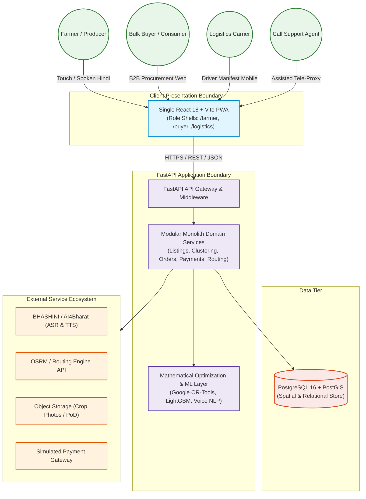
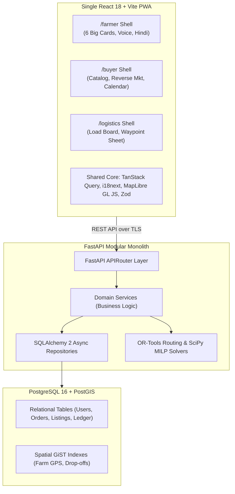
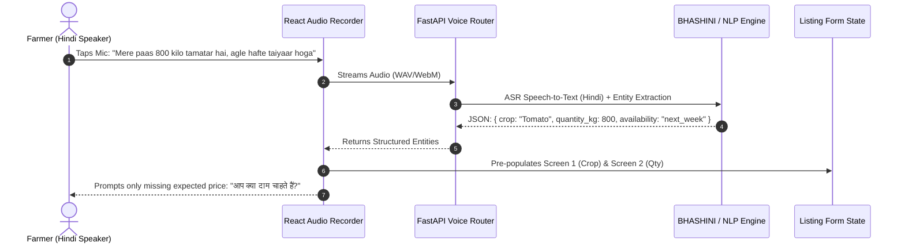

# KisanLink — Technical Requirements & Architecture Document (TRD)

**Project Name:** KisanLink (Direct Farm-to-Buyer Operating System)  
**Problem Statement ID:** 26033 (Smart India Hackathon 2026)  
**Document Version:** 1.0.0  
**Status:** Approved Technical Architecture  
**Primary Stack:** React 18+ (Vite, TypeScript, Tailwind CSS, MapLibre GL JS) + FastAPI (Python 3.11+, Pydantic v2, SQLAlchemy 2) + PostgreSQL 16 (PostGIS) + Google OR-Tools  
**Last Updated:** September 2026  

---

## Table of Contents

1. [Document Purpose & Scope](#1-document-purpose--scope)
2. [System Context & Operational Boundaries](#2-system-context--operational-boundaries)
3. [Architectural Principles & Non-Negotiables](#3-architectural-principles--non-negotiables)
4. [High-Level System Architecture](#4-high-level-system-architecture)
5. [Modular Monolith Architecture Decision](#5-modular-monolith-architecture-decision)
6. [Frontend Architecture (React + Vite PWA)](#6-frontend-architecture-react--vite-pwa)
7. [Backend Architecture (FastAPI & Domain Services)](#7-backend-architecture-fastapi--domain-services)
8. [Database Architecture (PostgreSQL 16 + PostGIS)](#8-database-architecture-postgresql-16--postgis)
9. [Geographic & Spatial Processing Architecture](#9-geographic--spatial-processing-architecture)
10. [Authentication & Authorization Subsystem](#10-authentication--authorization-subsystem)
11. [Marketplace & Reverse Marketplace Architecture](#11-marketplace--reverse-marketplace-architecture)
12. [Procurement Matching Engine Architecture](#12-procurement-matching-engine-architecture)
13. [Dynamic Farmer Clustering Architecture](#13-dynamic-farmer-clustering-architecture)
14. [Order Management & State Machine Architecture](#14-order-management--state-machine-architecture)
15. [Logistics & Fleet Dispatch Architecture](#15-logistics--fleet-dispatch-architecture)
16. [Road Routing & Google OR-Tools Optimization](#16-road-routing--google-or-tools-optimization)
17. [Payment, Escrow Simulation & Multi-Split Settlements](#17-payment-escrow-simulation--multi-split-settlements)
18. [AI, Machine Learning & Forecasting Architecture](#18-ai-machine-learning--forecasting-architecture)
19. [Language, Voice & BHASHINI Integration Subsystem](#19-language-voice--bhashini-integration-subsystem)
20. [Contextual Notification Subsystem](#20-contextual-notification-subsystem)
21. [Object & Media Storage Architecture](#21-object--media-storage-architecture)
22. [PWA, Offline Caching & Low-Bandwidth Strategy](#22-pwa-offline-caching--low-bandwidth-strategy)
23. [Security, Input Sanitization & Auditability](#23-security-input-sanitization--auditability)
24. [Scalability & Performance Budgets](#24-scalability--performance-budgets)
25. [Failure Modes & Graceful Degradation Safeguards](#25-failure-modes--graceful-degradation-safeguards)
26. [Observability, Telemetry & Structured Logging](#26-observability-telemetry--structured-logging)
27. [Testing Strategy & Test Harnesses](#27-testing-strategy--test-harnesses)
28. [External Integration Contracts](#28-external-integration-contracts)
29. [Provider Abstraction Layer (Hexagonal Ports & Adapters)](#29-provider-abstraction-layer-hexagonal-ports--adapters)
30. [Technical Debt & Risk Register](#30-technical-debt--risk-register)
31. [Architecture Decision Records (ADRs) Summary](#31-architecture-decision-records-adrs-summary)
32. [Future Infrastructure Scaling Strategy](#32-future-infrastructure-scaling-strategy)

---

## 1. Document Purpose & Scope

This Technical Requirements Document (TRD) governs the system topology, component interactions, database schemas, computational models, network contracts, and infrastructure specifications for **KisanLink**. It bridges the functional requirements in [PRD.md](./PRD.md) and the execution roadmap in [IMPLEMENTATION_PLAN.md](./IMPLEMENTATION_PLAN.md).

---

## 2. System Context & Operational Boundaries



---

## 3. Architectural Principles & Non-Negotiables

1. **Strict Tri-Partite Computation Classification:**
   - **Deterministic Rules:** Auth, permissions, financial splits, order FSM, quantity constraints, and database transactions are 100% deterministic code.
   - **Mathematical Optimization:** Multi-farmer supply pooling (MILP) and vehicle routing (CVRP) use Google OR-Tools solvers with mathematical optimality bounds.
   - **AI/ML & Generative Systems:** Demand forecasting, voice parsing, and CV grading provide statistical recommendations; **AI never writes unvalidated data directly to the database**.
2. **FastAPI Business Logic Boundary:**
   - The React frontend communicates strictly with FastAPI via typed REST APIs. Direct frontend-to-database manipulation is strictly prohibited.
3. **Location as a First-Class Primitive:**
   - All geographical points are stored as native PostGIS `geography(Point, 4326)` types. Distance queries, bounding boxes, and cluster radiuses must leverage PostGIS GiST spatial indexing (`ST_DWithin`, `ST_Distance`).
4. **Resilience to Upstream Failures:**
   - Every external service (BHASHINI voice API, road routing engine, image classifier) has an automated, immediate deterministic fallback. The application remains 100% operational offline or during external service outages.

---

## 4. High-Level System Architecture



---

## 5. Modular Monolith Architecture Decision

### 5.1 Rationale
A **Modular Monolith** in FastAPI is selected over microservices for SIH 2026:
- **Zero Distributed Network Overhead:** Order placement, dynamic farmer clustering, and escrow locking execute within a single ACID database transaction.
- **Rapid Shared Typing:** Direct code reuse of Pydantic v2 schemas and validation logic between domain services.
- **Simplified Deployment & Testing:** Single container startup (`docker-compose up`) enabling deterministic test automation and instant demo resets.

### 5.2 Domain Module Boundaries
```
backend/
├── app/
│   ├── auth/            # JWT issuance, mobile OTP, role validation
│   ├── users/           # User accounts, farmer/buyer/transporter profiles
│   ├── listings/        # Crop listings, pre-harvest declarations, media
│   ├── requirements/    # Buyer reverse marketplace procurement postings
│   ├── matching/        # Supplier scoring, dynamic clustering solver
│   ├── orders/          # Order lifecycle FSM, line-item allocations
│   ├── logistics/       # Load manifests, vehicle assignments, PoD verification
│   ├── routing/         # OSRM road matrix abstraction & Google OR-Tools CVRP
│   ├── payments/        # Simulated escrow ledger, multi-party split settlements
│   ├── pricing/         # APMC mandi benchmarks, fair-price calculation engine
│   ├── forecasting/     # Regional demand regression models (LightGBM/XGBoost)
│   ├── voice/           # BHASHINI / Whisper speech transcription & NLP parsing
│   ├── rescue/          # Spoilage risk evaluation, urgent wastage discounting
│   ├── impact/          # Macroeconomic SIH impact aggregation metrics
│   └── assisted/        # Call-center tele-support proxy verification
```

---

## 6. Frontend Architecture (React + Vite PWA)

### 6.1 Technology Stack
- **Framework & Build:** React 18+, TypeScript 5+, Vite 5+.
- **PWA Capabilities:** `vite-plugin-pwa` with Workbox service worker caching for offline shell, cached localization dictionaries, and background draft sync.
- **State & Server Cache:** TanStack Query v5 (React Query) for server state caching, optimistic UI updates, and automatic polling for order status.
- **Form Handling:** React Hook Form + Zod for strict client-side validation before network transmission.
- **Styling & Tokens:** Tailwind CSS with custom semantic design tokens (`#236747` Deep Green, `#F7F4EB` Warm Ivory, `#D9613C` Produce Urgency).
- **Icons:** `lucide-react`.
- **Maps:** MapLibre GL JS for vector map rendering with zero vendor lock-in.
- **Internationalization:** `i18next` + `react-i18next` supporting instant Hindi (`hi`) and English (`en`) toggling.

### 6.2 Role Shell Isolation Architecture
```
src/
├── app/
│   ├── farmer/          # Radical simplicity: 6 large action cards, step-by-step wizard
│   ├── buyer/           # B2B reverse marketplace, crop calendar, digital twin map
│   ├── logistics/       # Utility-first load board, multi-stop pickup sheet
│   └── shared/          # Auth, order tracker, impact dashboard, assisted call-support
├── components/
│   ├── ui/              # shadcn/ui primitives customized to 16px border-radius
│   ├── voice/           # Microphone widget with Web Audio API waveform visualizer
│   └── map/             # MapLibre GL wrapper for clusters, heatmaps, and routing paths
```

---

## 7. Backend Architecture (FastAPI & Domain Services)

### 7.1 Framework Standards
- **Python Runtime:** Python 3.11+ using asynchronous `async`/`await` patterns for I/O operations.
- **Validation Engine:** Pydantic v2 for data coercion, schema serialization, and strict bounds checking.
- **ORM & Database Layer:** SQLAlchemy 2.0 with async engine (`asyncpg`) and declarative mapped dataclasses.
- **Database Migrations:** Alembic with auto-generating revision scripts targeting PostGIS geometries.

---

## 8. Database Architecture (PostgreSQL 16 + PostGIS)

### 8.1 Schema Design
The persistent data model uses PostgreSQL 16 with PostGIS extension. All spatial coordinates are stored natively:
```sql
CREATE EXTENSION IF NOT EXISTS postgis;
CREATE EXTENSION IF NOT EXISTS "uuid-ossp";

-- Example spatial column on listings:
-- location GEOGRAPHY(Point, 4326) NOT NULL
```

### 8.2 Spatial Query Optimization
Spatial bounding queries use PostGIS native operators:
```sql
-- Query active tomato listings within 50km of buyer location:
SELECT id, crop_name, quantity_kg, price_per_kg,
       ST_Distance(location, ST_SetSRID(ST_MakePoint(:buyer_lon, :buyer_lat), 4326)::geography) / 1000.0 AS distance_km
FROM crop_listings
WHERE crop_name = 'Tomato'
  AND status = 'ACTIVE'
  AND ST_DWithin(location, ST_SetSRID(ST_MakePoint(:buyer_lon, :buyer_lat), 4326)::geography, 50000)
ORDER BY distance_km ASC;
```

---

## 9. Geographic & Spatial Processing Architecture


- **Coordinates Standard:** WGS 84 (`EPSG:4326`).
- **Distance Metric:** Spheroidal geodetic distance in meters via PostGIS `ST_Distance(geography, geography)`.
- **Road Distance Matrix:** Asynchronous batching using OSRM Table API to retrieve real driving distance (km) and estimated transit duration (minutes).

---

## 10. Authentication & Authorization Subsystem

### 10.1 Passwordless Mobile OTP Flow
```mermaid
sequenceDiagram
    autonumber
    actor User as Farmer / Buyer / Transporter
    participant React as React PWA
    participant FastAPI as FastAPI Auth Service
    participant DB as PostgreSQL

    User->>React: Enters Mobile Number (e.g., +91 98123 45678)
    React->>FastAPI: POST /api/v1/auth/request-otp { phone: "+919812345678" }
    FastAPI->>DB: Persists OTP (5 min TTL)
    FastAPI-->>User: Sends 6-Digit SMS OTP (Simulated '123456' for SIH demo)
    User->>React: Inputs 6-digit OTP
    React->>FastAPI: POST /api/v1/auth/verify-otp { phone, otp }
    FastAPI->>DB: Validates OTP & retrieves/creates User record
    FastAPI-->>React: Returns JWT Access Token (24h) + Role Profile Payload
    React->>React: Stores JWT in secure memory + HttpOnly storage; redirects to role shell
```

---

## 11. Marketplace & Reverse Marketplace Architecture

### 11.1 Forward Marketplace
- Farmers list crop supply with harvest readiness timestamps (`harvest_date`), grading, batch weight, asking price, and GPS location.
- B2C consumers browse available supply with single-hop farm delivery.

### 11.2 Reverse Marketplace (Procurement Postings)
- B2B Bulk Buyers publish structured **Buyer Requirements**:
  - `crop_id`: Target crop type.
  - `target_quantity_kg`: E.g., 5,000 kg.
  - `max_price_per_kg`: E.g., ₹28.00/kg.
  - `delivery_deadline`: Target date/time.
  - `delivery_location`: PostGIS geography point.
  - `acceptable_grades`: Array `['GRADE_A', 'GRADE_B']`.
- Triggers the **Dynamic Farmer Clustering Solver**.

---

## 12. Procurement Matching Engine Architecture

The matching engine ranks candidate farmers using a multi-factor scoring function:

$$\text{Score}(F_i, R) = w_1 \cdot S_{\text{dist}} + w_2 \cdot S_{\text{price}} + w_3 \cdot S_{\text{time}} + w_4 \cdot S_{\text{rel}} + w_5 \cdot S_{\text{quality}}$$

Where:
- $S_{\text{dist}} = \max\left(0, 1 - \frac{\text{Distance}(F_i, R)}{R_{\max}}\right)$ (Proximity score).
- $S_{\text{price}} = \max\left(0, 1 - \frac{P_{F_i} - P_{\text{target}}}{P_{\text{target}}}\right)$ (Price alignment).
- $S_{\text{time}} = \text{Harvest readiness window overlap score } [0, 1]$.
- $S_{\text{rel}} = \text{Farmer historical fulfillment rating } [0, 1]$.
- Weights: $w_1 = 0.30, w_2 = 0.25, w_3 = 0.20, w_4 = 0.15, w_5 = 0.10$.

---

## 13. Dynamic Farmer Clustering Architecture

When a buyer requirement $Q_{\text{req}}$ exceeds any single farmer's quantity $q_i$, the system formulates a **Mixed-Integer Linear Program (MILP)**:

$$\min \sum_{i \in \text{Candidates}} \left( c_i \cdot x_i + \lambda \cdot d_i \cdot y_i \right)$$

$$\text{Subject to:} \quad \sum_{i} x_i = Q_{\text{req}}, \quad 0 \le x_i \le q_i \cdot y_i, \quad y_i \in \{0, 1\}$$

Where:
- $y_i = 1$ if Farmer $i$ is selected in the cluster, $0$ otherwise.
- $x_i$ is the quantity allocated from Farmer $i$.
- $c_i$ is the unit asking price of Farmer $i$.
- $d_i$ is the road distance between Farm $i$ and the centroid of the cluster.
- $\lambda$ is the spatial penalty weight minimizing geographic dispersion.

The solver creates an immutable `DynamicCluster` record referencing individual `ClusterItem` lines.

---

## 14. Order Management & State Machine Architecture

```mermaid
stateDiagram-v2
    [*] --> DRAFT : Buyer initiates / matches cluster
    DRAFT --> CONFIRMED : Buyer accepts sourcing plan
    CONFIRMED --> ESCROW_LOCKED : Payment secured in simulated escrow
    ESCROW_LOCKED --> PICKUP_SCHEDULED : Logistics vehicle assigned & route generated
    PICKUP_SCHEDULED --> IN_TRANSIT : Transporter completes farm pickups & verifies weight
    IN_TRANSIT --> DELIVERED : Consignment arrives at buyer destination
    DELIVERED --> SETTLED : Buyer inputs delivery OTP; automated split payout executes
    
    CONFIRMED --> CANCELLED : Cancelled before dispatch (100% refund)
    IN_TRANSIT --> DISPUTED : Damaged goods / weight mismatch flagged
    DISPUTED --> SETTLED : Mediation adjustment resolved
    SETTLED --> [*]
    CANCELLED --> [*]
```



---

## 15. Logistics & Fleet Dispatch Architecture

- **Load Board:** Dispatches consolidated cluster pickups to available transporters within the operational district.
- **Manifest Entity:** Holds sequential waypoint stops with farmer contact, GPS navigation link, and required loading weight.
- **Digital Proof of Delivery (PoD):** 4-digit verification code provided by buyer upon physical inspection.

---

## 16. Road Routing & Google OR-Tools Optimization

### 16.1 Separation of Road Geometry vs. Optimization
- **Road Routing Provider (OSRM):** Fetches real driving distance matrix $D_{ij}$ and transit duration $T_{ij}$ across all waypoint permutations.
- **Optimization Engine (Google OR-Tools):** Solves the **Capacitated Vehicle Routing Problem (CVRP)**:
  - Finds the optimal pickup sequence: $\text{Depot} \rightarrow \text{Farm } 3 \rightarrow \text{Farm } 1 \rightarrow \text{Farm } 4 \rightarrow \text{Farm } 2 \rightarrow \text{Buyer Destination}$.
  - Constraints: Total payload $\le \text{Vehicle Capacity}$ (e.g., 5.0 Tonnes), pickup completion before buyer delivery window.

---

## 17. Payment, Escrow Simulation & Multi-Split Settlements

```
+----------------------------------------------------------------------------------------------------+
|                                  SIMULATED ESCROW LEDGER BREAKDOWN                                 |
+----------------------------------------------------------------------------------------------------+
| Gross Buyer Payment (Locked at Order Confirmation) : ₹1,37,500.00                                   |
|                                                                                                    |
| Payout Disbursements (Triggered Automatically on Delivery OTP Verification):                        |
|   ├── Farmer A (Sonipat - 1,200 kg @ ₹25.00/kg)     : ₹ 30,000.00 (Direct UPI / Bank Transfer)     |
|   ├── Farmer B (Sonipat - 800 kg @ ₹25.00/kg)       : ₹ 20,000.00 (Direct UPI / Bank Transfer)     |
|   ├── Farmer C (Panipat - 1,700 kg @ ₹25.00/kg)     : ₹ 42,500.00 (Direct UPI / Bank Transfer)     |
|   ├── Farmer D (Panipat - 1,300 kg @ ₹25.00/kg)     : ₹ 32,500.00 (Direct UPI / Bank Transfer)     |
|   ├── Transporter (5.0T LCV Multi-Pickup Freight)   : ₹ 12,500.00 (Direct Freight Settlement)      |
|   └── KisanLink Platform Maintenance Fee (1.8%)     : ₹  2,500.00 (Platform Revenue)              |
+----------------------------------------------------------------------------------------------------+
| TOTAL BALANCED RECONCILIATION                      : ₹1,37,500.00 (Zero Drift Ledger)              |
+----------------------------------------------------------------------------------------------------+
```

---

## 18. AI, Machine Learning & Forecasting Architecture

### 18.1 Regional Demand Forecasting
- **Model:** Gradient Boosted Decision Trees (LightGBM / XGBoost Regressor).
- **Features:** Historic mandi arrival volumes, seasonal lag variables (7-day, 14-day, 28-day), rainfall anomalies, festival dates, active buyer procurement requests.
- **Output Transformation:** Continuous predicted demand metric mapped to qualitative badges for farmers:
  - $\Delta \text{Demand} > +15\% \rightarrow \mathbf{High\ Demand}$ (Green badge).
  - $-10\% \le \Delta \text{Demand} \le +15\% \rightarrow \mathbf{Normal}$ (Neutral badge).
  - $\Delta \text{Demand} < -10\% \rightarrow \mathbf{Low\ Demand}$ (Muted badge).

### 18.2 Indicative Produce Quality Grading (Stretch)
- Lightweight MobileNetV3 / Vision API estimating visible surface blemishes, color uniformity, and indicative grade (`Grade A`, `Grade B`, `Process Grade`).
- System explicitly frames output as *indicative computer vision estimation*, not certified chemical/lab inspection.

---

## 19. Language, Voice & BHASHINI Integration Subsystem



- **Provider Abstraction:** `SpeechService` interface allows swapping BHASHINI with AI4Bharat, OpenAI Whisper, or local browser Web Speech API without modifying core endpoints.

---

## 20. Contextual Notification Subsystem

- Asynchronous message broker delivering targeted push events:
  - `FARMER_MATCH_FOUND`: Triggered when buyer procurement matches farmer listing.
  - `ESCROW_SECURED`: Notification to farmer that buyer funds are locked; safe to harvest.
  - `TRUCK_DISPATCHED`: Live waypoint alerts for pickup arrival windows.
  - `WASTAGE_ALERT`: Notification to farmer when unsold perishables approach spoilage threshold.

---

## 21. Object & Media Storage Architecture

- **Storage Provider:** Supabase Storage / S3-compatible bucket (`/crop-images`, `/pod-signatures`).
- **Client-Side Compression:** Images compressed in React PWA canvas to $< 300\text{ KB}$ before upload to conserve mobile bandwidth.
- **Access Control:** Public read access for crop gallery; private signed URLs for dispute evidence and delivery receipts.

---

## 22. PWA, Offline Caching & Low-Bandwidth Strategy

1. **Static Shell Caching:** All HTML, JS, CSS, and localized JSON strings cached via Service Worker on initial load.
2. **Offline Listing Drafts:** If network drops while a farmer is creating a listing, the form draft persists in IndexedDB and automatically syncs upon reconnection.
3. **Lazy Map Loading:** MapLibre GL JS vector tiles are only initialized when the user enters navigation/tracking screens; basic crop listing never requires map loading.

---

## 23. Security, Input Sanitization & Auditability

- **Stateless JWTs:** Signed with HMAC-SHA256 containing user UUID, active role, and 24-hour expiry.
- **SQL Injection Prevention:** 100% parameterized queries via SQLAlchemy 2 ORM.
- **Pydantic Validation:** Strict bounds checking on all numeric inputs (e.g., $1 \le \text{Quantity} \le 100,000\text{ kg}$, $1.0 \le \text{Price} \le 1,000.0\text{ ₹/kg}$).
- **Operator Audit Trail:** All proxy actions taken by Call-Center agents append immutable audit records (`operator_id`, `farmer_id`, `action_type`, `timestamp`).

---

## 24. Scalability & Performance Budgets

| Metric | Target SLA | Strategy |
|---|---|---|
| API P95 Latency | $< 200\text{ ms}$ | Async FastAPI handlers, PostGIS spatial GiST indexing |
| Clustering Solver Execution | $< 1.0\text{ s}$ | Scipy MILP solver bounded to 50 nearest candidate farms |
| Route Optimization Run | $< 1.5\text{ s}$ | Google OR-Tools CVRP with 2.0s hard timeout limit |
| First Contentful Paint (FCP) | $< 1.2\text{ s}$ | Vite code-splitting, tree-shaking, lightweight PWA bundle |
| Database Connection Pool | 20 max active | SQLAlchemy async connection pool with recycled connections |

---

## 25. Failure Modes & Graceful Degradation Safeguards

```
+----------------------------------------------------------------------------------------------------+
|                                    GRACEFUL DEGRADATION MATRIX                                     |
+----------------------+-----------------------------+-----------------------------------------------+
| SUBSYSTEM / API      | PRIMARY PROVIDER            | AUTOMATED FALLBACK SAFEGUARD                  |
+----------------------+-----------------------------+-----------------------------------------------+
| Speech-to-Text       | BHASHINI / Cloud Whisper    | Native Browser Web Speech API -> Touch Wizard |
| Road Routing         | OSRM Road Matrix Server     | Haversine distance matrix with 1.3x road factor|
| Route Optimization   | Google OR-Tools CVRP Solver | Nearest-Neighbor Greedy TSP Routing Algorithm |
| Demand Forecasting   | LightGBM ML Regressor       | 30-Day Moving Average of APMC Mandi Arrivals  |
| Image Quality Grading| MobileNet CV Vision Model   | Farmer Self-Declared Quality Selection        |
| Map Tile Server      | MapLibre / OpenStreetMap    | Tabular Waypoint Stop List & Direct Dialing   |
+----------------------+-----------------------------+-----------------------------------------------+
```

---

## 26. Observability, Telemetry & Structured Logging

- **Structured JSON Logging:** Using Python `structlog` logging standard schema:
  `{"timestamp": "...", "level": "info", "request_id": "req-982", "service": "clustering", "duration_ms": 42.1}`
- **Health Probes:** `/healthz` (liveness) and `/readyz` (PostgreSQL PostGIS connectivity check).

---

## 27. Testing Strategy & Test Harnesses

- **Unit Tests (`pytest`):** Pydantic schema validation, fair-price math, fee allocations.
- **Integration Tests (`pytest-asyncio` + `httpx`):** FastAPI endpoints, JWT auth, database CRUD.
- **Optimization Tests:** Validating that the MILP clustering solver fulfills 5,000kg requirement with minimum distance and valid capacity.
- **End-to-End Golden Path Test:** Scripted synthetic test executing the 8-step SIH demo scenario against seeded corridor data.

---

## 28. External Integration Contracts

- **BHASHINI ASR/TTS:** REST API contract transmitting audio Base64 payload and receiving UTF-8 Devanagari text.
- **OSRM Engine:** `/table/v1/driving/{coordinates}` returning $N \times N$ duration and distance matrices.
- **Simulated Payment Gateway:** Webhook simulator firing `payment.captured` and `settlement.processed` events.

---

## 29. Provider Abstraction Layer (Hexagonal Ports & Adapters)

To prevent vendor lock-in, all external dependencies are decoupled behind Python abstract base classes:
```python
# Conceptual Port Interface
class RoutingEnginePort(ABC):
    @abstractmethod
    async def get_distance_matrix(self, points: list[tuple[float, float]]) -> list[list[float]]:
        pass

# Adapter Implementation (OSRM)
class OSRMRoutingAdapter(RoutingEnginePort):
    async def get_distance_matrix(self, points: list[tuple[float, float]]) -> list[list[float]]:
        # OSRM HTTP Call with Haversine Fallback
        ...
```

---

## 30. Technical Debt & Risk Register

| Risk ID | Technical Risk | Impact | Mitigation Plan |
|---|---|---|---|
| **TR-01** | PostGIS query slowdown with $> 100\text{k}$ listings | Medium | Partition `crop_listings` by Indian state / district and crop type. |
| **TR-02** | OSRM routing server rate-limiting | Medium | Local OSRM instance cached in memory for Delhi NCR bounding box. |
| **TR-03** | Low-end mobile device DOM memory exhaustion | Low | Virtualized scrolling (`@tanstack/react-virtual`) for marketplace lists. |

---

## 31. Architecture Decision Records (ADRs) Summary

- **ADR-001 (Monolith vs. Microservices):** Adopted Modular Monolith in FastAPI to avoid distributed transaction overhead.
- **ADR-002 (Frontend Framework):** Adopted Single React 18 + Vite PWA with role shells over Next.js to simplify deployment on Cloudflare and eliminate SSR operational complexity.
- **ADR-003 (Spatial Store):** Adopted PostGIS over manual Haversine math for native indexing and spatial queries.
- **ADR-004 (Clustering & Routing):** Adopted Google OR-Tools for mathematical optimization instead of LLM approximations.

---

## 32. Future Infrastructure Scaling Strategy

- **Phase 2 Expansion:** Introduction of Redis cache cluster for sub-10ms mandi price queries and WebSocket live driver GPS streaming.
- **Phase 3 Expansion:** Worker queues (Celery / ARQ) for background model retraining and batch SMS dispatch.

---
*End of KisanLink Technical Requirements Document (TRD)*
