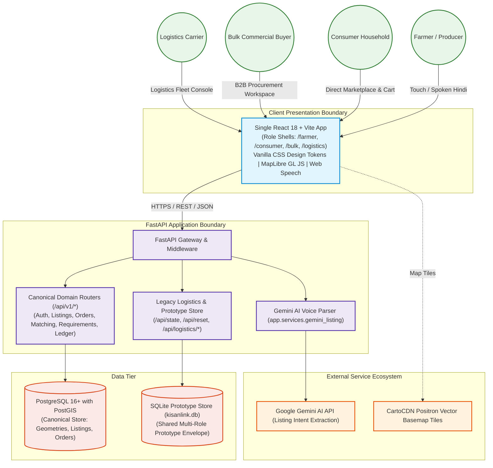
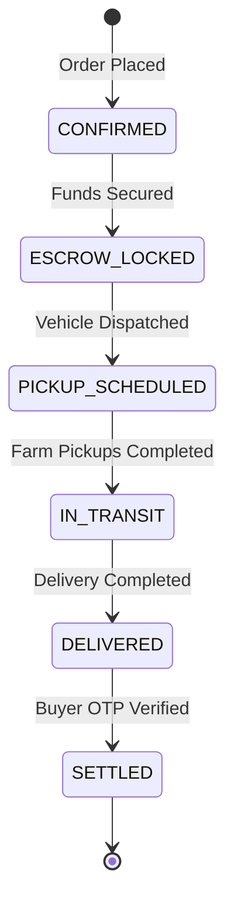
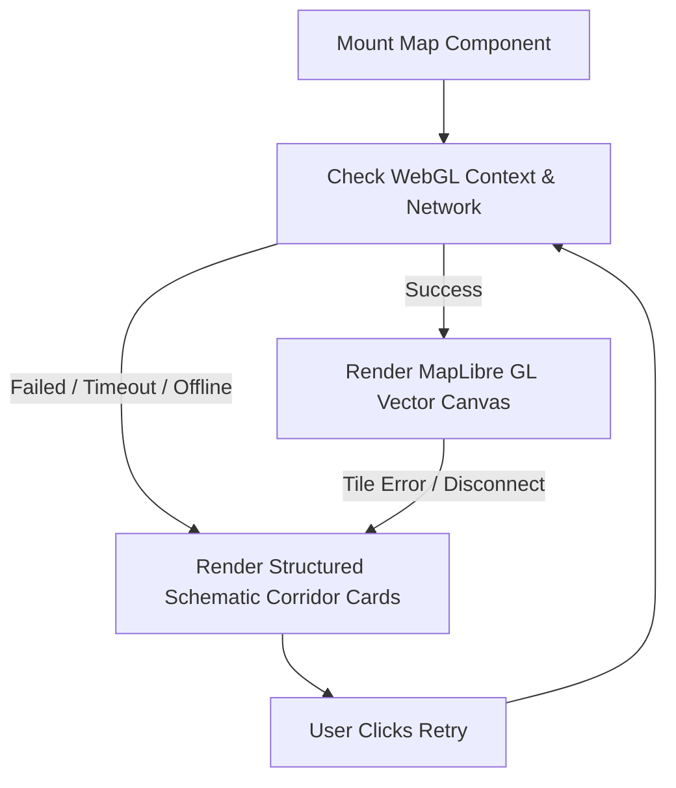

# KisanLink — Technical Requirements & Architecture Document (TRD)

**Project Name:** KisanLink (Direct Farm-to-Buyer Operating System)  
**Problem Statement ID:** 26033 (Smart India Hackathon 2026)  
**Document Version:** 1.1.0  
**Status:** Canonical Technical Architecture (Synchronized with Codebase)  
**Primary Stack:** React 18+ (Vite, TypeScript, Custom Vanilla CSS Tokens, MapLibre GL JS) + FastAPI (Python 3.11+, Pydantic v2, SQLAlchemy 2) + PostgreSQL 16+ (PostGIS) + Gemini AI NLP + SQLite Prototype State  
**Last Updated:** September 2026  

---

## Table of Contents

1. [Document Purpose & Scope](#1-document-purpose--scope)
2. [System Context & Operational Boundaries](#2-system-context--operational-boundaries)
3. [Architectural Principles & Non-Negotiables](#3-architectural-principles--non-negotiables)
4. [High-Level System Topology (Canonical Backend & Prototype Store)](#4-high-level-system-topology-canonical-backend--prototype-store)
5. [Modular Monolith Architecture Decision](#5-modular-monolith-architecture-decision)
6. [Frontend Architecture (React 18 + Vite + Vanilla CSS)](#6-frontend-architecture-react-18--vite--vanilla-css)
7. [Market Maker Subsystem Architecture](#7-market-maker-subsystem-architecture)
8. [Backend Architecture (FastAPI & Domain Services)](#8-backend-architecture-fastapi--domain-services)
9. [Database Architecture (PostgreSQL 16 + PostGIS)](#9-database-architecture-postgresql-16--postgis)
10. [Geographic & Spatial Processing Architecture](#10-geographic--spatial-processing-architecture)
11. [Authentication & Authorization Subsystem](#11-authentication--authorization-subsystem)
12. [Marketplace & Reverse Marketplace Architecture](#12-marketplace--reverse-marketplace-architecture)
13. [Procurement Matching Engine Architecture](#13-procurement-matching-engine-architecture)
14. [Dynamic Farmer Clustering Architecture](#14-dynamic-farmer-clustering-architecture)
15. [Order Management & State Machine Architecture](#15-order-management--state-machine-architecture)
16. [Logistics & Fleet Dispatch Architecture](#16-logistics--fleet-dispatch-architecture)
17. [Road Routing & Map Visualization (MapLibre + Fallback)](#17-road-routing--map-visualization-maplibre--fallback)
18. [Payment, Escrow Simulation & Multi-Split Settlements](#18-payment-escrow-simulation--multi-split-settlements)
19. [AI & Machine Learning Architecture (Gemini NLP & Heuristics)](#19-ai--machine-learning-architecture-gemini-nlp--heuristics)
20. [Language & Voice Subsystem (Web Speech + Gemini Extraction)](#20-language--voice-subsystem-web-speech--gemini-extraction)
21. [Contextual Notification Subsystem](#21-contextual-notification-subsystem)
22. [Security, Input Sanitization & Auditability](#22-security-input-sanitization--auditability)
23. [Scalability & Performance Budgets](#23-scalability--performance-budgets)
24. [Failure Modes & Graceful Degradation Safeguards](#24-failure-modes--graceful-degradation-safeguards)
25. [Testing Strategy & Test Harnesses](#25-testing-strategy--test-harnesses)
26. [Architecture Decision Records (ADRs) Summary](#26-architecture-decision-records-adrs-summary)

---

## 1. Document Purpose & Scope

This Technical Requirements Document (TRD) governs the system topology, component interactions, database schemas, computational models, network contracts, and infrastructure specifications for **KisanLink**. It bridges the functional requirements in [PRD.md](./PRD.md), [MARKET_MAKER.md](./MARKET_MAKER.md), and the execution roadmap.

---

## 2. System Context & Operational Boundaries



---

## 3. Architectural Principles & Non-Negotiables

1. **Farmer Floor Protection:**
   The farmer's floor price is an immutable input. Feasibility calculation solves for required volume, never for a lower farm-gate price.
2. **Deterministic Core Calculation:**
   Pricing splits, feasibility break-even points, cluster item quantities, and order transitions execute via closed-form deterministic arithmetic. AI is never permitted to alter transactional ledger amounts.
3. **Dual-Backend Data Harmony:**
   - **Canonical Backend (`/api/v1/*`):** Backed by PostgreSQL 16+ with native PostGIS geodetic queries for listings, search, orders, requirements, reviews, disputes, and audit logs.
   - **Prototype Store (`/api/state`):** Encapsulated via `backend/app/api/legacy_logistics.py` with SQLite backing (`kisanlink.db`) to enable zero-latency cross-module state propagation for live SIH demonstration.
4. **Resilience & Graceful Degradation:**
   - Map rendering failures fall back to structured schematic card layouts.
   - Speech-to-text failures fall back to direct numeric touch inputs.
   - Gemini voice parsing failures fall back to regex entity extractors.

---

## 4. High-Level System Topology (Canonical Backend & Prototype Store)

```mermaid
flowchart TB
    subgraph Frontend_App [Single React 18 + Vite App]
        F_Shell["/farmer Shell\n(Produce, Voice, Market Maker)"]
        C_Shell["/consumer Shell\n(Unified Home Marketplace, Cart)"]
        B_Shell["/bulk Shell\n(Procurement RFQs, Pool Visualizer)"]
        L_Shell["/logistics Shell\n(Jobs, Fleet, Corridor Map)"]
        M_Page["/role/market\n(Flagship Market Maker Engine)"]
    end

    subgraph Backend_App [FastAPI Server (uvicorn :8000)]
        RouterV1["/api/v1 Routers (Canonical PostgreSQL)"]
        RouterProto["/api/state & /api/logistics/* (Prototype Boundary)"]
        GeminiExt["/api/v1/listings/parse-voice (Gemini AI)"]
    end

    subgraph Data_Tier [Persistence Tier]
        PG[("PostgreSQL 16 + PostGIS")]
        Lite[("SQLite kisanlink.db (Prototype Store)")]
    end

    Frontend_App --> RouterV1
    Frontend_App --> RouterProto
    Frontend_App --> GeminiExt
    RouterV1 --> PG
    RouterProto --> Lite
```

---

## 5. Modular Monolith Architecture Decision

### 5.1 Rationale
A FastAPI Modular Monolith delivers optimal velocity and execution safety for the SIH 2026 prototype:
- **Zero Network Overhead:** Eliminates inter-service network hops and serialization latency.
- **Unified Domain Models:** Direct code reuse of Pydantic v2 schemas and SQLAlchemy models.
- **Single Container Deployment:** Easy orchestration via Docker Compose or local Python venv.

### 5.2 Backend Directory Structure
```text
backend/
├── alembic/                      # Database migrations (UUID & PostGIS enabled)
├── app/
│   ├── api/
│   │   ├── deps.py               # Dependency injection (get_db, auth tokens)
│   │   ├── legacy_logistics.py   # Isolated prototype store (/api/state, /api/reset)
│   │   └── v1/                   # Canonical API routers
│   │       ├── auth.py           # OTP & JWT token endpoints
│   │       ├── buyers.py         # Buyer profile endpoints
│   │       ├── clusters.py       # Dynamic supply clusters
│   │       ├── farmers.py        # Farmer dashboard, earnings, pickups
│   │       ├── listings.py       # Spatial PostGIS listings CRUD & parse-voice
│   │       ├── logistics.py      # Canonical shipments & route optimization
│   │       ├── matches.py        # Supplier scoring engine
│   │       ├── orders.py         # Direct B2C and bulk orders
│   │       ├── payments.py       # Escrow ledger
│   │       ├── requirements.py   # Buyer RFQs
│   │       ├── rescue.py         # Urgent rescue listings
│   │       ├── reviews.py        # Ratings & feedback
│   │       ├── disputes.py       # Mediation & dispute resolution
│   │       ├── audit.py          # Operator proxy audit logging
│   │       └── intelligence.py   # Price benchmarks & impact summary
│   ├── core/
│   │   ├── config.py             # Pydantic Settings
│   │   ├── logging.py            # Structlog configuration
│   │   └── security.py           # JWT creation and verification
│   ├── models/                   # SQLAlchemy declarative models
│   ├── schemas/                  # Pydantic v2 request/response schemas
│   ├── services/                 # Domain business logic & Gemini parser
│   ├── database.py               # Async engine & sessionmaker
│   ├── main.py                   # FastAPI application initialization
│   └── seed.py                   # Seed fixture for prototype state
└── requirements.txt
```

---

## 6. Frontend Architecture (React 18 + Vite + Vanilla CSS)

### 6.1 Technology Standards
- **Framework:** React 18, TypeScript, Vite.
- **Design System:** Custom Vanilla CSS (`frontend/src/index.css`) with strict semantic tokens (zero Tailwind CSS dependency).
- **Icons:** `lucide-react`.
- **Audio & Speech:** Browser `SpeechRecognition` / `webkitSpeechRecognition` API.
- **Maps:** MapLibre GL JS + CartoCDN Positron style with schematic fallback.

### 6.2 Component Directory Layout
```text
frontend/src/
├── components/
│   ├── ai/                      # MarketplaceAiTrigger, AiThinkingState, Pulse Cards
│   ├── maps/                    # DigitalTwinCorridorMap
│   ├── market/                  # MarketDemandRing, FreightCurve, ValueSplit, Convergence, UnlockReveal
│   ├── marketplace/             # ConsumerMarketplace (unified search, filter, sort)
│   └── voice/                   # VoiceInputModal
├── contexts/                    # AuthContext, LanguageContext, ToastContext
├── hooks/                       # useAsyncData, useReducedMotion
├── layouts/                     # AppShell (5-slot mobile nav, desktop sidebar)
├── pages/                       # FarmerExperience, ConsumerHome, BulkDashboard, LogisticsExperience, MarketMakerPage
├── services/                    # apiClient, marketMakerEngine, marketMakerService, prototypeService
└── types/                       # Core TypeScript domain models
```

---

## 7. Market Maker Subsystem Architecture

### 7.1 Mathematical Execution Model (`marketMakerEngine.ts`)
The Market Maker feasibility calculation is closed-form and inspectable:
$$\text{Freight}_{\text{total}} = \text{Fixed}_{\text{vehicle}} + (\text{PerKm}_{\text{vehicle}} \times \text{Distance}_{\text{km}})$$
$$\text{PlatformFee}_{\text{perKg}} = \text{round}(\text{FarmerFloor}_{\text{perKg}} \times \text{PlatformFeePct})$$
$$\text{Headroom}_{\text{perKg}} = \text{BuyerCeiling}_{\text{perKg}} - \text{FarmerFloor}_{\text{perKg}} - \text{PlatformFee}_{\text{perKg}}$$
$$\text{Threshold}_{\text{kg}} = \left\lceil \frac{\text{Freight}_{\text{total}}}{\text{Headroom}_{\text{perKg}}} \right\rceil$$

### 7.2 State Propagation & Corridor Serialization
Market Maker corridors are persisted in the prototype state under the `markets` array in `StatePayload` (`backend/app/api/legacy_logistics.py`). This guarantees that:
- Any commitment added by a user survives round-trips to `/api/state`.
- Crossing break-even volume updates the corridor status from `forming` to `viable`.
- Calling `createMarket()` generates real transactional entities:
  - Supply: Farmer Order (`KL-MM-XXXX`), Earning (`TX-MM-XXXX`), Farmer Pickup (`PK-MM-XXXX`).
  - Demand: Bulk Order (`KL-B-MM-XXXX`), Consumer Order (`KL-C-MM-XXXX`), Consignments.
  - Transport: Pooled Route (`RTE-MM-XXXX`) assigned to a live vehicle.

---

## 8. Backend Architecture (FastAPI & Domain Services)

- **Asynchronous Execution:** Async I/O across SQLAlchemy async sessions (`asyncpg`).
- **Pydantic v2 Contracts:** Strict request/response validation with automatic OpenAPI documentation.
- **Structured JSON Logging:** Built with `structlog` for production traceability.

---

## 9. Database Architecture (PostgreSQL 16 + PostGIS)

### 9.1 Schema Primitives
- Spatial columns use native PostGIS `GEOMETRY(Point, 4326)`:
```sql
CREATE EXTENSION IF NOT EXISTS postgis;

-- Example listings spatial index:
CREATE INDEX idx_crop_listings_location ON crop_listings USING GIST(location);
```

### 9.2 Spatial Queries
```sql
SELECT id, crop_name, quantity_kg, price_per_kg,
       ST_Distance(location, ST_SetSRID(ST_MakePoint(:lon, :lat), 4326)) AS distance_meters
FROM crop_listings
WHERE status = 'ACTIVE'
  AND ST_DWithin(location, ST_SetSRID(ST_MakePoint(:lon, :lat), 4326), :radius_meters);
```

---

## 10. Geographic & Spatial Processing Architecture

- **Primary Projections:** WGS84 (`EPSG:4326`) for persistent coordinates; Cartesian calculations converted to kilometers.
- **Clustering Heuristic:** Bounding radius grouping ensuring farm detour kilometers remain within threshold.

---

## 11. Authentication & Authorization Subsystem

- **Stateless Bearer JWT:** Issued via `/api/v1/auth/verify-otp`.
- **Role Enforcement:** FastAPI dependency injection (`require_farmer`, `require_buyer`, `require_operator`).

---

## 12. Marketplace & Reverse Marketplace Architecture

- **Consumer Direct:** Instant discovery and cart checkout on `ConsumerHome.tsx` (`#marketplace`).
- **Bulk Reverse Marketplace:** Requirements published via `POST /api/v1/requirements` with multi-criteria candidate clustering.

---

## 13. Procurement Matching Engine Architecture

- Multi-factor scoring in `MatchingEngine`:
  $$\text{Score} = w_1 \cdot S_{\text{dist}} + w_2 \cdot S_{\text{price}} + w_3 \cdot S_{\text{rep}} + w_4 \cdot S_{\text{fresh}} + w_5 \cdot S_{\text{urgency}}$$

---

## 14. Dynamic Farmer Clustering Architecture

- Dynamically aggregates multiple smallholder lots into single composite orders.
- Database records track individual `OrderFarmerAllocation` rows ensuring transparent payout distribution.

---

## 15. Order Management & State Machine Architecture



---

## 16. Logistics & Fleet Dispatch Architecture

- **Active Jobs Ranking:** Prioritizes issues (`status === 'issue'`) and unassigned pickups before routine work.
- **Fleet Allocation:** Vehicles track capacity (kg), driver, registration, and status (`available`, `assigned`, `in_transit`, `maintenance`).

---

## 17. Road Routing & Map Visualization (MapLibre + Fallback)

### 17.1 Map Rendering Architecture
- Uses `maplibre-gl` with CartoCDN Positron style (`https://basemaps.cartocdn.com/gl/positron-gl-style/style.json`).
- Route legs rendered as quadratic Bezier curves so overlapping legs remain distinct.

### 17.2 Fallback Strategy


---

## 18. Payment, Escrow Simulation & Multi-Split Settlements

- Upon buyer payment, 100% of order funds lock in simulated escrow custody.
- Split payout formula:
  $$\text{BuyerTotal} = \text{ProduceValue} + \text{Freight} + \text{PlatformFee}$$
  Farmer receives $\text{ProduceValue}$ with **zero deductions**.

---

## 19. AI & Machine Learning Architecture (Gemini NLP & Heuristics)

- **Voice Listing Extraction:** Google Gemini AI NLP (`extract_listing`) with regex fallback (`_basic_extract`).
- **Interactive AI Cards:** Powered by `MarketplaceAiTrigger.tsx` with staged timing, floating portal focus, and backdrop dimming.

---

## 20. Language & Voice Subsystem (Web Speech + Gemini Extraction)

1. User taps mic; browser Web Speech API streams speech recognition.
2. Transcript posts to `/api/v1/listings/parse-voice`.
3. Gemini extracts JSON schema attributes.
4. UI presents review form for confirmation.

---

## 21. Contextual Notification Subsystem

- Role-scoped notification feed in shared prototype state (`state.notifications`).
- Unlocked Market Maker corridors dispatch notifications across all 4 roles.

---

## 22. Security, Input Sanitization & Auditability

- Strict Pydantic input schemas.
- Operator proxy actions logged to `operator_audit_logs`.

---

## 23. Scalability & Performance Budgets

- First Contentful Paint: $< 1.0\text{ s}$ on 4G.
- API P95 latency: $< 200\text{ ms}$ for search and listings.

---

## 24. Failure Modes & Graceful Degradation Safeguards

- Map failure ➔ Schematic corridor cards.
- Speech failure ➔ Structured numeric touch keypad.
- Gemini failure ➔ Regex entity extraction.
- Backend offline ➔ Shared prototype state fallback.

---

## 25. Testing Strategy & Test Harnesses

- Backend: `pytest` + `pytest-asyncio` + `httpx`.
- Frontend: TypeScript type check (`tsc --noEmit`) and Vite build verification.

---

## 26. Architecture Decision Records (ADRs) Summary

- **ADR-01:** Modular Monolith over Microservices.
- **ADR-02:** Vanilla CSS design tokens over Tailwind CSS framework.
- **ADR-03:** Closed-form deterministic calculation for Market Maker feasibility.
- **ADR-04:** Unified Consumer Home over fragmented Explore page.
- **ADR-05:** MapLibre GL JS with schematic fallback UI.

---
*End of KisanLink Technical Requirements & Architecture Document (TRD)*
